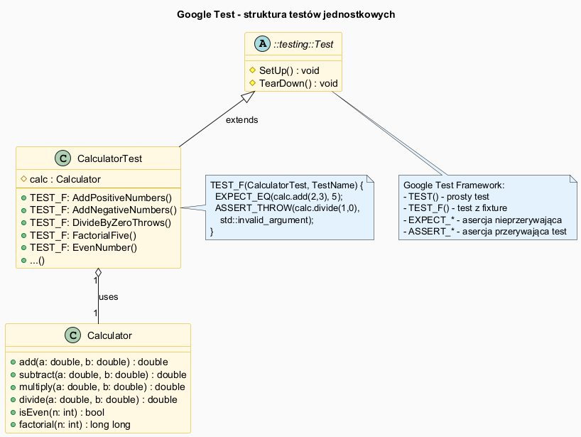

# Testy Jednostkowe w C++ – Google Test

## Slajd 1: Czym są testy jednostkowe?

**Test jednostkowy** (unit test) sprawdza działanie pojedynczej, izolowanej jednostki kodu (metody, funkcji) w kontrolowanych warunkach.

Zalety:
- Wykrywają błędy *wcześnie* – przy każdej zmianie kodu
- Dokumentują *oczekiwane zachowanie* kodu
- Umożliwiają bezpieczny refactoring

---

## Slajd 2: Google Test – framework testów dla C++

**Google Test** (gtest) to najpopularniejszy framework testów dla C++:

```
https://github.com/google/googletest
```

Instalacja przez CMake/FetchContent (zalecane):

```cmake
include(FetchContent)
FetchContent_Declare(
  googletest
  URL https://github.com/google/googletest/archive/refs/tags/v1.14.0.zip
)
FetchContent_MakeAvailable(googletest)
```

---

## Slajd 3: Anatomia testu – makra TEST i TEST_F

```cpp
// Prosty test bez fixture
TEST(NazwaGrupy, NazwaTestu) {
    EXPECT_EQ(2 + 2, 4);          // asercja – NIE przerywa testu po błędzie
    ASSERT_EQ(2 + 2, 4);          // asercja – PRZERYWA test po błędzie
}
```

```cpp
// Test z fixture (reużywalny kontekst)
class CalculatorTest : public ::testing::Test {
protected:
    Calculator calc;    // dostępny we wszystkich testach grupy
    void SetUp()    override { /* inicjalizacja */  }
    void TearDown() override { /* sprzątanie */     }
};

TEST_F(CalculatorTest, AddPositiveNumbers) {
    EXPECT_DOUBLE_EQ(calc.add(2.0, 3.0), 5.0);
}
```

---

### Prosty test (Makro TEST)

Jest to samodzielny przypadek testowy, który nie wymaga żadnego przygotowania zewnętrznego środowiska

- **Zastosowanie**: Testowanie prostych funkcji (np. matematycznych), metod statycznych lub klas, które nie wymagają skomplikowanej inicjalizacji
- **Struktura**: `TEST(NazwaZestawu, NazwaTestu) { ... }`
- **Charakterystyka**: Każdy test jest całkowicie odizolowany. Jeśli potrzebujesz obiektu, musisz go stworzyć wewnątrz klamerek `{}` każdego testu z osobna

---

### Test z fixture (Makro TEST_F)

*Fixture* to klasa (dziedzicząca po `::testing::Test`), która przygotowuje stałe otoczenie dla grupy testów. `F` w nazwie makra oznacza właśnie Fixture

- **Zastosowanie**: Gdy wiele testów korzysta z tych samych obiektów, połączeń z bazą danych lub konfiguracji. Pozwala to uniknąć powtarzania tego samego kodu (zasada DRY)
- **Struktura**: `TEST_F(NazwaKlasyFixture, NazwaTestu) { ... }`

Jak to działa:

- Dla każdego testu gtest tworzy nową, świeżą instancję klasy fixture
Uruchamia metodę `SetUp()` (lub konstruktor) przed testem
- Wykonuje ciało testu
- Uruchamia metodę `TearDown()` (lub destruktor) po teście

**Zaleta**: Masz dostęp do pól klasy fixture (zdefiniowanych jako protected lub public) bezpośrednio w ciele testu

---

### Porównanie w pigułce

| Cecha            | Prosty test (`TEST`)        | Test z fixture (`TEST_F`)           |
|------------------|-----------------------------|-------------------------------------|
| Główny cel       | Szybki test bez powiązań    | Współdzielenie logiki inicjalizacji |
| Przygotowanie danych | Ręcznie w każdym teście | Automatycznie w `SetUp()` lub konstruktorze |
| Dostęp do danych | Tylko lokalne zmienne | Pola i metody klasy fixture |
| Izolacja | Pełna | Pełna (każdy test dostaje nową instancję fixture) |

---

## Slajd 4: Makra asercji

| Makro                        | Opis                                       |
|------------------------------|--------------------------------------------|
| `EXPECT_EQ(actual, expected)`| Porównanie `==` (nie przerywa testu)       |
| `ASSERT_EQ(actual, expected)`| Porównanie `==` (przerywa test)            |
| `EXPECT_DOUBLE_EQ(a, b)`     | Porównanie zmiennoprzecinkowe              |
| `EXPECT_TRUE(condition)`     | Warunek prawdziwy                          |
| `EXPECT_FALSE(condition)`    | Warunek fałszywy                           |
| `ASSERT_THROW(expr, type)`   | Sprawdza czy rzucany jest wyjątek `type`   |
| `EXPECT_NEAR(a, b, margin)`  | Porównanie z tolerancją                    |

---

## Slajd 5: Klasa Calculator – testowana jednostka

Plik: [`src/Calculator.h`](src/Calculator.h)

```cpp
class Calculator {
public:
    double add(double a, double b) const   { return a + b; }
    double subtract(double a, double b) const { return a - b; }
    double multiply(double a, double b) const { return a * b; }

    double divide(double a, double b) const {
        if (b == 0.0)
            throw std::invalid_argument("Dzielnik nie może być zerem!");
        return a / b;
    }

    bool isEven(int n) const { return n % 2 == 0; }

    long long factorial(int n) const {
        if (n < 0) throw std::invalid_argument("Silnia tylko dla n >= 0");
        return (n <= 1) ? 1 : n * factorial(n - 1);
    }
};
```

---

## Slajd 6: Plik testów – pełny przykład

Plik: [`src/calculator_tests.cpp`](src/calculator_tests.cpp)

```cpp
#include <gtest/gtest.h>
#include "Calculator.h"

class CalculatorTest : public ::testing::Test {
protected:
    Calculator calc;
};

TEST_F(CalculatorTest, AddPositiveNumbers) {
    EXPECT_DOUBLE_EQ(calc.add(2.0, 3.0), 5.0);
}

TEST_F(CalculatorTest, DivideByZeroThrows) {
    ASSERT_THROW(calc.divide(10.0, 0.0), std::invalid_argument);
}

TEST_F(CalculatorTest, FactorialFive) {
    EXPECT_EQ(calc.factorial(5), 120LL);
}

TEST_F(CalculatorTest, EvenNumber) {
    EXPECT_TRUE(calc.isEven(4));
    EXPECT_FALSE(calc.isEven(7));
}
```

---

## Slajd 7: Diagram – struktura testów



```
CalculatorTest     ← fixture (::testing::Test)
    │
    ├── calc : Calculator   ← testowana klasa
    │
    ├── TEST_F: AddPositiveNumbers
    ├── TEST_F: DivideByZeroThrows
    ├── TEST_F: FactorialFive
    └── ...
```

---

## Slajd 8: CMakeLists.txt – konfiguracja budowania

Plik: [`CMakeLists.txt`](CMakeLists.txt)

```cmake
cmake_minimum_required(VERSION 3.14)
project(CalculatorTests CXX)
set(CMAKE_CXX_STANDARD 17)

include(FetchContent)
FetchContent_Declare(
  googletest
  URL https://github.com/google/googletest/archive/refs/tags/v1.14.0.zip
)
FetchContent_MakeAvailable(googletest)

enable_testing()

add_executable(calculator_tests src/calculator_tests.cpp)
target_include_directories(calculator_tests PRIVATE src)
target_link_libraries(calculator_tests GTest::gtest_main)

include(GoogleTest)
gtest_discover_tests(calculator_tests)
```

---

## Slajd 9: Budowanie i uruchomienie testów

```bash
# Konfiguracja projektu CMake
cmake -S . -B build

# Budowanie
cmake --build build

# Uruchomienie testów
cd build && ctest --output-on-failure

# Lub bezpośrednio
./build/calculator_tests
```

Przykładowe wyjście:
```
[==========] Running 14 tests from 1 test suite.
[----------] 14 tests from CalculatorTest
[ RUN      ] CalculatorTest.AddPositiveNumbers
[       OK ] CalculatorTest.AddPositiveNumbers (0 ms)
[ RUN      ] CalculatorTest.DivideByZeroThrows
[       OK ] CalculatorTest.DivideByZeroThrows (0 ms)
...
[  PASSED  ] 14 tests.
```

---

## Slajd 10: Dobre praktyki testowania

1. **AAA** – *Arrange, Act, Assert*: przygotuj → wykonaj → sprawdź
2. Jedna asercja logiczna na test (łatwiej znaleźć błąd)
3. Nazwy testowe opisują *co* testujemy i *jaki efekt* oczekujemy
4. Testuj przypadki brzegowe: zero, wartości ujemne, null
5. Testuj rzucanie wyjątków: `ASSERT_THROW`

```cpp
TEST_F(CalculatorTest, DivideByZeroThrows) {
    // Arrange: kalkulator jest gotowy (w fixture)
    // Act + Assert:
    ASSERT_THROW(
        calc.divide(10.0, 0.0),
        std::invalid_argument
    );
}
```

---

## Podsumowanie

| Pojęcie         | Znaczenie                                      |
|-----------------|------------------------------------------------|
| Test jednostkowy| Weryfikacja izolowanej jednostki kodu          |
| Fixture         | Reużywalny kontekst testów (`::testing::Test`) |
| `TEST()`        | Prosty test bez fixture                        |
| `TEST_F()`      | Test z fixture                                 |
| `EXPECT_*`      | Asercja nieprzerywająca testu                  |
| `ASSERT_*`      | Asercja przerywająca test po błędzie           |

---

## Dobre praktyki, antywzorce i zastosowania

- Dobra praktyka: trzymaj testy male i jednoznaczne, jeden scenariusz na jeden test.
- Dobra praktyka: stosuj nazwy testow opisujace zachowanie, np. `DivideByZeroThrows`.
- Dobra praktyka: uzywaj `ASSERT_*` gdy dalsze kroki testu nie maja sensu po bledzie.
- Antywzorzec: testy zalezne od kolejności uruchomienia albo wspolnego stanu globalnego.
- Antywzorzec: test, ktory sprawdza wiele rzeczy naraz i utrudnia diagnoze porazki.
- Zastosowanie: testy jednostkowe zabezpieczaja refaktoryzacje i wykrywaja regresje.
- Zastosowanie: idealne do walidacji bibliotek narzedziowych i krytycznych funkcji obliczeniowych.

## Pliki źródłowe

| Plik                                    | Opis                           |
|-----------------------------------------|--------------------------------|
| [`src/Calculator.h`](src/Calculator.h) | Klasa testowana                |
| [`src/calculator_tests.cpp`](src/calculator_tests.cpp) | Testy jednostkowe  |
| [`CMakeLists.txt`](CMakeLists.txt)      | Konfiguracja CMake + gtest     |
| [`unit_test_diagram.puml`](unit_test_diagram.puml) | Diagram UML         |
