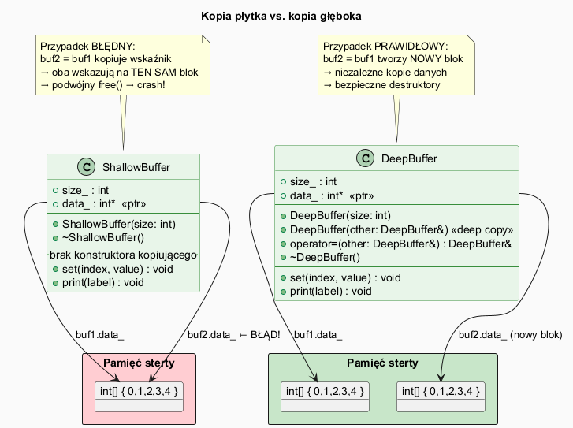

# Kopie Płytkie i Głębokie w C++

## Slajd 1: Problem – wskaźniki i dynamiczna pamięć

Gdy klasa posiada pola będące **wskaźnikami** na dynamicznie alokowane dane, domyślne zachowanie kopiowania **kopiuje wskaźnik**, a nie dane, na które wskazuje.

```
Kopia płytka:   buf1.data_ ──┐
                buf2.data_ ──┴──── int[] { 0,1,2,3,4 }  ← JEDEN blok!

Kopia głęboka:  buf1.data_ ───── int[] { 0,1,2,3,4 }  ← blok A
                buf2.data_ ───── int[] { 0,1,2,3,4 }  ← blok B (kopia)
```

---

## Slajd 2: Kopia płytka – zachowanie domyślne

Kompilator generuje **domyślny konstruktor kopiujący**, który kopiuje wszystkie pola *bit po bicie* (*memberwise copy*).

```cpp
class ShallowBuffer {
    int* data_;   // wskaźnik
public:
    ShallowBuffer(int size) {
        data_ = new int[size];  // alokacja
    }
    // BRAK konstruktora kopiującego → domyślny skopuje wskaźnik!
    ~ShallowBuffer() {
        delete[] data_;         // podwójny free → crash!
    }
};

ShallowBuffer buf1(5);
ShallowBuffer buf2 = buf1;   // data_ skopiowany jako wskaźnik
buf2.set(0, 999);            // modyfikuje DANE buf1!
// Destruktory: PODWÓJNY DELETE → niezdefiniowane zachowanie
```

---

## Slajd 3: Kopia głęboka – własny konstruktor

```cpp
class DeepBuffer {
    int  size_;
    int* data_;
public:
    DeepBuffer(int size) : size_(size) {
        data_ = new int[size_];
    }

    // Konstruktor kopiujący – GŁĘBOKA kopia
    DeepBuffer(const DeepBuffer& other) : size_(other.size_) {
        data_ = new int[size_];                    // NOWY blok
        std::memcpy(data_, other.data_,
                    size_ * sizeof(int));           // kopiuj dane
    }

    ~DeepBuffer() { delete[] data_; }
};

DeepBuffer buf1(5);
DeepBuffer buf2 = buf1;   // nowy blok, niezależna kopia
buf2.set(0, 999);         // NIE modyfikuje buf1
```

---

## Slajd 4: Operator przypisania – reguła trzech

Jeśli definiujesz destruktor zarządzający zasobem, musisz też zdefiniować:
1. Konstruktor kopiujący
2. Operator przypisania kopiującego

```cpp
// Operator przypisania (Rule of Three)
DeepBuffer& operator=(const DeepBuffer& other) {
    if (this == &other) return *this;   // ochrona: buf1 = buf1
    delete[] data_;                     // zwolnij stary blok
    size_ = other.size_;
    data_ = new int[size_];
    std::memcpy(data_, other.data_,
                size_ * sizeof(int));
    return *this;
}
```

---

## Slajd 5: Kiedy kopia głęboka jest potrzebna?

| Sytuacja                                    | Kopia płytka OK? |
|---------------------------------------------|:----------------:|
| Klasa zawiera tylko typy wartościowe (`int`, `double`, `string`) | ✅ |
| Klasa zawiera wskaźniki na alokowane zasoby | ❌               |
| Klasa zarządza plikami/gniazdami/mutexami   | ❌               |
| `std::vector`, `std::string` (klasy STL)    | ✅ (mają własne) |

> **C++ Core Guideline C.21:** Jeśli zdefiniujesz lub `=delete`ujesz jakiekolwiek z: destruktor, konstruktor kopiujący, operator=, to zdefiniuj wszystkie pięć operacji specjalnych (**Reguła Pięciu**).

---

## Slajd 6: Diagram klas



```
ShallowBuffer               DeepBuffer
──────────────────          ──────────────────────────
- size_: int                - size_: int
- data_: int*               - data_: int*
──────────────────          ──────────────────────────
+ ShallowBuffer(size)       + DeepBuffer(size)
+ ~ShallowBuffer()          + DeepBuffer(other&)  ← deep copy
  [brak copy ctor!]         + operator=(other&)
                            + ~DeepBuffer()
```

---

## Slajd 7: Pełna implementacja – DeepBuffer

Plik: [`src/Buffer.h`](src/Buffer.h)

```cpp
DeepBuffer(const DeepBuffer& other) : size_(other.size_) {
    data_ = new int[size_];
    std::memcpy(data_, other.data_, size_ * sizeof(int));
    std::cout << "[DeepBuffer] Kopia głęboka: "
              << other.data_ << " → " << data_ << "\n";
}

DeepBuffer& operator=(const DeepBuffer& other) {
    if (this == &other) return *this;
    delete[] data_;
    size_ = other.size_;
    data_ = new int[size_];
    std::memcpy(data_, other.data_, size_ * sizeof(int));
    return *this;
}
```

---

## Slajd 8: Demonstracja w programie

Plik: [`src/main.cpp`](src/main.cpp)

```cpp
int main() {
    DeepBuffer buf1(5);               // [0,1,2,3,4]
    DeepBuffer buf2 = buf1;           // głęboka kopia

    std::cout << buf1.data_ << "\n";  // adres A
    std::cout << buf2.data_ << "\n";  // adres B (inny!)

    buf2.set(0, 999);                 // modyfikuje tylko buf2
    buf1.print("buf1");               // [0,1,2,3,4] – niezmienione
    buf2.print("buf2");               // [999,1,2,3,4]
}
```

---

## Slajd 9: Kompilacja i uruchomienie

```bash
g++ -std=c++17 -o copy src/main.cpp
./copy
```

Obserwuj adresy pamięci w wyjściu – dla kopii głębokiej będą różne.

---

## Slajd 10: RAII – bezpieczne zarzadzanie zasobem

**RAII (Resource Acquisition Is Initialization)** oznacza, ze zasob jest pobierany w konstruktorze,
a zwalniany automatycznie w destruktorze. Dzięki temu unikamy wyciekow pamieci i nie musimy
pamietac o recznym `delete[]` w kodzie uzywajacym klasy.

```cpp
class SafeBuffer {
    std::vector<int> data_;  // RAII: vector sam zwolni pamiec
public:
    explicit SafeBuffer(int size) : data_(size) {
        std::iota(data_.begin(), data_.end(), 0);
    }

    void set(int i, int v) { data_[i] = v; }
    void print(const char* name) const {
        std::cout << name << ": ";
        for (int x : data_) std::cout << x << " ";
        std::cout << "\n";
    }
};

int main() {
    SafeBuffer a(5);
    SafeBuffer b = a;   // poprawna kopia bez pisania delete/new
    b.set(0, 999);
    a.print("a");       // 0 1 2 3 4
    b.print("b");       // 999 1 2 3 4
} // wyjscie z zakresu => zasoby zwolnione automatycznie
```

Wniosek: RAII upraszcza kod i ogranicza ryzyko bledow zwiazanych z recznym zarzadzaniem pamiecia.

---

## Podsumowanie

| Pojęcie              | Znaczenie                                                  |
|----------------------|------------------------------------------------------------|
| Kopia płytka         | Kopiuje wartości pól – wskaźniki współdzielone            |
| Kopia głęboka        | Alokuje nowe zasoby i kopiuje dane                        |
| Reguła Trzech        | Destruktor + copy ctor + operator= razem                  |
| Reguła Pięciu (C++11)| + move ctor + move operator=                              |
| `memcpy`             | Szybkie bit-per-bit kopiowanie bloku pamięci              |
| Self-assignment guard| `if (this == &other) return *this`                        |

---

## Dobre praktyki, antywzorce i zastosowania

- Dobra praktyka: gdy klasa zarzadza zasobem, implementuj pelny zestaw operacji specjalnych.
- Dobra praktyka: po `delete` ustawiaj wskaznik na `nullptr`, by unikac dangling pointer.
- Dobra praktyka: preferuj RAII i kontenery STL (`std::vector`, `std::string`) zamiast surowych wskaznikow.
- Antywzorzec: kopiowanie wskaznika 1:1 (shallow copy) dla obiektow posiadajacych zasoby.
- Antywzorzec: brak ochrony self-assignment w `operator=` i podwojne zwalnianie pamieci.
- Zastosowanie: buforowanie danych binarnych, klasy zarzadzajace pamiecia i starszy kod low-level.
- Zastosowanie: zrozumienie copy vs deep copy jest kluczowe przy integracji z API C.

## Pliki źródłowe

| Plik                          | Opis                                   |
|-------------------------------|----------------------------------------|
| [`src/Buffer.h`](src/Buffer.h) | ShallowBuffer i DeepBuffer            |
| [`src/main.cpp`](src/main.cpp) | Demonstracja różnicy                  |
| [`copy_diagram.puml`](copy_diagram.puml) | Diagram UML                 |
