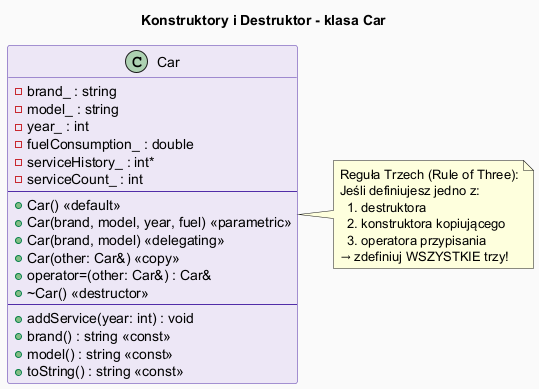
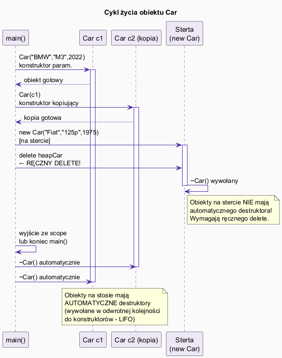

# Konstruktory i Destruktory w C++

## Slajd 1: Konstruktor – czym jest?

**Konstruktor** to specjalna metoda wywoływana automatycznie przy tworzeniu obiektu.  
Jego zadaniem jest **inicjalizacja** pól obiektu do poprawnego stanu.

Cechy konstruktora:
- Nazwa identyczna jak nazwa klasy
- Brak zwracanego typu (nawet `void`)
- Może być przeciążony (wiele wersji)
- Wywoływany **dokładnie raz** – przy tworzeniu obiektu

---

## Slajd 2: Konstruktor domyślny i parametryczny

```cpp
class Car {
private:
    std::string brand_;
    int         year_;
public:
    // 1. Konstruktor domyślny (zero-arg)
    Car() : brand_("Unknown"), year_(2000) {
        std::cout << "[Car] Konstruktor domyślny\n";
    }

    // 2. Konstruktor parametryczny
    Car(const std::string& brand, int year)
        : brand_(brand), year_(year) {
        std::cout << "[Car] Konstruktor: " << brand_ << "\n";
    }
};

Car c1;                     // konstruktor domyślny
Car c2("BMW", 2022);        // konstruktor parametryczny
```

**Lista inicjalizacyjna** (`:  brand_(brand), year_(year)`) jest wykonywana *przed* ciałem konstruktora – jest to preferowany sposób inicjalizacji.

---

## Slajd 3: Konstruktor delegujący (C++11)

Jeden konstruktor może wywołać inny konstruktor tej samej klasy:

```cpp
// Konstruktor pełny
Car(const std::string& brand, const std::string& model,
    int year, double fuel = 0.0)
    : brand_(brand), model_(model), year_(year), fuel_(fuel) {}

// Konstruktor skrócony – deleguje do pełnego
Car(const std::string& brand, const std::string& model)
    : Car(brand, model, 2024) {   // ← delegowanie
    std::cout << "[Car] Konstruktor 2-arg\n";
}
```

Eliminuje duplikację kodu inicjalizacyjnego.

---

## Slajd 4: Konstruktor kopiujący

Wywołany gdy tworzymy **nowy obiekt jako kopię** istniejącego:

```cpp
Car(const Car& other)           // const ref – nie modyfikujemy źródła
    : brand_(other.brand_),
      model_(other.model_),
      year_(other.year_) {
    // Dla pół wskaźnikowych: GŁĘBOKA kopia
    serviceHistory_ = new int[10]{};
    std::copy(other.serviceHistory_,
              other.serviceHistory_ + 10, serviceHistory_);
    std::cout << "[Car] Konstruktor kopiujący\n";
}
```

Konstruktor kopiujący jest wywołany przy:
- `Car c2(c1);`
- `Car c2 = c1;` *(inicjalizacja, nie przypisanie!)*
- Przekazywaniu obiektu przez wartość do funkcji
- Zwracaniu obiektu przez wartość z funkcji

---

## Slajd 5: Destruktor

**Destruktor** porządkuje zasoby gdy obiekt jest niszczony:

```cpp
~Car() {
    std::cout << "[Car] Destruktor: " << brand_ << "\n";
    delete[] serviceHistory_;    // zwolnij pamięć dynamiczną
}
```

Cechy destruktora:
- Nazwa: `~NazwaKlasy`
- Brak parametrów, brak zwracanego typu
- Tylko **jeden** destruktor (nie można przeciążać)
- Wywoływany automatycznie dla obiektów na stosie
- Wywoływany **ręcznie** (przez `delete`) dla obiektów na stercie

---

## Slajd 6: Kiedy wywoływane są destruktory?

```cpp
void example() {               //
    Car c1("Fiat", "125p");    // ← konstruktor c1
    {
        Car c2("BMW", "M3");   // ← konstruktor c2
    }                          // ← destruktor c2 (koniec bloku)
    // c1 nadal żyje
}                              // ← destruktor c1 (koniec funkcji)

Car* heap = new Car("VW","Golf");
delete heap;                   // ← destruktor heap (ręcznie!)
```

> **Kolejność destruktorów** jest odwrotna do kolejności konstruktorów (LIFO – jak stos).

---

## Slajd 7: Reguła Trzech i Pięciu

```
Jeśli zarządzasz zasobem (pamięcią, plikiem, socket...):

REGUŁA TRZECH (C++98):
  ✅ Destruktor
  ✅ Konstruktor kopiujący
  ✅ Operator przypisania kopiującego (operator=)

REGUŁA PIĘCIU (C++11):
  ✅ + Konstruktor przenoszący (move ctor)
  ✅ + Operator przypisania przenoszącego (move operator=)
```

---

## Slajd 8: Diagram klas i cykl życia

  


```
main()          c1 (stos)       c2 (kopia)      heap (sterta)
  │              │                │                │
  ├─── new ──────►  ctor param    │                │
  ├─── copy ───────────────────── ► ctor kopiujący │
  ├─── new heap ────────────────────────────────── ► ctor param
  ├─── delete heap ────────────────────────────────── ~dtor (ręczny)
  │
  └── koniec main():
          ~dtor c2 (LIFO)
          ~dtor c1 (LIFO)
```

---

## Slajd 9: Pełna klasa Car

Plik: [`src/Car.h`](src/Car.h)

```cpp
class Car {
private:
    std::string brand_, model_;
    int         year_;
    double      fuelConsumption_;
    int*        serviceHistory_;   // zasób dynamiczny
    int         serviceCount_;
public:
    Car();                         // domyślny
    Car(brand, model, year, fuel); // parametryczny
    Car(brand, model);             // delegujący
    Car(const Car&);               // kopiujący (deep copy)
    Car& operator=(const Car&);    // operator=
    ~Car();                        // destruktor – delete[] serviceHistory_
    void addService(int year);
    std::string toString() const;
};
```

---

## Slajd 10: Kompilacja i uruchomienie

```bash
g++ -std=c++17 -o constructors src/main.cpp
./constructors
```

Obserwuj kolejność komunikatów z konstruktorów i destruktorów – ilustruje cykl życia obiektów.

---

## Podsumowanie

| Konstruktor         | Kiedy wywołany                              |
|---------------------|---------------------------------------------|
| Domyślny `Car()`    | `Car c;` lub `new Car()`                    |
| Parametryczny       | `Car c("BMW", 2022);`                       |
| Delegujący          | Wewnątrz innego konstruktora tej klasy      |
| Kopiujący           | `Car c2(c1);` lub `Car c2 = c1;`           |

| Pojęcie          | Znaczenie                                         |
|------------------|---------------------------------------------------|
| Destruktor       | Sprząta zasoby, wywoływany automatycznie/ręcznie  |
| Lista inicjalizacyjna | Inicjalizuje pola przed ciałem konstruktora  |
| Reguła Trzech    | Destruktor + copy ctor + operator= razem          |
| Reguła Pięciu    | Reguła Trzech + move ctor + move operator=        |

---

## Pliki źródłowe

| Plik                                          | Opis                           |
|-----------------------------------------------|--------------------------------|
| [`src/Car.h`](src/Car.h)                     | Kompletna klasa Car            |
| [`src/main.cpp`](src/main.cpp)               | Demonstracja cyklu życia       |
| [`constructor_diagram.puml`](constructor_diagram.puml) | Diagram klasy UML   |
| [`lifecycle_diagram.puml`](lifecycle_diagram.puml)     | Diagram sekwencji   |
