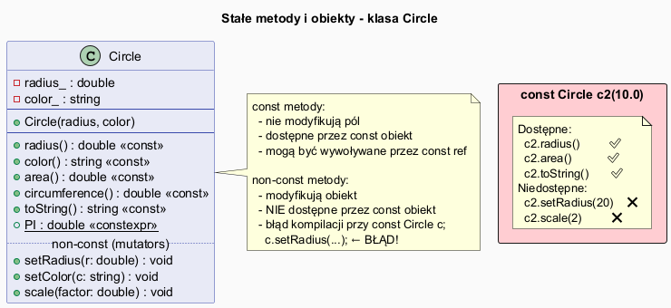

# Stałe Metody i Obiekty (`const`) w C++

## Slajd 1: Słowo kluczowe `const` – po co?

`const` informuje kompilator (i programistę), że:
- obiekt/zmienna **nie będzie modyfikowana**
- metoda **nie modyfikuje** stanu obiektu

Korzyści:
- Błędy modyfikacji wykryte **w czasie kompilacji**
- Lepsze intencje kodu (dokumentacja)
- Umożliwia optymalizacje kompilatora
- Wymagane przy przekazywaniu przez `const&`

---

## Slajd 2: Stała metoda (`const` po nazwie)

```cpp
class Circle {
    double radius_;
public:
    // CONST metoda – gwarantuje że nie zmienia pól obiektu
    double area() const {
        return M_PI * radius_ * radius_;   // tylko czyta radius_
    }

    // NON-CONST – modyfikuje obiekt
    void setRadius(double r) {
        radius_ = r;                       // modyfikuje pole
    }
};
```

Reguła: **Gettery i metody obliczeniowe** powinny zawsze być `const`.

---

## Slajd 3: Obiekt stały (`const` przed typem)

```cpp
const Circle c(10.0, "red");   // obiekt stały

c.area();            // ✅ const metoda
c.toString();        // ✅ const metoda
c.setRadius(20.0);   // ❌ BŁĄD KOMPILACJI!
c.scale(2.0);        // ❌ BŁĄD KOMPILACJI!
```

Na obiekcie `const` można wywołać **wyłącznie metody `const`**.

---

## Slajd 4: Przekazywanie przez `const` referencję

Najczęstszy wzorzec w C++:

```cpp
// Funkcja akceptuje obiekt przez const ref:
// - nie kopiuje (wydajne)
// - nie modyfikuje (bezpieczne)
void printCircleInfo(const Circle& c) {
    std::cout << c.area() << "\n";     // ✅
    c.setRadius(5.0);                  // ❌ BŁĄD KOMPILACJI
}

// Użycie:
Circle c1(5.0);
const Circle c2(10.0);
printCircleInfo(c1);   // ✅ zwykły obiekt przez const ref
printCircleInfo(c2);   // ✅ const obiekt przez const ref
```

---

## Slajd 5: `const` wskaźniki – 4 kombinacje

```cpp
Circle c(5.0);
const Circle cc(5.0);

// 1. Wskaźnik do const (nie można zmieniać obiektu przez wskaźnik)
const Circle* p1 = &c;
p1->setRadius(3.0);   // ❌ błąd
p1 = &cc;             // ✅ można przesunąć wskaźnik

// 2. Const wskaźnik (sam wskaźnik jest const, obiekt nie)
Circle* const p2 = &c;
p2->setRadius(3.0);   // ✅ obiekt modyfikowalny
p2 = &c;              // ❌ błąd – wskaźnik const

// 3. Const wskaźnik do const
const Circle* const p3 = &c;
// p3->setRadius(3.0); ❌
// p3 = &c;            ❌
```

---

## Slajd 6: `static constexpr` – stała czasu kompilacji

```cpp
class Circle {
public:
    // Stała dostępna bez tworzenia obiektu, wyliczona w czasie kompilacji
    static constexpr double PI = 3.14159265358979323846;
};

// Użycie:
double area = Circle::PI * r * r;   // bez obiektu Circle!
```

`constexpr` > `const` > `#define` (bezpieczniejsze, typowane, debugowalne)

---

## Slajd 7: Diagram klas



```
Circle
──────────────────────────────
- radius_: double
- color_: string
──────────────────────────────
+ radius() const               ← tylko const obiekty
+ color() const
+ area() const
+ circumference() const
+ toString() const
+ PI: double constexpr static
──────────────────────────────
+ setRadius(r)                 ← tylko non-const obiekty
+ setColor(c)
+ scale(factor)
```

---

## Slajd 8: Pełna klasa Circle

Plik: [`src/Circle.h`](src/Circle.h)

```cpp
class Circle {
    double radius_;
    std::string color_;
public:
    Circle(double radius, const std::string& color = "red");

    double radius() const { return radius_; }
    double area()   const { return M_PI * radius_ * radius_; }
    double circumference() const { return 2.0 * M_PI * radius_; }
    std::string toString()  const;

    void setRadius(double r);      // non-const
    void setColor(const std::string& c);
    void scale(double factor);     // non-const

    static constexpr double PI = 3.14159265358979323846;
};
```

---

## Slajd 9: Program ilustrujący

Plik: [`src/main.cpp`](src/main.cpp)

```cpp
Circle c1(5.0, "blue");
c1.setRadius(7.0);       // OK – c1 nie jest const

const Circle c2(10.0, "red");
std::cout << c2.area() << "\n";  // OK – area() jest const
// c2.setRadius(20.0);           // BŁĄD: setRadius nie jest const

printCircleInfo(c1);    // przez const& – bezpieczny odczyt
printCircleInfo(c2);    // const obiekt przez const& – OK
```

---

## Slajd 10: Kompilacja

```bash
g++ -std=c++17 -o constdemo src/main.cpp
./constdemo
```

Odkomentuj zakomentowane linie (`// BŁĄD`) by zobaczyć komunikaty kompilatora.

---

## Podsumowanie

| Zapis                   | Znaczenie                                        |
|-------------------------|--------------------------------------------------|
| `double area() const`   | Metoda nie modyfikuje obiektu                    |
| `const Circle c`        | Obiekt stały – tylko metody const dostępne       |
| `const Circle& c`       | Const referencja – bezpieczne przekazywanie      |
| `const Circle* p`       | Wskaźnik na stały obiekt                         |
| `Circle* const p`       | Stały wskaźnik na (niestały) obiekt              |
| `static constexpr T PI` | Stała wyliczona w czasie kompilacji              |

---

## Dobre praktyki, antywzorce i zastosowania

- Dobra praktyka: oznaczaj metody odczytowe jako `const`, by wzmacniac kontrakt API.
- Dobra praktyka: przekazuj duze obiekty jako `const&` zamiast przez wartosc.
- Dobra praktyka: uzywaj `constexpr` dla stalych matematycznych i konfiguracji kompilacyjnej.
- Antywzorzec: castowanie `const` (`const_cast`) w zwyklym kodzie aplikacyjnym.
- Antywzorzec: brak `const` w interfejsie, co utrudnia uzycie obiektu w kodzie niemutowalnym.
- Zastosowanie: biblioteki API, modele domenowe i funkcje obliczeniowe bez efektow ubocznych.
- Zastosowanie: bezpieczne wspoldzielenie obiektow miedzy modulami i watkami (read-only).

## Pliki źródłowe

| Plik                              | Opis                               |
|-----------------------------------|------------------------------------|
| [`src/Circle.h`](src/Circle.h)   | Klasa Circle z metodami const      |
| [`src/main.cpp`](src/main.cpp)   | Demonstracja obiektów const        |
| [`const_diagram.puml`](const_diagram.puml) | Diagram UML                |
