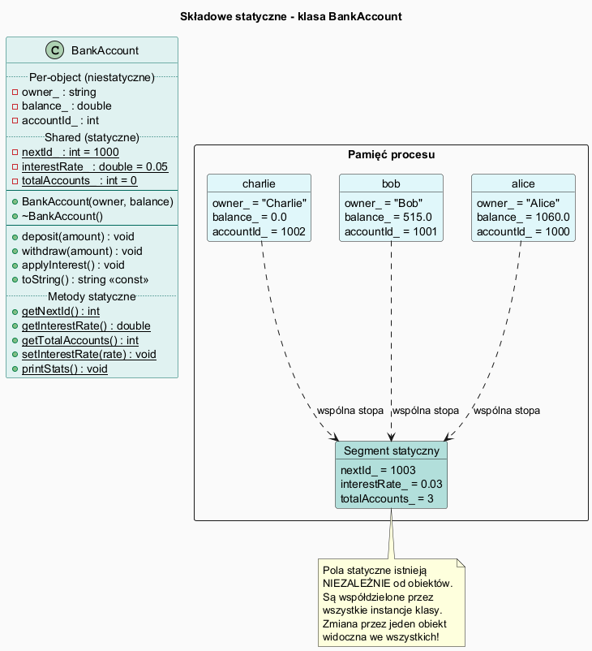

# Składowe Statyczne w C++

## Slajd 1: Składowe instancji vs. statyczne

Każdy obiekt klasy ma **własną kopię** pól niestatycznych.  
Pole **statyczne** jest **jedną kopią wspólną** dla wszystkich obiektów.

```
Pola niestatyczne (per-object):             Pole statyczne (shared):

┌─────────────────────┐                    ┌──────────────────────────────┐
│ alice               │ ─────────────────► │ BankAccount::interestRate_   │
│  owner_  = "Alice"  │                    │   = 0.03                     │
│  balance_= 1060.00  │ ─────────────────► │  (jedna wspólna kopia        │
└─────────────────────┘                    │   dla wszystkich obiektów)   │
                                           │                              │
┌─────────────────────┐                    │                              │
│ bob                 │ ─────────────────► │                              │
│  owner_  = "Bob"    │                    └──────────────────────────────┘
│  balance_=  515.00  │
└─────────────────────┘

┌─────────────────────┐
│ charlie             │
│  owner_  = "Charlie"│
│  balance_=    0.00  │
└─────────────────────┘
```

---

## Slajd 2: Deklaracja i definicja

```cpp
class BankAccount {
    // w klasie: DEKLARACJA
    static int    nextId_;          // licznik kont
    static double interestRate_;    // stopa procentowa
    static int    totalAccounts_;   // liczba żywych obiektów
    ...
};

// POZA klasą: DEFINICJA (tradycyjnie w pliku .cpp)
int    BankAccount::nextId_        = 1000;
double BankAccount::interestRate_  = 0.05;
int    BankAccount::totalAccounts_ = 0;

// C++17: inline w nagłówku (eliminuje oddzielny .cpp)
inline int    BankAccount::nextId_        = 1000;
```

---

## Slajd 3: Metoda statyczna

```cpp
class BankAccount {
public:
    // Metoda statyczna – nie ma wskaźnika this!
    static void setInterestRate(double rate) {
        interestRate_ = rate;    // OK: statyczne pole
        // balance_ += 1;        // BŁĄD: niestałe pole – brak this!
    }

    static int getTotalAccounts() { return totalAccounts_; }
};

// Wywołanie BEZ obiektu (zalecane):
BankAccount::setInterestRate(0.03);
int count = BankAccount::getTotalAccounts();

// Przez obiekt (możliwe, ale mylące – unikaj!):
alice.getTotalAccounts();    // to samo, ale sugeruje "należy do alice"
```

---

## Slajd 4: Użycie w konstruktorze i destruktorze

```cpp
BankAccount::BankAccount(const std::string& owner, double balance)
    : owner_(owner), balance_(balance) {
    accountId_ = nextId_++;    // przydziel unikalny ID
    totalAccounts_++;          // zlicz nowy obiekt
}

BankAccount::~BankAccount() {
    totalAccounts_--;          // zmniejsz licznik
}
```

Dzięki temu zawsze wiemy ile obiektów istnieje: `BankAccount::getTotalAccounts()`.

---

## Slajd 5: `static const` i `static constexpr`

```cpp
class MathConstants {
public:
    static constexpr double PI    = 3.14159265358979;
    static constexpr double E     = 2.71828182845905;
    static constexpr int    MAX_N = 1000;
};

// Użycie bez tworzenia obiektu:
double area = MathConstants::PI * r * r;
```

`static constexpr` = stała **klasy**, wyliczona **w czasie kompilacji** – nie zajmuje pamięci w obiektach.

---

## Slajd 6: Diagram klas i pamięci



```
Segment statyczny / globalny:
┌──────────────────────────────────┐
│ BankAccount::nextId_     = 1003  │  ← jedna zmienna
│ BankAccount::interestRate_ = 0.03│  ← jedna zmienna
│ BankAccount::totalAccounts_ = 3  │  ← jedna zmienna
└──────────────────────────────────┘

Stos / sterta (per-obiekt):
┌────────────────┐  ┌────────────────┐
│ alice          │  │ bob            │
│  owner_=Alice  │  │  owner_=Bob    │
│  balance_=1060 │  │  balance_=515  │
│  accountId_=   │  │  accountId_=   │
│    1000        │  │    1001        │
└────────────────┘  └────────────────┘
```

---

## Slajd 7: Wzorzec Singleton – zastosowanie static

Klasyczne zastosowanie statycznej składowej: wzorzec Singleton.

```cpp
class AppConfig {
private:
    static AppConfig* instance_;    // jedyna instancja
    AppConfig() {}                  // prywatny ctor!

public:
    static AppConfig& getInstance() {
        if (!instance_)
            instance_ = new AppConfig();
        return *instance_;
    }

    // C++11 – lokalny obiekt statyczny (thread-safe):
    static AppConfig& getInstance() {
        static AppConfig instance;  // stworzony przy pierwszym wywołaniu
        return instance;
    }
};
```

---

## Slajd 8: Pełna klasa BankAccount

Plik: [`src/BankAccount.h`](src/BankAccount.h)

```cpp
class BankAccount {
    std::string owner_;
    double      balance_;
    int         accountId_;

    static int    nextId_;          // wspólne
    static double interestRate_;
    static int    totalAccounts_;
public:
    BankAccount(const std::string& owner, double balance = 0.0);
    ~BankAccount();

    void deposit(double amount);
    void withdraw(double amount);
    void applyInterest();           // używa interestRate_

    static void   setInterestRate(double rate);
    static int    getTotalAccounts();
    static void   printStats();
};

inline int    BankAccount::nextId_        = 1000;
inline double BankAccount::interestRate_  = 0.05;
inline int    BankAccount::totalAccounts_ = 0;
```

---

## Slajd 9: Demonstracja

Plik: [`src/main.cpp`](src/main.cpp)

```cpp
BankAccount::printStats();          // bez obiektów – stat. metoda
BankAccount alice("Alice", 1000.0);
BankAccount bob("Bob", 500.0);
BankAccount::printStats();          // totalAccounts_ = 2

BankAccount::setInterestRate(0.03); // zmiana dla WSZYSTKICH obiektów
alice.applyInterest();              // używa 0.03
bob.applyInterest();                // używa 0.03
```

---

## Slajd 10: Kompilacja i uruchomienie

```bash
g++ -std=c++17 -o static_members src/main.cpp
./static_members
```

---

## Podsumowanie

| Pojęcie                | Znaczenie                                                   |
|------------------------|-------------------------------------------------------------|
| Pole statyczne         | Jedna kopia wspólna dla wszystkich obiektów klasy           |
| Metoda statyczna       | Nie ma `this`, może używać tylko pól/metod statycznych      |
| Dostęp                 | `NazwaKlasy::pole`, `NazwaKlasy::metoda()`                 |
| Definicja              | Poza klasą (lub `inline` w nagłówku w C++17)                |
| `static constexpr`     | Stała klasy, wyliczona w czasie kompilacji                  |
| Singleton              | Klasyczny wzorzec używający static składowej                |

---

## Dobre praktyki, antywzorce i zastosowania

- Dobra praktyka: statyczne pola stosuj tylko dla danych wspólnych dla wszystkich instancji.
- Dobra praktyka: pilnuj enkapsulacji statycznych pól przez metody klasowe.
- Dobra praktyka: preferuj `inline static` (C++17) dla prostszej definicji w nagłówku.
- Antywzorzec: nadużywanie statycznego stanu globalnego i ukryte zależności między modułami.
- Antywzorzec: traktowanie Singletona jako domyślnego rozwiązania każdego problemu.
- Zastosowanie: liczniki obiektów, cache konfiguracji, stałe parametry wspólne.
- Zastosowanie: fabryki i rejestry typów, gdy stan ma być wspólny dla całej klasy.

## Pliki źródłowe

| Plik                                      | Opis                               |
|-------------------------------------------|------------------------------------|
| [`src/BankAccount.h`](src/BankAccount.h) | Klasa z polami i metodami static   |
| [`src/main.cpp`](src/main.cpp)           | Demonstracja składowych statycznych|
| [`static_diagram.puml`](static_diagram.puml) | Diagram UML                    |
