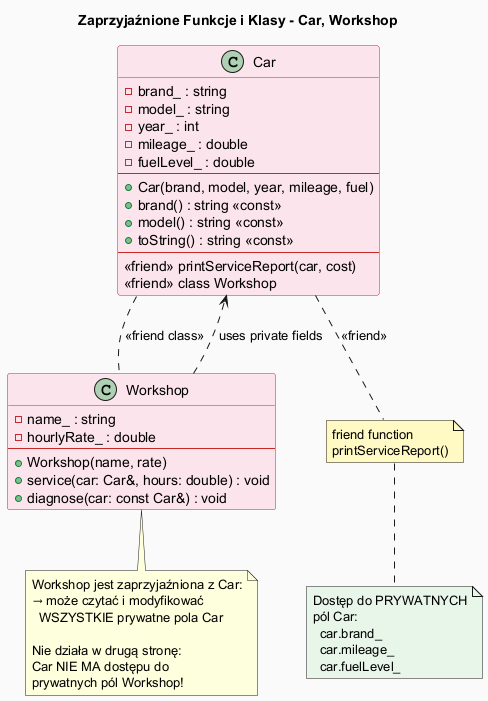

# Funkcje i Klasy Zaprzyjaźnione (`friend`) w C++

## Slajd 1: Czym jest `friend`?

`friend` to mechanizm C++ pozwalający wybranym **funkcjom** lub **klasom** dostęp do **prywatnych i chronionych** składowych innej klasy.

> "Zaprzyjaźnienie jest wyjątkiem od enkapsulacji – stosuj rozważnie!"

```
Bez friend:                     Z friend:
external_fn(car.fuelLevel_)     friend_fn(car.fuelLevel_)
// BŁĄD: prywatne!              // OK: friend ma dostęp!
```

---

## Slajd 2: Zaprzyjaźniona funkcja

```cpp
class Car {
private:
    std::string brand_;
    double      fuelLevel_;

public:
    // Deklaracja zaprzyjaźnienia – wewnątrz klasy
    friend void printServiceReport(const Car& car, double cost);
};

// Definicja – POZA klasą (nie należy do klasy!)
void printServiceReport(const Car& car, double cost) {
    // Dostęp do prywatnych pól:
    std::cout << car.brand_     << "\n";   // ✅
    std::cout << car.fuelLevel_ << "\n";   // ✅
}
```

Zaprzyjaźniona funkcja:
- **Nie jest metodą** klasy (brak `this`)
- Ma dostęp do prywatnych składowych
- Zdefiniowana poza klasą

---

## Slajd 3: Zaprzyjaźniona klasa

```cpp
class Car {
private:
    double fuelLevel_;
    double mileage_;
public:
    // Cała klasa Workshop jest zaprzyjaźniona
    friend class Workshop;
};

class Workshop {
public:
    void service(Car& car) {
        car.fuelLevel_ = 100.0;    // ✅ dostęp do prywatnego!
        // car.mileage_ → też dostępne!
    }
};
```

Zaprzyjaźniona klasa – **wszystkie jej metody** mają dostęp do prywatnych składowych `Car`.

---

## Slajd 4: Zaprzyjaźnienie NIE jest symetryczne

```
Car  friend class Workshop   ← Workshop widzi prywatne Car
Workshop NIE zaprzyjaźnia Car ← Car NIE widzi prywatnych Workshop!
```

```cpp
class Workshop {
private:
    double hourlyRate_;    // prywatne pole Workshop
public:
    void service(Car& car) {
        car.fuelLevel_ = 100.0;    // ✅ Car jest zaprzyjaźniony
        // car.hourlyRate_ → nie istnieje w Car
    }
};

class Car {
public:
    friend class Workshop;
    // NIE daje dostępu do Workshop::hourlyRate_!
};
```

---

## Slajd 5: Kiedy używać `friend`?

| Użycie                         | Przykład                                     |
|--------------------------------|----------------------------------------------|
| Operator `<<` dla `std::ostream` | `friend ostream& operator<<(ostream&, Car&)` |
| Klasy ściśle współpracujące    | Iterator i kontener                          |
| Diagnostyka / raportowanie     | Klasa raportu serwisowego                    |
| Testowanie                     | Klasa testowa dostępująca internalsy         |

**Unikaj** `friend` gdy:
- Można zamiast tego dodać publiczny getter/setter
- Narusza zasadę pojedynczej odpowiedzialności
- Łączy niespowiązane ze sobą klasy

---

## Slajd 6: Klasyczny `friend` – operator <<

```cpp
class Vector2D {
    double x_, y_;
public:
    friend std::ostream& operator<<(std::ostream& os, const Vector2D& v) {
        return os << "(" << v.x_ << ", " << v.y_ << ")";
    }
};

Vector2D v(3.0, 4.0);
std::cout << v << "\n";   // wywołuje operator<<
```

To najczęstsze legalne zastosowanie `friend` w C++.

---

## Slajd 7: Diagram klas



```
Car                         Workshop
────────────────────        ─────────────────────────────
- brand_: string            - name_: string
- model_: string            - hourlyRate_: double
- fuelLevel_: double        ─────────────────────────────
- mileage_: double          + service(car: Car&): void
────────────────────        + diagnose(car: const Car&)
<<friend>> Workshop
<<friend>> printServiceReport()
```

---

## Slajd 8: Pełna implementacja

Plik: [`src/Car.h`](src/Car.h)

```cpp
class Car {
private:
    std::string brand_, model_;
    int         year_;
    double      mileage_, fuelLevel_;
public:
    Car(brand, model, year, mileage, fuelLevel);
    std::string toString() const;

    friend void printServiceReport(const Car& car, double cost);
    friend class Workshop;
};

void printServiceReport(const Car& car, double cost) {
    // bezpośredni dostęp do car.brand_, car.fuelLevel_ itd.
}

class Workshop {
    void service(Car& car, double hours) {
        car.fuelLevel_ = 100.0;  // modyfikuje prywatne!
    }
    void diagnose(const Car& car) {
        std::cout << car.mileage_;  // odczyt prywatnego
    }
};
```

---

## Slajd 9: Kompilacja i uruchomienie

```bash
# Ręcznie:
g++ -std=c++17 -Wall -Wextra -o src/friend_demo.exe src/main.cpp
src/friend_demo.exe

# Przez skrypt (z katalogu głównego projektu):
.\build.ps1 -Task programs
```

---

## Podsumowanie

| Pojęcie              | Znaczenie                                               |
|----------------------|---------------------------------------------------------|
| `friend` funkcja     | Funkcja zewnętrzna z dostępem do prywatnych składowych |
| `friend` klasa       | Wszystkie metody klasy mają dostęp do prywatnych pol   |
| Asymetryczność       | A friend B ≠ B friend A                                |
| Typowe użycie        | `operator<<`, iterator + kontener, testy               |
| Ostrożnie!           | Narusza enkapsulację – stosuj tylko gdy konieczne       |

---

## Dobre praktyki, antywzorce i zastosowania

- Dobra praktyka: dawaj `friend` tylko tam, gdzie API publiczne byloby nienaturalne albo nieefektywne.
- Dobra praktyka: ograniczaj zakres zaprzyjaznienia do konkretnej funkcji zamiast calej klasy.
- Dobra praktyka: dokumentuj dlaczego `friend` jest potrzebny i jaki zakres dostepu jest wymagany.
- Antywzorzec: masowe dodawanie `friend` jako skrotu do "obejscia" projektowania interfejsu.
- Antywzorzec: silne sprzezenie klas przez wzajemne zaprzyjaznianie bez uzasadnienia.
- Zastosowanie: operatory strumieniowe, helpery serializacji, testy jednostkowe internali.
- Zastosowanie: algorytmy wymagajace wydajnego dostepu do stanu prywatnego bez kopiowania.

## Zadania dla studentów

Zadania (nieco trudniejsze niż przykłady) znajdziesz w katalogu [`exercises/`](exercises/README.md):

| Nr | Temat | Kluczowe zagadnienia |
|----|-------|----------------------|
| 1 | [`BankAccount` + `Auditor`](exercises/README.md#zadanie-1--bankaccount-i-auditor) | `friend class`, `operator<<`, `std::vector` |
| 2 | [`Vector2D` + `Matrix2x2`](exercises/README.md#zadanie-2--vector2d-i-matrix2x2) | `friend` obu klas jednocześnie, forward declaration |
| 3 | [`TemperatureSensor` + `DataExporter`](exercises/README.md#zadanie-3--temperaturesensor-i-dataexporter) | `friend class`, statystyki, zapis do pliku |

Rozwiązania: [`exercises/solutions/`](exercises/solutions/)

```
exercises/
├── README.md                    ← treści zadań
└── solutions/
    ├── ex1_bank/
    │   ├── BankAccount.h
    │   └── main.cpp
    ├── ex2_matrix/
    │   ├── Vector2D.h
    │   ├── Matrix2x2.h
    │   └── main.cpp
    └── ex3_sensor/
        ├── TemperatureSensor.h
        └── main.cpp
```

---

## Pliki źródłowe

| Plik                              | Opis                              |
|-----------------------------------|-----------------------------------|
| [`src/Car.h`](src/Car.h)         | Car z deklaracjami friend         |
| [`src/main.cpp`](src/main.cpp)   | Demonstracja zaprzyjaźnienia      |
| [`friend_diagram.puml`](friend_diagram.puml) | Diagram UML             |
| [`friend_diagram.png`](friend_diagram.png)   | Wygenerowany diagram PNG |
