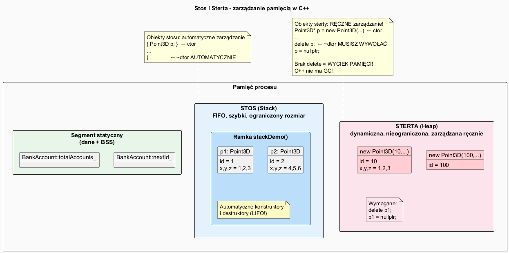

# Stos i Sterta – Zarządzanie Pamięcią w C++ (Brak GC)

## Slajd 1: C++ nie ma Garbage Collectora!

W językach takich jak Java, Python, C# **Garbage Collector** automatycznie zwalnia nieużywaną pamięć.

**C++ nie ma GC!** Programista jest odpowiedzialny za każdą alokowaną pamięć:

```
Java/Python/C#:    new Foo() → GC zwolni kiedy niepotrzebne
C++:               new Foo() → TY musisz wywołać delete!
```

W zamian C++ daje pełną kontrolę i przewidywalną wydajność.

---

## Slajd 2: Stos (Stack) – automatyczna pamięć

**Stos (stack)** to obszar pamięci zarządzany automatycznie przez kompilator:

```cpp
void example() {
    int    x = 42;                // na stosie
    double d = 3.14;              // na stosie
    Point3D p(1, 1.0, 2.0, 3.0); // na stosie

    {
        Point3D inner(2, 4.0, 5.0, 6.0);  // na stosie (wewnętrzny blok)
    }   // ← ~dtor inner: AUTOMATYCZNIE

    // p nadal żyje
}   // ← ~dtor p, x, d: AUTOMATYCZNIE (LIFO)
```

Cechy stosu:
- Szybka alokacja – inkrementacja wskaźnika stosu
- Ograniczony rozmiar (domyślnie ~1–8 MB)
- Obiekty żyją **do końca bloku** w którym powstały
- Destruktory wywoływane **automatycznie** (LIFO)

---

## Slajd 3: Sterta (Heap) – dynamiczna pamięć

**Sterta (heap)** to duży obszar pamięci zarządzany przez `new`/`delete`:

```cpp
// Alokacja – konstruktor wywołany
Point3D* p = new Point3D(10, 1.0, 2.0, 3.0);

// Użycie przez wskaźnik
p->x = 99.0;
std::cout << p->toString() << "\n";

// OBOWIĄZKOWE zwolnienie – destruktor wywołany
delete p;
p = nullptr;   // dobra praktyka: usuń dangling pointer
```

Cechy sterty:
- Duży rozmiar (ograniczony przez RAM + swap)
- Obiekt żyje **do wywołania `delete`** lub końca programu
- Destruktor wywołany **tylko przez `delete`**
- Bez `delete` → **wyciek pamięci!**

---

## Slajd 4: Tablice dynamiczne

```cpp
// Alokacja tablicy
const int N = 5;
int* arr = new int[N];          // alokacja N intów
Point3D* pts = new Point3D[N];  // NxPoint3D – ctor dla każdego!

// Użycie
for (int i = 0; i < N; ++i)
    arr[i] = i * 2;

// Zwolnienie – WAŻNE: delete[] (z nawiasami!) dla tablic
delete[] arr;     // ✅ zwolnij tablicę
delete[] pts;     // ✅ destruktor dla każdego elementu!

// delete arr;    // ❌ BŁĄD: dla tablicy musi być delete[]!
```

---

## Slajd 5: Wyciek pamięci (Memory Leak)

```cpp
void badFunction() {
    Point3D* p = new Point3D(99);  // alokacja
    // ... jakaś praca ...
    // Brak delete p; → WYCIEK PAMIĘCI!
}   // p (wskaźnik stos) zniszczony, ale obiekt na stercie pozostaje!

// Efekt po wielu wywołaniach:
for (int i = 0; i < 1000000; ++i)
    badFunction();    // → program zjada coraz więcej RAM!
```

Wyciek pamięci w C++:
- Nie powoduje natychmiastowego błędu
- Program działa wolniej, zużywa więcej RAM
- Może zakończyć program przez `std::bad_alloc`
- **Valgrind** / **AddressSanitizer** wykrywają wycieki

---

## Slajd 6: RAII – idiom bezpiecznego zarządzania

**RAII** (Resource Acquisition Is Initialization) – zasada C++:

> Zasób jest przydzielany w konstruktorze, zwalniany w destruktorze.

```cpp
class ResourceSafeDemo {
    int* data_;
public:
    // Alokacja W KONSTRUKTORZE
    ResourceSafeDemo(int size) : data_(new int[size]) {}

    // Zwolnienie W DESTRUKTORZE – automatyczne, zawsze!
    ~ResourceSafeDemo() { delete[] data_; }
};

{
    ResourceSafeDemo safe(1000);   // ctor: alokacja
    // ... używaj ...
}   // ← dtor: zwolnienie AUTOMATYCZNIE (nawet przy wyjątku!)
```

---

## Slajd 7: Smart Pointers (C++11) – RAII gotowe rozwiązania

```cpp
// unique_ptr – jeden właściciel, automatyczne delete
{
    auto p = std::make_unique<Point3D>(20, 5.0, 6.0, 7.0);
    std::cout << p->toString() << "\n";
}   // ← delete automatycznie!

// shared_ptr – współdzielona własność
auto sp1 = std::make_shared<Point3D>(21, 8.0, 9.0, 10.0);
auto sp2 = sp1;   // refcount = 2
// delete gdy ostatni shared_ptr wyjdzie ze scope
```

| Smart pointer  | Własność         | Kiedy używać                        |
|----------------|------------------|--------------------------------------|
| `unique_ptr`   | wyłączna         | domyślnie – jeden właściciel        |
| `shared_ptr`   | współdzielona    | wiele właścicieli                   |
| `weak_ptr`     | brak (obserwator)| unikanie cykli w shared_ptr         |

**Zasada:** Preferuj smart pointery nad gołymi `new`/`delete`!

---

## Slajd 8: Porównanie – stos vs. sterta

| Cecha               | Stos                        | Sterta                        |
|---------------------|-----------------------------|-------------------------------|
| Alokacja            | Automatyczna (bp + offset)  | `new`/`malloc`                |
| Zwolnienie          | Automatyczne (koniec bloku) | `delete`/`free` – RĘCZNIE    |
| Rozmiar             | Mały (~1-8 MB)              | Duży (RAM + swap)             |
| Szybkość            | Bardzo szybka               | Wolniejsza (zarządzanie)      |
| Czas życia          | Zakres bloku                | Do `delete` lub końca programu|
| Wyciek pamięci      | Niemożliwy                  | Możliwy (brak delete)         |
| Obiekt polimorficzny| Utrudniony                  | Naturalny (przez wskaźnik)    |

---

## Slajd 9: Diagram pamięci



```
┌──────────────────────────────────────────────────────────────┐
│                      PAMIĘĆ PROCESU                          │
├──────────────────┬───────────────────┬────────────────────── │
│     STOS         │     STERTA        │  SEGMENT STATYCZNY    │
│  (automatyczny)  │  (ręczny)         │  (zmienne statyczne)  │
│                  │                   │                        │
│ Point3D p1       │ Point3D* hp1 ──►  │ BankAccount::nextId_  │
│ Point3D p2       │ Point3D[3]   ──►  │ BankAccount::rate_    │
│ int x            │                   │                        │
│ [destruktory     │ [delete!          │                        │
│  auto przy LIFO] │  obowiązkowe]     │                        │
└──────────────────┴───────────────────┴────────────────────── ┘
```

---

## Slajd 10: Demonstracja kodu

Plik: [`src/main.cpp`](src/main.cpp)

```cpp
// Stos – automatyczne zarządzanie
void stackDemo() {
    Point3D p1(1, 1.0, 2.0, 3.0);   // ctor auto
    {
        Point3D p2(2, 4.0, 5.0, 6.0);
    }   // ← ~p2 automatycznie
}   // ← ~p1 automatycznie

// Sterta – ręczne zarządzanie
void heapDemo() {
    Point3D* p = new Point3D(10, 1.0, 2.0, 3.0);
    delete p;    // ← OBOWIĄZKOWE!
    p = nullptr; // ← zabezpieczenie

    int* arr = new int[5];
    delete[] arr;  // ← delete[] dla tablic!
}
```

---

## Slajd 11: Kompilacja i uruchomienie

```bash
g++ -std=c++17 -o memory src/main.cpp
./memory
```

Dla wykrycia wycieków (Linux):
```bash
g++ -std=c++17 -g -fsanitize=address -o memory src/main.cpp
./memory
```

---

## Podsumowanie

| Pojęcie              | Opis                                                   |
|----------------------|--------------------------------------------------------|
| Stos (stack)         | Automatyczna pamięć lokalna, szybka, ograniczona       |
| Sterta (heap)        | Dynamiczna pamięć, `new`/`delete`, duża               |
| `new`/`delete`       | Alokacja i zwalnianie na stercie                       |
| `new[]`/`delete[]`   | Tablice na stercie                                     |
| Memory leak          | Brak `delete` → wyciek pamięci                        |
| RAII                 | Zasoby zarządzane przez konstruktor/destruktor         |
| Smart pointers       | `unique_ptr`, `shared_ptr` – automatyczne zarządzanie |
| Brak GC              | C++ wymaga ręcznego zarządzania lub RAII               |

---

## Dobre praktyki, antywzorce i zastosowania

- Dobra praktyka: preferuj obiekty na stosie i RAII, a `new/delete` stosuj tylko gdy to konieczne.
- Dobra praktyka: dla dynamicznej pamieci wybieraj `std::unique_ptr` jako domyslna opcje.
- Dobra praktyka: zawsze paruj `new[]` z `delete[]` i `new` z `delete`.
- Antywzorzec: surowe wskazniki jako wlasciciele zasobow bez jasnej odpowiedzialnosci za zwolnienie.
- Antywzorzec: "zapomniane" `delete`, ktore powoduje ciche wycieki i degradacje wydajnosci.
- Zastosowanie: systemy embedded, silniki gier, komponenty czasu rzeczywistego i biblioteki C++.
- Zastosowanie: swiadome zarzadzanie pamiecia w kodzie wydajnosciowym i niskopoziomowym.

## Pliki źródłowe

| Plik                                  | Opis                              |
|---------------------------------------|-----------------------------------|
| [`src/MemoryDemo.h`](src/MemoryDemo.h) | Klasy do demonstracji pamięci    |
| [`src/main.cpp`](src/main.cpp)        | Demonstracja stosu i sterty       |
| [`memory_diagram.puml`](memory_diagram.puml) | Diagram UML              |
