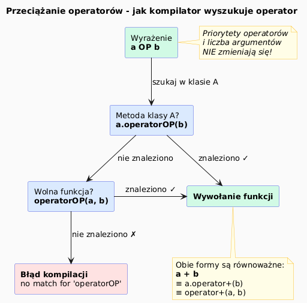

# Przeciążanie Operatorów – Wprowadzenie

## Slajd 1: Problem – czym różni się kod czytelny od nieczytelnego?

Rozważmy dodawanie dwóch wektorów matematycznych **bez** i **z** przeciążeniem operatorów:

```cpp
// BEZ przeciążenia – wywołujemy metody wprost
Vec2D v3 = v1.add(v2.scale(2.0)).subtract(v4);

// Z przeciążeniem – zapis zbliżony do matematyki
Vec2D v3 = v1 + v2 * 2.0 - v4;
```

Oba fragmenty robią dokładnie to samo. Drugi jest znacznie bardziej czytelny.

> **Przeciążanie operatorów** pozwala definiować znaczenie operatorów (`+`, `-`, `*`, `<<`, itd.)
> dla własnych typów (klas i struktur), tak by kod wyglądał naturalnie.

---

## Slajd 2: Idea – operator jako ukryta funkcja

W C++ każde wyrażenie z operatorem jest tłumaczone przez kompilator na **wywołanie funkcji**:

```
Zapis skrócony          Rzeczywiste wywołanie
─────────────────────   ──────────────────────────────
a + b                →  a.operator+(b)          (metoda)
a + b                →  operator+(a, b)         (wolna funkcja)
a += b               →  a.operator+=(b)
++a                  →  a.operator++()          (prefix)
a++                  →  a.operator++(0)         (postfix, int dummy)
cout << a            →  operator<<(cout, a)     (wolna funkcja)
```

Operator to **zwykła funkcja z wyjątkową nazwą**: `operator+`, `operator<<`, `operator==` itd.

---

## Slajd 3: Mechanizm wewnętrzny (jak kompilator to widzi)

```cpp
class Vec2D {
public:
    Vec2D(double x, double y) : x_(x), y_(y) {}

    // Definiujemy operator+
    Vec2D operator+(const Vec2D& other) const {
        return Vec2D(x_ + other.x_, y_ + other.y_);
    }

private:
    double x_, y_;
};

Vec2D a(1.0, 2.0), b(3.0, 4.0);
Vec2D c = a + b;                  // kompilator zamienia na:
Vec2D c = a.operator+(b);         // → identyczne działanie
```

Kompilator najpierw szuka metody `operator+` w klasie lewego operandu,
a jeśli jej nie ma — szuka wolnej funkcji `operator+(Vec2D, Vec2D)`.

---

## Slajd 4: Po co to robimy? – motywacja

| Cel | Przykład |
|-----|---------|
| **Czytelność** – zapis matematyczny | `v1 + v2`, `m1 * m2`, `c1 - c2` |
| **Spójność** – własne typy zachowują się jak wbudowane | `int a = 1+2;` ↔ `Vec a = b+c;` |
| **Integracja ze standardową biblioteką** | `std::sort` wymaga `operator<`; `std::cout` wymaga `operator<<` |
| **Ekspresywność DSL** | Biblioteki jak Eigen, OpenCV, boost używają operatorów do zwięzłego zapisu |

> **Meyers (Effective C++, poz. 24):** Przeciążaj operatory wtedy, gdy ich znaczenie jest oczywiste
> i intuicyjne dla użytkownika klasy — nigdy dla „fajności".

---

## Slajd 5: Co NIE zmienia się przy przeciążaniu

Przeciążanie **nie** zmienia:
- **priorytetów operatorów** – `a + b * c` to zawsze `a + (b * c)`,
- **łączności** – `a + b + c` to zawsze `(a + b) + c`,
- **liczby argumentów** – operator binarny zawsze ma 2 argumenty,
- **znaczenia dla typów wbudowanych** – `int a = 1 + 2` jest niezmienne.

```cpp
// Priorytety działają tak samo dla obiektów, jak dla int:
Vec2D result = a + b * 2.0;      // najpierw b*2.0, potem a+...
```

---

## Slajd 6: Diagram – schemat wyszukiwania operatora



<!-- Wygeneruj PNG z PlantUML: plantuml intro_diagram.puml -->

```
Wyrażenie:   a OP b
                │
                ▼
   ┌─ Czy OP to metoda klasy A? ───── TAK ──► a.operatorOP(b)
   │
   └─ NIE
       │
       ▼
   ┌─ Czy istnieje wolna funkcja operatorOP(A,B)? ─ TAK ──► operatorOP(a, b)
   │
   └─ NIE ──► Błąd kompilacji:
              "no match for 'operator+' ..."
```

---

## Slajd 7: Pierwsza ilustracja – Vec2D z operatorami i bez

Plik: [`src/main.cpp`](src/main.cpp)

```cpp
// BEZ przeciążenia operatorów
struct VecBezOp {
    double x, y;
    VecBezOp add(const VecBezOp& o) const { return {x + o.x, y + o.y}; }
    bool equals(const VecBezOp& o) const  { return x == o.x && y == o.y; }
};

VecBezOp a(1.0, 2.0), b(3.0, 4.0);
VecBezOp c = a.add(b);                // ← nieeleganckie
if (a.equals(b)) { ... }              // ← nieeleganckie

// Z PRZECIĄŻENIEM operatorów
struct Vec {
    double x, y;
    Vec operator+(const Vec& o)   const { return {x + o.x, y + o.y}; }
    bool operator==(const Vec& o) const { return x == o.x && y == o.y; }
    friend std::ostream& operator<<(std::ostream& os, const Vec& v) {
        return os << "(" << v.x << ", " << v.y << ")";
    }
};

Vec u(1.0, 2.0), v(3.0, 4.0);
Vec w = u + v;                        // ← czytelne, naturalne
if (u == v) { ... }                   // ← intuicyjne
std::cout << w << "\n";               // ← integracja z iostream
```

---

## Slajd 8: Zasady ogólne przeciążania (wprowadzenie)

| Zasada | Opis |
|--------|------|
| **Nie zmieniaj semantyki** | `operator+` powinien dodawać, nie odejmować |
| **Spójność typów zwracanych** | `a + b` → nowy obiekt; `a += b` → referencja do `a` |
| **`const` dla operatorów czytających** | Operatory nie modyfikujące obiektu — `const` |
| **Nie przeciążaj dla zabawy** | Tylko gdy zapis jest naturalny i oczywisty |
| **Preferuj wolne funkcje** | Dla symetrycznych operatorów (`+`, `-`, `==`) |

Szczegółowe zasady omówione są w rozdziale [03 – Składnia i zasady](../03_syntax_and_rules/README.md).

---

## Slajd 9: Kompilacja i uruchomienie przykładu

```bash
# Windows (g++ z MSYS2/ucrt64)
g++ -std=c++17 -o intro src/main.cpp && ./intro
```

Oczekiwane wyjście:

```
=== Bez przeciążenia (metody) ===
a.add(b) = (4, 6)
a i b są różne

=== Z przeciążeniem (operatory) ===
u       = (1, 2)
v       = (3, 4)
u + v   = (4, 6)
v - u   = (2, 2)
u * 2.0 = (2, 4)
u == u  = true
u == v  = false

=== operator+ wywołany jawnie ===
u.operator+(v) = (4, 6)
```

---

## Podsumowanie

| Pojęcie | Znaczenie |
|---------|-----------|
| Przeciążanie operatora | Definiowanie funkcji `operatorX` dla własnego typu |
| Metoda składowa | `T T::operatorX(args)` – `this` = lewy operand |
| Wolna funkcja | `T operatorX(T lhs, T rhs)` – oba operandy jako parametry |
| `friend` | Pozwala wolnej funkcji na dostęp do prywatnych pól |

---

## Dobre praktyki i antywzorce

- **Dobra praktyka:** przeciążaj operatory tylko wtedy, gdy zapis jest intuicyjny (np. `+` dodaje, `==` porównuje).
- **Dobra praktyka:** zdefiniuj `operator!=` przez `operator==` (unikasz duplikacji kodu).
- **Antywzorzec:** `operator+` który drukuje na ekranie — operator powinien robić jedno: dodawać.
- **Antywzorzec:** pominięcie `const` w operatorach czytających — uniemożliwia użycie ze stałymi.

## Pliki źródłowe

| Plik | Opis |
|------|------|
| [`src/main.cpp`](src/main.cpp) | Porównanie kodu z operatorami i bez |
| [`intro_diagram.puml`](intro_diagram.puml) | Diagram wyszukiwania operatora |
