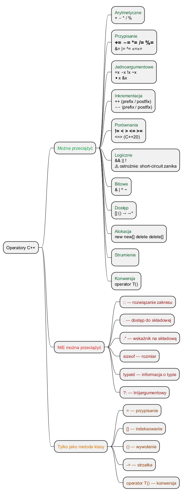

# Operatory w C++ – przegląd

## Slajd 1: Wszystkie operatory w C++

C++ definiuje następujące kategorie operatorów:

| Kategoria | Operatory |
|-----------|-----------|
| **Arytmetyczne** | `+` `-` `*` `/` `%` |
| **Przypisanie** | `=` `+=` `-=` `*=` `/=` `%=` `&=` `\|=` `^=` `<<=` `>>=` |
| **Jednoargumentowe** | `+x` `-x` `!x` `~x` `*x` `&x` `++x` `x++` `--x` `x--` |
| **Porównania** | `==` `!=` `<` `>` `<=` `>=` |
| **Logiczne** | `&&` `\|\|` `!` |
| **Bitowe** | `&` `\|` `^` `~` `<<` `>>` |
| **Dostęp** | `[]` `()` `->` `->*` `.` `.*` |
| **Alokacja** | `new` `new[]` `delete` `delete[]` |
| **Inne** | `?:` `,` `sizeof` `typeid` `static_cast` itd. |

---

## Slajd 2: Których operatorów NIE można przeciążyć?

Sześć operatorów jest **zarezerwowanych** – nie możemy ich przeciążyć:

| Operator | Nazwa | Powód zakazu |
|----------|-------|-------------|
| `::` | Rozwiązanie zakresu | Musi działać statycznie (w czasie kompilacji) |
| `.` | Dostęp do składowej | Zmieniałoby fundamentalne reguły dostępu do obiektów |
| `.*` | Wskaźnik na składową | Jak wyżej |
| `sizeof` | Rozmiar typu/obiektu | Wynik musi być znany w czasie kompilacji |
| `typeid` | Informacja o typie | Część RTTI, działa na typach, nie wartościach |
| `?:` | Operator trójargumentowy | Nieznana liczba argumentów + short-circuit eval |

> **C++20** dodał `<=>` (operator „statku kosmicznego") jako precedens porównania trójstronnego —
> i ten **można** przeciążyć.

---

## Slajd 3: Których operatorów NIE NALEŻY przeciążać?

Nie wszystkie przeciążalne operatory *warto* przeciążać. Szczególnie ostrożnie z:

### Operatory `&&` i `||`

```cpp
// Dla typów wbudowanych: short-circuit evaluation
bool wynik = (ptr != nullptr) && ptr->isValid();
//                              ↑ to NIE wykona się, gdy ptr==nullptr

// Po przeciążeniu: short-circuit ZANIKA!
// operator&&(lhs, rhs) jest zwykłą funkcją
// — obie strony zostaną obliczone PRZED wywołaniem
```

### Operator `,`

```cpp
// Wbudowany: sekwencja wyrażeń, wartość ostatniego
int x = (a++, b++, c);   // zdefiniowana kolejność

// Przeciążony: kolejność argumentów przy wywołaniu
// funkcji jest nieokreślona → nieprzewidywalne zachowanie
```

### Operator `&` (jednoargumentowy adres)

```cpp
// Zwraca adres obiektu — przeciążenie dezorientuje użytkowników
// Biblioteki takie jak boost::spirit to robią, ale to wyjątki
```

> **Meyers (Effective C++, poz. 23):** Nie przeciążaj `&&`, `||` ani `,`.

---

## Slajd 4: Które operatory zawsze muszą być metodami?

Pięć operatorów **musi** być zdefiniowanych jako **metody klasy** (nie wolne funkcje):

| Operator | Wymóg | Uzasadnienie |
|----------|-------|-------------|
| `=` | Metoda | Przypisanie modyfikuje lewy operand |
| `[]` | Metoda | Wymagany dostęp do stanu obiektu |
| `()` | Metoda | Wywołanie funkcji/funktoru |
| `->` | Metoda | Dostęp przez wskaźnik do składowej |
| (konwersja) `operator T()` | Metoda | Konwertuje `this` na inny typ |

---

## Slajd 5: Tabela – metoda vs. wolna funkcja

| Sytuacja | Zalecana forma |
|----------|----------------|
| Operator modyfikuje lewy operand (`+=`, `++`) | **Metoda** |
| Lewy operand może być typem wbudowanym (`2 * Wektor`) | **Wolna funkcja** |
| Operator symetryczny (`+`, `==`, `<`) | **Wolna funkcja** (lub metoda, ale wolna lepsza) |
| Operator `<<`, `>>` (strumień po lewej) | **Wolna funkcja** (obowiązkowo) |
| Operator `=`, `[]`, `()`, `->` | **Metoda** (obowiązkowo) |

---

## Slajd 6: Diagram – mapa operatorów



<!-- Wygeneruj PNG z PlantUML: plantuml operators_diagram.puml -->

```
Operatory C++
├── Można przeciążyć
│   ├── Arytmetyczne     + - * / %
│   ├── Porównania       == != < > <= >=   (C++20: <=>)
│   ├── Logiczne         && || !           (ostrożnie!)
│   ├── Bitowe           & | ^ ~ << >>
│   ├── Przypisanie      = += -= *= /= …
│   ├── Inkrementacja    ++ --
│   ├── Dostęp           [] () -> ->*
│   ├── Alokacja         new new[] delete delete[]
│   └── I/O              << >>
└── NIE można przeciążyć
    └── :: . .* sizeof typeid ?:
```

---

## Slajd 7: Przykład – wpływ na integrację z STL

```cpp
#include <vector>
#include <algorithm>

struct Temp { double val; bool operator<(const Temp& o) const { return val < o.val; } };

std::vector<Temp> v = { {37.5}, {36.6}, {38.2} };
std::sort(v.begin(), v.end());  // działa dzięki operator<
```

Bez `operator<` wywołanie `std::sort` skończy się **błędem kompilacji**.

Podobnie `std::map` i `std::set` wymagają `operator<`,
a `std::cout` – `operator<<`.

---

## Slajd 8: Przykład kodu demonstracyjnego

Plik: [`src/main.cpp`](src/main.cpp)

```cpp
#include <vector>
#include <algorithm>
#include <iostream>

struct Matrix2x2 {
    double a, b, c, d;
    Matrix2x2 operator+(const Matrix2x2& m) const {
        return {a+m.a, b+m.b, c+m.c, d+m.d};
    }
    Matrix2x2 operator*(const Matrix2x2& m) const {
        return { a*m.a+b*m.c, a*m.b+b*m.d,
                 c*m.a+d*m.c, c*m.b+d*m.d };
    }
    Matrix2x2 operator-() const { return {-a,-b,-c,-d}; }
    bool operator==(const Matrix2x2& m) const {
        return a==m.a && b==m.b && c==m.c && d==m.d;
    }
    friend std::ostream& operator<<(std::ostream& os, const Matrix2x2& m) {
        return os << "[" << m.a <<" "<< m.b <<" / "<< m.c <<" "<< m.d <<"]";
    }
};
```

---

## Podsumowanie

| Pytanie | Odpowiedź |
|---------|-----------|
| Ile operatorów można przeciążyć? | Prawie wszystkie – ok. 40 |
| Których NIE wolno? | `::` `.` `.*` `sizeof` `typeid` `?:` |
| Których NIE NALEŻY? | `&&` `\|\|` `,` (tracą ważne właściwości) |
| Które MUSZĄ być metodami? | `=` `[]` `()` `->` konwersje |

---

## Dobre praktyki i antywzorce

- **Dobra praktyka:** przeciążaj `<=>` w C++20 — kompilator automatycznie generuje wtedy `<`, `>`, `<=`, `>=`.
- **Dobra praktyka:** definiuj `operator<` jako wolną funkcję – ułatwia użycie z kontenerami STL.
- **Antywzorzec:** przeciążenie `operator&&` lub `operator||` – zanika short-circuit evaluation.
- **Antywzorzec:** klasa bez `operator<<` trudna do debugowania i testowania.

## Pliki źródłowe

| Plik | Opis |
|------|------|
| [`src/main.cpp`](src/main.cpp) | Demonstracja klasy Matrix2x2 z różnymi operatorami |
| [`operators_diagram.puml`](operators_diagram.puml) | Mapa operatorów w C++ |
