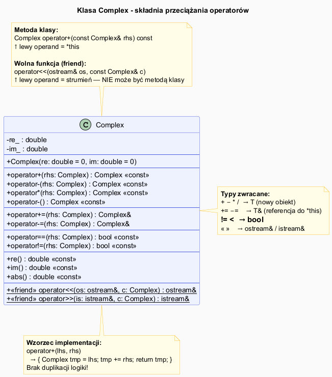

# Składnia i Zasady Przeciążania Operatorów

## Slajd 1: Dwie formy definicji operatora

Operator można zdefiniować na dwa sposoby:

### Forma 1: Metoda klasy (member function)

```cpp
class Complex {
public:
    // Lewy operand to zawsze *this
    Complex operator+(const Complex& rhs) const {
        return Complex(re_ + rhs.re_, im_ + rhs.im_);
    }
private:
    double re_, im_;
};

// Użycie:
Complex a(1, 2), b(3, 4);
Complex c = a + b;       // ≡ a.operator+(b)
```

### Forma 2: Wolna funkcja (free function)

```cpp
// Poza klasą – oba operandy jako parametry
Complex operator+(const Complex& lhs, const Complex& rhs) {
    return Complex(lhs.re() + rhs.re(), lhs.im() + rhs.im());
}

// Użycie:
Complex c = a + b;       // ≡ operator+(a, b)
```

---

## Slajd 2: Słowo kluczowe `friend` – dostęp do prywatnych pól

Gdy operator jest wolną funkcją ale potrzebuje dostępu do pól prywatnych:

```cpp
class Complex {
public:
    // Deklaracja friend WEWNĄTRZ klasy
    friend Complex operator+(const Complex& lhs, const Complex& rhs);
    friend std::ostream& operator<<(std::ostream& os, const Complex& c);

private:
    double re_, im_;   // ← prywatne pola
};

// Definicja POZA klasą – ma dostęp do prywatnych pól
Complex operator+(const Complex& lhs, const Complex& rhs) {
    return Complex(lhs.re_ + rhs.re_, lhs.im_ + rhs.im_); // re_, im_ prywatne
}
```

> **Uwaga:** `friend` to wyjątek od enkapsulacji. Używaj go oszczędnie,
> najczęściej tylko dla `operator<<` i `operator>>`.

---

## Slajd 3: Kiedy używać metody, a kiedy wolnej funkcji?

| Sytuacja | Forma | Przykład |
|----------|-------|---------|
| Operator modyfikuje obiekt | **Metoda** | `operator+=`, `operator++` |
| Operator MUSI być metodą | **Metoda** | `operator=`, `operator[]`, `operator()`, `operator->` |
| Lewy operand może być typem wbudowanym | **Wolna funkcja** | `2.0 * Wektor` |
| Operacja symetryczna (`a op b` = `b op a`) | **Wolna funkcja** | `operator+`, `operator==` |
| Strumienie `<<` i `>>` | **Wolna funkcja** | `ostream& operator<<(ostream&, ...)` |

**Reguła Meyersa** (Effective C++, poz. 24): Jeśli operator może być wolną funkcją — zrób go wolną funkcją.
Zwiększa to elastyczność przy konwersjach niejawnych.

```cpp
Complex c(3, 4);
// Metoda: 2.0 + c  →  (2.0).operator+(c)  → BŁĄD: double nie ma operator+(Complex)
// Wolna:  2.0 + c  →  operator+(2.0, c)   → OK: double konwertuje się na Complex(2.0, 0)
```

---

## Slajd 4: Typy zwracane – konwencja

| Kategoria operatora | Typ zwracany | Uzasadnienie |
|--------------------|--------------|-------------|
| Arytmetyczny (`+`, `-`, `*`, `/`) | `T` (przez wartość) | Nowy obiekt, oba operandy niezmienione |
| Porównanie (`==`, `!=`, `<`) | `bool` | Wartość logiczna |
| Przypisanie z działaniem (`+=`, `-=`) | `T&` (referencja do `*this`) | Umożliwia łańcuchowanie: `a += b += c` |
| Przypisanie (`=`) | `T&` (referencja do `*this`) | Umożliwia `a = b = c` |
| Jednoargumentowy prefix (`++a`) | `T&` (referencja do `*this`) | Modyfikuje i zwraca zmodyfikowany |
| Jednoargumentowy postfix (`a++`) | `T` (przez wartość) | Stary stan przed modyfikacją |
| Strumień (`<<`, `>>`) | `ostream&` / `istream&` | Umożliwia łańcuchowanie: `cout << a << b` |

---

## Slajd 5: const-correctness – dlaczego ważne

```cpp
class Complex {
public:
    // Operator NIE modyfikuje *this → const
    Complex operator+(const Complex& rhs) const { ... }

    // Operator MODYFIKUJE *this → NIE const
    Complex& operator+=(const Complex& rhs) {
        re_ += rhs.re_;
        im_ += rhs.im_;
        return *this;
    }
};

const Complex c1(1, 2);
Complex c2(3, 4);

Complex sum = c1 + c2;    // OK – operator+ jest const, może być wywołany na stałej
// c1 += c2;              // BŁĄD KOMPILACJI – operator+= nie jest const
```

> **Zasada:** Każdy operator, który nie modyfikuje lewego operandu, powinien być `const`.

---

## Slajd 6: Związek między operatorami – implementacja przez delegację

Dobra praktyka: definiuj `operator@=` jako metodę, a `operator@` przez delegację:

```cpp
class Complex {
public:
    // 1. Podstawowy — modyfikuje obiekt
    Complex& operator+=(const Complex& rhs) {
        re_ += rhs.re_;
        im_ += rhs.im_;
        return *this;
    }
    // 2. Pochodny — tworzy kopię i deleguje do +=
    friend Complex operator+(Complex lhs, const Complex& rhs) {
        return lhs += rhs;   // lhs to kopia lewego operandu
    }
};
```

Zalety tego wzorca:
- brak duplikacji logiki,
- kompilator może użyć copy-elision (NRVO),
- spójność między `a + b` a `a += b`.

---

## Slajd 7: Diagram klas – Complex



<!-- Wygeneruj PNG z PlantUML: plantuml syntax_diagram.puml -->

```
Complex
──────────────────────────────────────────
- re_ : double
- im_ : double
──────────────────────────────────────────
+ Complex(re=0, im=0)
──────────────────────────────────────────
+ operator+(rhs: Complex) : Complex [const]
+ operator-(rhs: Complex) : Complex [const]
+ operator*(rhs: Complex) : Complex [const]
+ operator-()             : Complex [const]   ← jednoargumentowy
+ operator+=(rhs: Complex) : Complex&
+ operator-=(rhs: Complex) : Complex&
+ operator==(rhs: Complex) : bool   [const]
+ operator!=(rhs: Complex) : bool   [const]
+ abs()                   : double  [const]
+ re()                    : double  [const]
+ im()                    : double  [const]
──────────────────────────────────────────
<<friend>> operator<<(os, c) : ostream&
<<friend>> operator>>(is, c) : istream&
```

---

## Slajd 8: Pełny kod – klasa Complex

Plik: [`src/Complex.h`](src/Complex.h)

```cpp
class Complex {
public:
    Complex(double re = 0.0, double im = 0.0) : re_(re), im_(im) {}

    Complex operator+(const Complex& o) const { return {re_ + o.re_, im_ + o.im_}; }
    Complex operator-(const Complex& o) const { return {re_ - o.re_, im_ - o.im_}; }
    Complex operator*(const Complex& o) const {
        return { re_*o.re_ - im_*o.im_,
                 re_*o.im_ + im_*o.re_ };
    }
    Complex operator-() const { return {-re_, -im_}; }

    Complex& operator+=(const Complex& o) {
        re_ += o.re_; im_ += o.im_; return *this;
    }
    Complex& operator-=(const Complex& o) {
        re_ -= o.re_; im_ -= o.im_; return *this;
    }

    bool operator==(const Complex& o) const { return re_ == o.re_ && im_ == o.im_; }
    bool operator!=(const Complex& o) const { return !(*this == o); }

    double re()  const { return re_; }
    double im()  const { return im_; }
    double abs() const { return std::sqrt(re_ * re_ + im_ * im_); }

    friend std::ostream& operator<<(std::ostream& os, const Complex& c);
    friend std::istream& operator>>(std::istream& is, Complex& c);

private:
    double re_, im_;
};
```

---

## Slajd 9: Program demonstracyjny

Plik: [`src/main.cpp`](src/main.cpp)

```cpp
#include "Complex.h"

int main() {
    Complex c1(3.0, 4.0), c2(1.0, -2.0);
    std::cout << "c1     = " << c1       << "\n";  // 3 + 4i
    std::cout << "c2     = " << c2       << "\n";  // 1 - 2i
    std::cout << "c1+c2  = " << (c1+c2) << "\n";  // 4 + 2i
    std::cout << "c1-c2  = " << (c1-c2) << "\n";  // 2 + 6i
    std::cout << "c1*c2  = " << (c1*c2) << "\n";  // 11 + -2i
    std::cout << "-c1    = " << (-c1)   << "\n";  // -3 + -4i
    std::cout << "|c1|   = " << c1.abs()<< "\n";  // 5

    c1 += c2;
    std::cout << "c1+=c2 = " << c1 << "\n";

    Complex c3;
    std::cout << "Podaj liczbę zespoloną (Re Im): ";
    std::cin >> c3;
    std::cout << "Podano: " << c3 << "\n";
}
```

---

## Kompilacja

```bash
g++ -std=c++17 -o complex src/main.cpp && ./complex
```

---

## Podsumowanie

| Pojęcie | Opis |
|---------|------|
| Metoda klasy | `T T::operatorX(…) const` – `this` = lewy operand |
| Wolna funkcja | `T operatorX(T lhs, T rhs)` – oba operandy jako argumenty |
| `friend` | Pozwala wolnej funkcji dostęp do prywatnych pól |
| Typ zwracany | Wartość dla arytmetyki; `T&` dla przypisania; `bool` dla porównań |
| `const` | Obowiązkowe dla operatorów niemodfykujących obiektu |

---

## Dobre praktyki i antywzorce

- **Dobra praktyka:** implementuj `operator@` przez `operator@=` (unikasz duplikacji kodu).
- **Dobra praktyka:** operatory symetryczne (`+`, `==`) jako wolne funkcje – symetria konwersji.
- **Antywzorzec:** pominięcie `const` na operatorach czytających – uniemożliwia użycie ze stałymi.
- **Antywzorzec:** zwracanie referencji z `operator+` – prowadzi do dangling reference.

## Pliki źródłowe

| Plik | Opis |
|------|------|
| [`src/Complex.h`](src/Complex.h) | Klasa `Complex` – pełna implementacja |
| [`src/main.cpp`](src/main.cpp) | Program demonstracyjny |
| [`syntax_diagram.puml`](syntax_diagram.puml) | Diagram UML klasy Complex |
