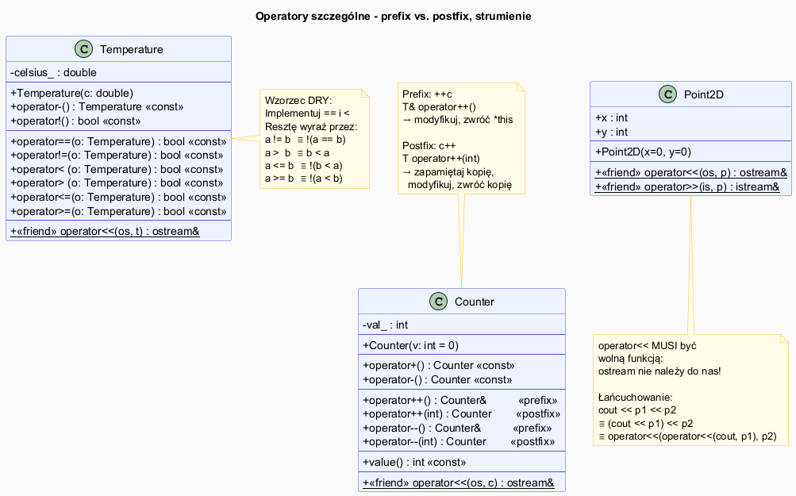

# Przypadki Szczególne Przeciążania Operatorów

## Slajd 1: Operatory jednoargumentowe (unarne)

Operatory jednoargumentowe przyjmują **jeden argumentów** – bieżący obiekt (`this`).

```cpp
class Temperature {
    double celsius_;
public:
    explicit Temperature(double c) : celsius_(c) {}

    // Negacja – zwróć przeciwną temperaturę (różnicę od zera)
    Temperature operator-() const { return Temperature(-celsius_); }

    // Jednoargumentowy + – zwróć kopię
    Temperature operator+() const { return *this; }

    // Operator logiczny NOT – czy temperatura jest zerowa?
    bool operator!() const { return celsius_ == 0.0; }

    double value() const { return celsius_; }
};

Temperature t(36.6);
Temperature neg = -t;    // ≡ t.operator-()  → -36.6
bool zero = !t;          // ≡ t.operator!()  → false
```

---

## Slajd 2: Inkrementacja i dekrementacja – prefix vs. postfix

To najczęstszy przypadek szczególny. Oba operatory `++` mają **tę samą nazwę** – C++ rozróżnia je
przez fikcyjny parametr `int` w wersji postfixowej:

```
Forma    Sygnatura                         Opis
──────── ─────────────────────────────── ──────────────────────────
++obj    T& T::operator++()               prefix – modyfikuje i zwraca *this
obj++    T  T::operator++(int)            postfix – zapamiętuje stary stan
```

---

## Slajd 3: Implementacja prefix ++

```cpp
class Counter {
    int val_;
public:
    explicit Counter(int v = 0) : val_(v) {}

    // ── PREFIX ++c ──────────────────────────────────────────
    // 1. Inkrementuj
    // 2. Zwróć NOWY stan przez referencję
    Counter& operator++() {
        ++val_;
        return *this;
    }

    // ── PREFIX --c ──────────────────────────────────────────
    Counter& operator--() {
        --val_;
        return *this;
    }
};

Counter c(5);
Counter& ref = ++c;    // c.val_ = 6, ref odnosi się do c
std::cout << ref.value();   // 6
```

---

## Slajd 4: Implementacja postfix ++

```cpp
// ── POSTFIX c++ ──────────────────────────────────────────
// Parametr int jest "manekinem" – kompilator przekazuje 0
// Służy tylko do odróżnienia od wersji prefix.
// 1. ZAPAMIĘTAJ stary stan w kopii
// 2. Inkrementuj *this
// 3. Zwróć KOPIĘ starego stanu (PRZEZ WARTOŚĆ, nie referencję!)
Counter operator++(int) {
    Counter old = *this;   // kopia przed inkrementacją
    ++val_;                // modyfikacja *this
    return old;            // zwrot starego stanu
}

Counter c(5);
Counter old = c++;    // old.val_=5, c.val_=6
std::cout << old.value();  // 5  ← stary stan
std::cout << c.value();    // 6  ← nowy stan
```

> **Wydajność:** Postfix kopiuje obiekt — dla złożonych klas preferuj prefix `++c`.
> `for (auto it = v.begin(); it != v.end(); ++it)` – zawsze prefix!

---

## Slajd 5: Diagram – prefix vs. postfix



<!-- Wygeneruj PNG z PlantUML: plantuml special_diagram.puml -->

```
Wywołanie    Sygnatura               Działanie
──────────── ─────────────────────── ─────────────────────────────
  ++c         operator++()            modyfikuj c, zwróć referencję
  c++         operator++(int/*=0*/)   kopia → modyfikuj c → zwróć kopię
  --c         operator--()            modyfikuj c, zwróć referencję
  c--         operator--(int/*=0*/)   kopia → modyfikuj c → zwróć kopię
```

---

## Slajd 6: Operatory porównania

Zasada DRY: zaimplementuj `==` i `<`, resztę wyraź przez nie:

```cpp
class Temperature {
    double celsius_;
public:
    bool operator==(const Temperature& o) const { return celsius_ == o.celsius_; }
    bool operator!=(const Temperature& o) const { return !(*this == o); }

    bool operator< (const Temperature& o) const { return celsius_ < o.celsius_; }
    bool operator> (const Temperature& o) const { return o < *this; }    // odwrócenie
    bool operator<=(const Temperature& o) const { return !(o < *this); } // negacja odwrócenia
    bool operator>=(const Temperature& o) const { return !(*this < o); }
};
```

> **C++20:** Zdefiniuj tylko `operator<=>` (operator „statku kosmicznego"),
> a kompilator sam wygeneruje wszystkie 6 operatorów porównania.

```cpp
// C++20 – auto generuje ==, !=, <, >, <=, >=
auto operator<=>(const Temperature& o) const = default;
```

---

## Slajd 7: Operatory wejścia i wyjścia `<<` i `>>`

`operator<<` i `operator>>` **MUSZĄ** być wolnymi funkcjami, ponieważ:
- lewy operand to `std::ostream` / `std::istream` (klasa biblioteczna, której nie możemy zmodyfikować),
- nie możemy dodać metody do cudzej klasy.

```cpp
// Tylko jako wolna funkcja (ewentualnie friend):
std::ostream& operator<<(std::ostream& os, const Point2D& p) {
    return os << "(" << p.x << ", " << p.y << ")";
}
// ↑ Typ zwracany: ostream& umożliwia łańcuchowanie:
// cout << p1 << " i " << p2 << "\n";
// ≡ (((cout << p1) << " i ") << p2) << "\n";

std::istream& operator>>(std::istream& is, Point2D& p) {
    return is >> p.x >> p.y;  // p musi być NON-const
}
```

---

## Slajd 8: Pełny przykład – Counter, Temperature, Point2D

Plik: [`src/main.cpp`](src/main.cpp)

```cpp
Counter c(5);
std::cout << "++c = " << ++c << "\n";   // 6 – nowy stan
std::cout << "c++ = " << c++ << "\n";  // 6 – stary stan (c staje się 7)
std::cout << "c   = " << c   << "\n";  // 7

Temperature t1(20.0), t2(37.0);
std::cout << (t1 < t2) << "\n";    // true
std::cout << (t2 > t1) << "\n";    // true

Point2D p;
std::cin >> p;                  // czytaj x i y ze strumienia
std::cout << p << "\n";        // wypisz (x, y)
```

---

## Slajd 9: Kompilacja

```bash
g++ -std=c++17 -o special src/main.cpp && ./special
```

---

## Podsumowanie

| Operator | Sygnatura | Zwraca |
|----------|-----------|--------|
| Prefix `++` | `T& operator++()` | Referencja do `*this` |
| Postfix `++` | `T operator++(int)` | Kopia stanu PRZED inkrementacją |
| Porównanie `==` | `bool operator==(const T&) const` | `bool` |
| `<` | `bool operator<(const T&) const` | `bool` |
| `<<` | `ostream& operator<<(ostream&, const T&)` | `ostream&` (wolna funkcja) |
| `>>` | `istream& operator>>(istream&, T&)` | `istream&` (wolna funkcja) |

---

## Dobre praktyki i antywzorce

- **Dobra praktyka:** Preferuj `++it` zamiast `it++` w pętlach – unikasz kopiowania.
- **Dobra praktyka:** `operator!=` implementuj przez `!operator==`, `operator>` przez odwrócone `<`.
- **Dobra praktyka:** `operator<<` zawsze przez referencję do strumienia, żeby móc łańcuchować.
- **Antywzorzec:** Zwracanie referencji z postfix `++` – prowadzi do dangling reference!
- **Antywzorzec:** `operator>>` z parametrem `const T&` zamiast `T&` – nie można zapisać wczytanej wartości.

## Pliki źródłowe

| Plik | Opis |
|------|------|
| [`src/main.cpp`](src/main.cpp) | Counter, Temperature, Point2D z pełnym zestawem operatorów |
| [`special_diagram.puml`](special_diagram.puml) | Diagram prefix vs. postfix |
