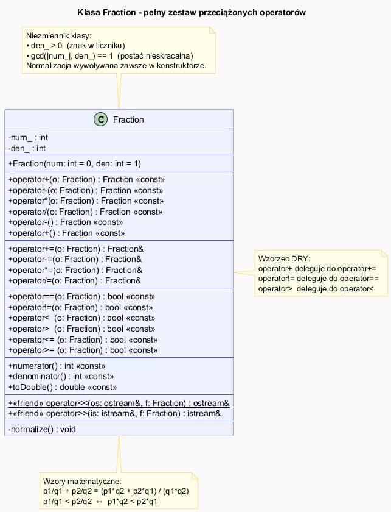

# Przykłady Przeciążania Operatorów – Klasa `Fraction`

## Slajd 1: Projekt klasy `Fraction`

`Fraction` reprezentuje **ułamek zwykły** $\frac{p}{q}$. Jest to klasyczny przykład klasy, która
naturalnie „domaga się" kompletnego zestawu operatorów matematycznych.

Wymagania:
- Arytmetyka: `+`, `-`, `*`, `/`, `+=`, `-=`, `*=`, `/=`
- Operacje jednoargumentowe: `-f`, `+f`
- Porównania: `==`, `!=`, `<`, `>`, `<=`, `>=`
- Wejście/wyjście: `<<`, `>>`
- Redukcja do postaci nieskracalnej (NWD)

```
Fraction(3, 6)  →  przechowywane jako  1/2   (normalizacja)
Fraction(1,-2)  →  przechowywane jako -1/2   (ujemny licznik)
```

---

## Slajd 2: Normalizacja ułamka

Każdy ułamek jest **automatycznie redukowany** do postaci nieskracalnej przy konstruowaniu:

```cpp
void normalize() {
    // 1. Przenies znak do licznika
    if (den_ < 0) { num_ = -num_; den_ = -den_; }

    // 2. Podziel przez NWD (std::gcd z <numeric>, C++17)
    int g = std::gcd(std::abs(num_), den_);
    num_ /= g;
    den_ /= g;
}

// Wywołanie w konstruktorze:
Fraction(3, 6)  → normalize() → num_=1, den_=2  (1/2)
Fraction(4, -8) → normalize() → num_=-1, den_=2 (-1/2)
```

`std::gcd` jest dostępne w `<numeric>` od C++17.

---

## Slajd 3: Arytmetyka ułamków – wzory matematyczne

$$\frac{p_1}{q_1} + \frac{p_2}{q_2} = \frac{p_1 q_2 + p_2 q_1}{q_1 q_2}$$

$$\frac{p_1}{q_1} - \frac{p_2}{q_2} = \frac{p_1 q_2 - p_2 q_1}{q_1 q_2}$$

$$\frac{p_1}{q_1} \cdot \frac{p_2}{q_2} = \frac{p_1 p_2}{q_1 q_2}$$

$$\frac{p_1}{q_1} \div \frac{p_2}{q_2} = \frac{p_1 q_2}{q_1 p_2}$$

Implementacja:

```cpp
Fraction operator+(const Fraction& o) const {
    return Fraction(num_ * o.den_ + o.num_ * den_,  den_ * o.den_);
}
Fraction operator-(const Fraction& o) const {
    return Fraction(num_ * o.den_ - o.num_ * den_,  den_ * o.den_);
}
Fraction operator*(const Fraction& o) const {
    return Fraction(num_ * o.num_,  den_ * o.den_);
}
Fraction operator/(const Fraction& o) const {
    return Fraction(num_ * o.den_,  den_ * o.num_);
}
```

Konstruktor automatycznie redukuje wynik przez `normalize()`.

---

## Slajd 4: Operatory przypisania z działaniem

Wzorzec delegacji do operatora arytmetycznego:

```cpp
Fraction& operator+=(const Fraction& o) {
    *this = *this + o;   // użyj zdefiniowanego operator+
    return *this;
}
// Analogicznie: -=, *=, /=
```

Łańcuchowanie:

```cpp
Fraction a(1, 2), b(1, 3), c(1, 6);
a += b += c;    // najpierw b += 1/6 → b = 1/2, potem a += 1/2 → a = 1
```

---

## Slajd 5: Porównania ułamków

Dwa ułamki $\frac{p_1}{q_1}$ i $\frac{p_2}{q_2}$ porównujemy przez **sprowadzenie do wspólnego mianownika**:

$$\frac{p_1}{q_1} < \frac{p_2}{q_2} \iff p_1 q_2 < p_2 q_1$$

```cpp
bool operator==(const Fraction& o) const {
    // Po normalizacji wystarczy porównanie pól
    return num_ == o.num_ && den_ == o.den_;
}
bool operator< (const Fraction& o) const {
    return num_ * o.den_ < o.num_ * den_;
}
// Reszta przez delegację:
bool operator!=(const Fraction& o) const { return !(*this == o); }
bool operator> (const Fraction& o) const { return o < *this; }
bool operator<=(const Fraction& o) const { return !(o < *this); }
bool operator>=(const Fraction& o) const { return !(*this < o); }
```

---

## Slajd 6: Diagram klasy Fraction



<!-- Wygeneruj PNG z PlantUML: plantuml examples_diagram.puml -->

```
Fraction
──────────────────────────────────────────────
- num_ : int    (licznik)
- den_ : int    (mianownik, zawsze > 0)
──────────────────────────────────────────────
+ Fraction(num=0, den=1)
──────────────────────────────────────────────
+ operator+(o: Fraction) : Fraction [const]
+ operator-(o: Fraction) : Fraction [const]
+ operator*(o: Fraction) : Fraction [const]
+ operator/(o: Fraction) : Fraction [const]
+ operator-() : Fraction [const]
──────────────────────────────────────────────
+ operator+=(o: Fraction) : Fraction&
+ operator-=(o: Fraction) : Fraction&
+ operator*=(o: Fraction) : Fraction&
+ operator/=(o: Fraction) : Fraction&
──────────────────────────────────────────────
+ operator==(o: Fraction) : bool [const]
+ operator!=(o: Fraction) : bool [const]
+ operator< (o: Fraction) : bool [const]
+ operator> (o: Fraction) : bool [const]
+ operator<=(o: Fraction) : bool [const]
+ operator>=(o: Fraction) : bool [const]
──────────────────────────────────────────────
+ numerator()   : int   [const]
+ denominator() : int   [const]
+ toDouble()    : double [const]
──────────────────────────────────────────────
<<friend>> operator<<(os, f) : ostream&
<<friend>> operator>>(is, f) : istream&
```

---

## Slajd 7: Pełny kod – nagłówek Fraction.h

Plik: [`src/Fraction.h`](src/Fraction.h)

```cpp
#include <numeric>  // std::gcd (C++17)
#include <stdexcept>

class Fraction {
public:
    Fraction(int num = 0, int den = 1) : num_(num), den_(den) {
        if (den_ == 0)
            throw std::invalid_argument("Mianownik nie może być zerem!");
        normalize();
    }

    Fraction operator+(const Fraction& o) const {
        return Fraction(num_ * o.den_ + o.num_ * den_, den_ * o.den_);
    }
    Fraction operator/(const Fraction& o) const {
        if (o.num_ == 0)
            throw std::domain_error("Dzielenie przez zero!");
        return Fraction(num_ * o.den_, den_ * o.num_);
    }
    // ... (pozostałe operatory)

    friend std::ostream& operator<<(std::ostream& os, const Fraction& f) {
        return (f.den_ == 1) ? os << f.num_ : os << f.num_ << "/" << f.den_;
    }

private:
    int num_, den_;
    void normalize() {
        if (den_ < 0) { num_ = -num_; den_ = -den_; }
        int g = std::gcd(std::abs(num_), den_);
        num_ /= g; den_ /= g;
    }
};
```

---

## Slajd 8: Program demonstracyjny

Plik: [`src/main.cpp`](src/main.cpp)

```cpp
#include "Fraction.h"

int main() {
    Fraction a(1, 2), b(1, 3);
    std::cout << "a = " << a << "\n";         // 1/2
    std::cout << "b = " << b << "\n";         // 1/3
    std::cout << "a + b = " << (a + b) << "\n";  // 5/6
    std::cout << "a - b = " << (a - b) << "\n";  // 1/6
    std::cout << "a * b = " << (a * b) << "\n";  // 1/6
    std::cout << "a / b = " << (a / b) << "\n";  // 3/2

    Fraction c(3, 4);
    c += a;
    std::cout << "c(3/4) += a: " << c << "\n";  // 5/4

    std::cout << std::boolalpha;
    std::cout << "1/2 == 2/4: " << (Fraction(1,2) == Fraction(2,4)) << "\n"; // true
    std::cout << "1/3 < 1/2:  " << (b < a)  << "\n";   // true
    std::cout << "1/2 > 1/3:  " << (a > b)  << "\n";   // true
}
```

---

## Slajd 9: Kompilacja

```bash
g++ -std=c++17 -o fraction src/main.cpp && ./fraction
```

Oczekiwane wyjście:
```
a = 1/2
b = 1/3
a + b = 5/6
a - b = 1/6
a * b = 1/6
a / b = 3/2
c(3/4) += a: 5/4
1/2 == 2/4: true
1/3 < 1/2:  true
1/2 > 1/3:  true
```

---

## Podsumowanie

| Kategoria | Operatory | Forma |
|-----------|-----------|-------|
| Arytmetyczne | `+` `-` `*` `/` | Wolna lub metoda; zwracają nowy `Fraction` |
| Przypisanie | `+=` `-=` `*=` `/=` | Metoda; zwraca `Fraction&` |
| Jednoargumentowe | `-f` `+f` | Metoda; zwraca `Fraction` |
| Porównania | `==` `!=` `<` `>` `<=` `>=` | Wolna lub metoda; zwraca `bool` |
| I/O | `<<` `>>` | Wolna funkcja; zwraca strumień |

---

## Dobre praktyki i antywzorce

- **Dobra praktyka:** Normalizuj w konstruktorze — masz pewność, że ułamek jest zawsze w postaci kanonicznej.
- **Dobra praktyka:** Implementuj `operator+` przez `operator+=` — jedna logika, dwa operatory.
- **Dobra praktyka:** Rzucaj wyjątki dla niepoprawnych danych (mianownik = 0, dzielenie przez 0).
- **Antywzorzec:** Brak normalizacji — `1/2 == 2/4` zwraca `false` pomimo równoważności.

## Pliki źródłowe

| Plik | Opis |
|------|------|
| [`src/Fraction.h`](src/Fraction.h) | Klasa `Fraction` – pełna implementacja |
| [`src/main.cpp`](src/main.cpp) | Program demonstracyjny |
| [`examples_diagram.puml`](examples_diagram.puml) | Diagram UML klasy Fraction |
