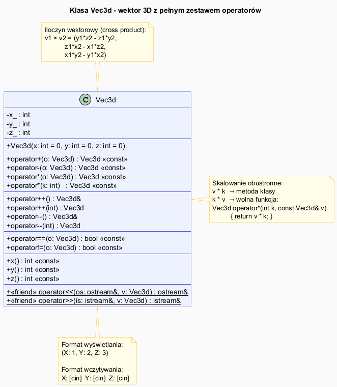

# Większy Przykład – Klasa `Vec3d`

## Slajd 1: Opis zadania

> **Zadanie:** Napisz klasę `Vec3d`, która pozwoli na wykonywanie działań na wektorach.  
> Klasa ma obsługiwać:
> - **Dodawanie** wektorów (`v1 + v2`)
> - **Odejmowanie** wektorów (`v1 - v2`)
> - **Inkrementację** wektorów (`++v`, `v++`)
> - **Mnożenie** wektorów (iloczyn wektorowy, `v1 * v2`) oraz skalowanie (`v * k`, `k * v`)
> - **Porównanie** (`==`, `!=`)
> - **Wyświetlanie** w postaci `(X: …, Y: …, Z: …)`
> - **Wczytywanie** wektora z konsoli (współrzędne to liczby całkowite)

---

## Slajd 2: Analiza – co implementujemy?

| Operacja | Operator | Forma | Typ zwracany |
|----------|----------|-------|-------------|
| Dodawanie | `+` | Metoda lub wolna | `Vec3d` |
| Odejmowanie | `-` | Metoda lub wolna | `Vec3d` |
| Iloczyn wektorowy | `*` | Metoda lub wolna | `Vec3d` |
| Skalowanie `v * k` | `*` | Metoda | `Vec3d` |
| Skalowanie `k * v` | `*` | Wolna funkcja | `Vec3d` |
| Prefix `++` | `++` | Metoda | `Vec3d&` |
| Postfix `++` | `++` | Metoda | `Vec3d` |
| Prefix `--` | `--` | Metoda | `Vec3d&` |
| Postfix `--` | `--` | Metoda | `Vec3d` |
| Równość | `==` | Metoda lub wolna | `bool` |
| Nierówność | `!=` | Metoda lub wolna | `bool` |
| Wyświetlanie | `<<` | Wolna (friend) | `ostream&` |
| Wczytywanie | `>>` | Wolna (friend) | `istream&` |

---

## Slajd 3: Iloczyn wektorowy – przypomnenie

Iloczyn wektorowy $\vec{v_1} \times \vec{v_2}$ dla wektorów w $\mathbb{R}^3$:

$$\vec{v_1} \times \vec{v_2} = \begin{vmatrix} \vec{i} & \vec{j} & \vec{k} \\ x_1 & y_1 & z_1 \\ x_2 & y_2 & z_2 \end{vmatrix} = \begin{pmatrix} y_1 z_2 - z_1 y_2 \\ z_1 x_2 - x_1 z_2 \\ x_1 y_2 - y_1 x_2 \end{pmatrix}$$

W kodzie:

```cpp
Vec3d operator*(const Vec3d& o) const {
    return Vec3d(
        y_ * o.z_ - z_ * o.y_,
        z_ * o.x_ - x_ * o.z_,
        x_ * o.y_ - y_ * o.x_
    );
}
```

---

## Slajd 4: Diagram klasy Vec3d



<!-- Wygeneruj PNG z PlantUML: plantuml vec3d_diagram.puml -->

```
Vec3d
─────────────────────────────────────────────
- x_ : int
- y_ : int
- z_ : int
─────────────────────────────────────────────
+ Vec3d(x=0, y=0, z=0)
─────────────────────────────────────────────
+ operator+(o: Vec3d) : Vec3d [const]
+ operator-(o: Vec3d) : Vec3d [const]
+ operator*(o: Vec3d) : Vec3d [const]   ← iloczyn wektorowy
+ operator*(k: int)   : Vec3d [const]   ← skalowanie
─────────────────────────────────────────────
+ operator++() : Vec3d&                 ← prefix
+ operator++(int) : Vec3d               ← postfix
+ operator--() : Vec3d&
+ operator--(int) : Vec3d
─────────────────────────────────────────────
+ operator==(o: Vec3d) : bool [const]
+ operator!=(o: Vec3d) : bool [const]
─────────────────────────────────────────────
+ x() : int [const]
+ y() : int [const]
+ z() : int [const]
─────────────────────────────────────────────
<<friend>> operator<<(os, v) : ostream&
<<friend>> operator>>(is, v) : istream&
─────────────────────────────────────────────
<<free>> operator*(k: int, v: Vec3d) : Vec3d
```

---

## Slajd 5: Implementacja – konstruktor i arytmetyka

Plik: [`src/Vec3d.h`](src/Vec3d.h)

```cpp
class Vec3d {
public:
    Vec3d(int x = 0, int y = 0, int z = 0) : x_(x), y_(y), z_(z) {}

    // Dodawanie: komponent po komponencie
    Vec3d operator+(const Vec3d& o) const {
        return Vec3d(x_ + o.x_, y_ + o.y_, z_ + o.z_);
    }
    // Odejmowanie
    Vec3d operator-(const Vec3d& o) const {
        return Vec3d(x_ - o.x_, y_ - o.y_, z_ - o.z_);
    }
    // Iloczyn wektorowy (cross product)
    Vec3d operator*(const Vec3d& o) const {
        return Vec3d(
            y_ * o.z_ - z_ * o.y_,
            z_ * o.x_ - x_ * o.z_,
            x_ * o.y_ - y_ * o.x_
        );
    }
    // Skalowanie: v * k
    Vec3d operator*(int k) const {
        return Vec3d(x_ * k, y_ * k, z_ * k);
    }
```

---

## Slajd 6: Implementacja – inkrementacja

```cpp
    // Prefix ++v: inkrementuj każdą składową, zwróć *this
    Vec3d& operator++() {
        ++x_; ++y_; ++z_;
        return *this;
    }
    // Postfix v++: zapamiętaj kopię, inkrementuj, zwróć kopię
    Vec3d operator++(int) {
        Vec3d old = *this;
        ++x_; ++y_; ++z_;
        return old;
    }
    // Analogicznie --, --v, v--
    Vec3d& operator--() { --x_; --y_; --z_; return *this; }
    Vec3d  operator--(int) { Vec3d old=*this; --x_;--y_;--z_; return old; }
```

---

## Slajd 7: Implementacja – porównania i I/O

```cpp
    bool operator==(const Vec3d& o) const {
        return x_ == o.x_ && y_ == o.y_ && z_ == o.z_;
    }
    bool operator!=(const Vec3d& o) const { return !(*this == o); }

    // Wyświetlanie: (X: 1, Y: 2, Z: 3)
    friend std::ostream& operator<<(std::ostream& os, const Vec3d& v) {
        return os << "(X: " << v.x_ << ", Y: " << v.y_ << ", Z: " << v.z_ << ")";
    }
    // Wczytywanie: podaj kolejno X, Y, Z
    friend std::istream& operator>>(std::istream& is, Vec3d& v) {
        std::cout << "X: "; is >> v.x_;
        std::cout << "Y: "; is >> v.y_;
        std::cout << "Z: "; is >> v.z_;
        return is;
    }
};

// Skalowanie z lewej strony: k * v
inline Vec3d operator*(int k, const Vec3d& v) { return v * k; }
```

---

## Slajd 8: Program demonstracyjny

Plik: [`src/main.cpp`](src/main.cpp)

```cpp
#include "Vec3d.h"

int main() {
    Vec3d v1(1, 2, 3), v2(4, 5, 6);
    std::cout << "v1 + v2 = " << (v1 + v2) << "\n";  // (X: 5, Y: 7, Z: 9)
    std::cout << "v1 * v2 = " << (v1 * v2) << "\n";  // iloczyn wektorowy
    std::cout << "v1 * 3  = " << (v1 * 3)  << "\n";  // skalowanie
    std::cout << "2 * v2  = " << (2 * v2)  << "\n";  // skalowanie z lewej

    Vec3d v3(0, 0, 0);
    std::cout << "++v3 = " << ++v3 << "\n";            // (X: 1, Y: 1, Z: 1)
    std::cout << "v3++ = " << v3++ << " (stary)\n";    // (X: 1, Y: 1, Z: 1) – stary stan

    std::cout << std::boolalpha;
    std::cout << "v1 == v1: " << (v1 == v1) << "\n";  // true
    std::cout << "v1 != v2: " << (v1 != v2) << "\n";  // true

    Vec3d v4;
    std::cout << "Podaj wektor v4:\n";
    std::cin >> v4;
    std::cout << "v1 + v4 = " << (v1 + v4) << "\n";
}
```

---

## Slajd 9: Kompilacja i przykładowe wyjście

```bash
g++ -std=c++17 -o vec3d src/main.cpp && ./vec3d
```

```
=== Tworzenie wektorów ===
v1 = (X: 1, Y: 2, Z: 3)
v2 = (X: 4, Y: 5, Z: 6)

=== Dodawanie i odejmowanie ===
v1 + v2 = (X: 5, Y: 7, Z: 9)
v2 - v1 = (X: 3, Y: 3, Z: 3)

=== Iloczyn wektorowy ===
v1 * v2 = (X: -3, Y: 6, Z: -3)

=== Skalowanie ===
v1 * 3 = (X: 3, Y: 6, Z: 9)
2 * v2 = (X: 8, Y: 10, Z: 12)

=== Inkrementacja ===
v3 = (X: 0, Y: 0, Z: 0)
++v3 = (X: 1, Y: 1, Z: 1)
v3++ = (X: 1, Y: 1, Z: 1)  ← stary stan; v3 stało się (2,2,2)

=== Porównania ===
v1 == v1: true
v1 == v2: false
v1 != v2: true

=== Wczytywanie ===
X: 10
Y: 20
Z: 30
Podany wektor: (X: 10, Y: 20, Z: 30)
```

---

## Podsumowanie modułu

| Temat | Kluczowe pojęcia |
|-------|-----------------|
| Wprowadzenie | Operator = ukryta funkcja; przejrzysta składnia |
| Przegląd operatorów | Które można/warto; które muszą być metodą |
| Składnia | Metoda vs. wolna funkcja; `const`; typy zwracane |
| Przypadki szczególne | Prefix/postfix; `<<`/`>>` tylko wolne funkcje |
| Fraction | Normalizacja; DRY; wzorzec `op` przez `op=` |
| Vec3d | Iloczyn wektorowy; skalowanie obustronne |

---

## Dobre praktyki i antywzorce

- **Dobra praktyka:** Zacznij od `operator==` i `operator<`, resztę wyprowadź automatycznie.
- **Dobra praktyka:** Skalowanie `k * v` jako wolna funkcja — zapewnia symetrię.
- **Antywzorzec:** Brak getterów `x()`, `y()`, `z()` — utrudnia testowanie bez friend.
- **Antywzorzec:** `operator*` jako zarówno iloczyn jak i skalowanie bez wyraźnej dokumentacji co robi który — użytkownik klasy może się pomylić.

## Pliki źródłowe

| Plik | Opis |
|------|------|
| [`src/Vec3d.h`](src/Vec3d.h) | Klasa `Vec3d` – pełna implementacja |
| [`src/main.cpp`](src/main.cpp) | Program demonstracyjny |
| [`vec3d_diagram.puml`](vec3d_diagram.puml) | Diagram UML klasy Vec3d |
