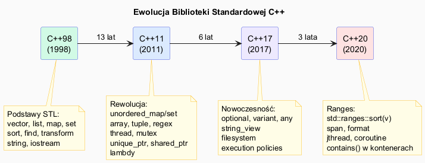

# STL – Historia i Architektura

## Slajd 1: Życie przed STL – problem fragmentacji

Przed standaryzacją C++ każdy pisał własne struktury danych od zera:

```cpp
// Typowy kod z lat 80./90. – ręczna tablica dynamiczna
struct IntArray {
    int*   data;
    int    size;
    int    capacity;
};

void push(IntArray* arr, int val) { /* ręczna realokacja */ }
int  get (IntArray* arr, int i)   { return arr->data[i]; }
void free(IntArray* arr)          { delete[] arr->data; }
```

**Problemy:**
- Każdy projekt miał własną implementację listy, stosu, kolejki
- Brak gwarancji złożoności, brak testów, brak spójności
- Kod algorytmu był spleciony z typem danych: `sortIntArray`, `sortDoubleArray`...
- Żaden algorytm nie działał z kodem kogoś innego

**Fragmentacja to nie tylko niedogodność — to fundamentalny problem inżynieryjny.**
Gdy algorytm sortowania jest zakodowany na konkretną strukturę danych, każda zmiana
wymagań wymaga **przepisania algorytmu od zera**. Biblioteki z lat 80. były wzajemnie
niekompatybilne — `SortLib` firmy A nie potrafiła posortować danych z `ContainerLib`
firmy B. Brak gwarancji złożoności oznaczał, że „szybka" funkcja mogła być O(n²) bez
ostrzeżenia. STL rozwiązuje te problemy przez separację obowiązków: kontener zarządza
pamięcią, algorytm realizuje logikę, iterator jest kontraktem między nimi.

---

## Slajd 2: Alexander Stepanov i generic programming

**Alexander Stepanov** (wraz z Meng Lee) zaproponował STL w 1994 roku.  
Idea opierała się na badaniach nad **programowaniem generycznym** —
abstrakcją algorytmów niezależną od typów danych.

Kluczowy wgląd Stepanova:

> *„Algorytm i struktura danych powinny być od siebie niezależne.  
> Łączy je jedynie kontrakt — iterator."*

```
                 ┌──────────────┐
  Algorytmy ────▶│   Iterator   │◀──── Kontenery
  (sort, find)   └──────────────┘      (vector, list)

  Algorytm nie wie, co przechowuje kontener.
  Kontener nie wie, jaki algorytm na nim działa.
  Iterator jest wspólnym językiem.
```

Stepanov udowodnił, że **generyczne algorytmy** mogą być równie szybkie jak
specjalizowane — co było wówczas kontrowersyjną tezą.

**Iterator jako punkt elastyczności.** Geniusz architektury STL polega na tym, że
iterator jest **jedynym interfejsem** między algorytmem a kontenerem — ani algorytm
nie zna szczegółów kontenera, ani kontener nie wie nic o algorytmach. Ta separacja
pozwala dodawać nowe kontenery (działające ze wszystkimi istniejącymi algorytmami)
i nowe algorytmy (działające ze wszystkimi istniejącymi kontenerami) całkowicie
niezależnie. Stepanov czerpał inspirację z algebry abstrakcyjnej: algorytm `std::sort`
wymaga „RandomAccessIterator" — tak jak twierdzenie matematyczne wymaga „pierścienia"
czy „grupy". Generyczny algorytm z formalnym wymaganiem to dokładnie ta sama idea
co matematyczny lemat z założeniami. To dlatego STL jest uważany za jedno z
najpiękniejszych zastosowań teorii typów w inżynierii oprogramowania.

---

## Slajd 3: Trzy filary STL

STL opiera się na trzech wzajemnie niezależnych komponentach:

| Filar | Co robi | Przykłady |
|---|---|---|
| **Kontenery** | Przechowują dane, zarządzają pamięcią | `vector`, `map`, `set`, `deque` |
| **Algorytmy** | Operują na zakresach danych | `sort`, `find`, `transform`, `accumulate` |
| **Iteratory** | Łączą kontenery z algorytmami | `begin()`, `end()`, `++`, `*` |

Plus dwa dodatkowe:

| Komponent | Co robi | Przykłady |
|---|---|---|
| **Funktory / lambdy** | Parametryzują algorytmy | `std::less`, `[](int x){ return x>0; }` |
| **Alokatory** | Zarządzają pamięcią kontenerów | `std::allocator`, alokatory pul |

---

## Slajd 4: Ewolucja – od C++98 do C++20

| Standard | Rok | Kluczowe dodatki do biblioteki |
|---|---|---|
| **C++98** | 1998 | Podstawowe kontenery, algorytmy, iteratory, `string` |
| **C++03** | 2003 | Poprawki błędów, brak nowych funkcji |
| **C++11** | 2011 | `unordered_map/set`, `array`, `tuple`, `regex`, `thread`, lambdy, `unique_ptr`/`shared_ptr` |
| **C++14** | 2014 | Lambdy generyczne, `make_unique` |
| **C++17** | 2017 | `optional`, `variant`, `any`, `string_view`, `filesystem`, algorytmy równoległe |
| **C++20** | 2020 | Ranges, `span`, `format`, `jthread`, `coroutine`, `contains()` w kontenerach |
| **C++23** | 2023 | `flat_map/set`, `mdspan`, `print`, rozszerzenia Ranges |

> Biblioteka standardowa liczy dziś **ponad 1500 komponentów** — typów, funkcji i stałych.

**Tempo wzrostu biblioteki odzwierciedla ewolucję potrzeb C++.** C++98 dał fundamenty
(kontenery, algorytmy), C++11 wprowadził idiomy nowoczesnego C++ (move semantics,
lambdy, smart pointery). C++17 dodał typy ogólnego użytku eliminujące powszechne
antywzorce: `optional` zastępuje zwracanie wartości sentinel (`-1`, `nullptr`), `variant`
zastępuje unie z ręcznym discriminatorem, `filesystem` eliminuje platformo-zależne API.
C++20 z Ranges to największa zmiana w algorytmach od C++98 — zamiast par iteratorów,
całe zakresy i kompozycja przez pipe `|`. Każdy nowy standard biblioteki jest wynikiem
wieloletnich propozycji i dyskusji w komitecie ISO — zmiany są celowe i przemyślane.

---

## Slajd 5: Mapa komponentów

```
Biblioteka standardowa C++
│
├── Kontenery sekwencyjne
│   ├── vector       – tablica dynamiczna (ciągła pamięć)
│   ├── deque        – kolejka dwustronna
│   ├── list         – lista dwukierunkowa
│   ├── forward_list – lista jednokierunkowa
│   └── array        – tablica stałego rozmiaru
│
├── Kontenery asocjacyjne (posortowane, drzewo RB)
│   ├── map / multimap
│   └── set / multiset
│
├── Kontenery asocjacyjne (nieuporządkowane, hash)
│   ├── unordered_map / unordered_multimap
│   └── unordered_set / unordered_multiset
│
├── Adaptery kontenerów
│   ├── stack        – LIFO (domyślnie nad deque)
│   ├── queue        – FIFO
│   └── priority_queue – kopiec
│
├── Algorytmy            <algorithm>, <numeric>, <ranges>
├── Iteratory            <iterator>
├── Funktory             <functional>
├── Łańcuchy tekstu      <string>, <string_view>
├── Narzędzia ogólne     <utility>, <optional>, <variant>, <any>
├── Czas                 <chrono>
├── System plików        <filesystem>
├── Wejście/wyjście      <iostream>, <fstream>, <sstream>
└── Wątki                <thread>, <mutex>, <atomic>
```

---

## Pliki źródłowe

| Plik | Opis |
|------|------|
| [`src/main.cpp`](src/main.cpp) | Demonstracja: kod przed i po STL, użycie podstawowych kontenerów |
| [`history_diagram.puml`](history_diagram.puml) | Oś czasu ewolucji STL i mapa komponentów |
| [`history_diagram.png`](history_diagram.png) | Wygenerowany diagram PNG |


