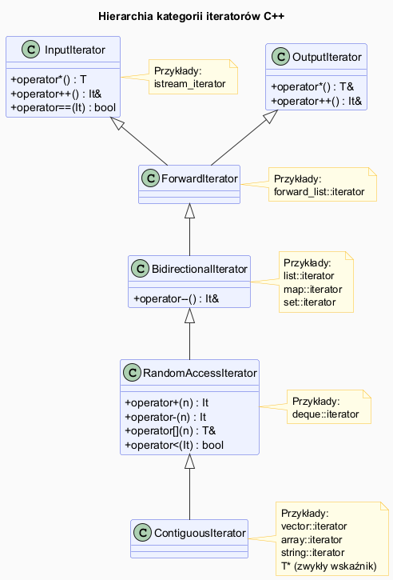

# STL – Iteratory

## Slajd 1: Czym jest iterator

Iterator to **uogólniony wskaźnik** — obiekt wskazujący na element zakresu,
który można przesuwać i wyłuskiwać. Jest mostem między kontenerem a algorytmem.

```cpp
std::vector<int> v = {10, 20, 30, 40};

std::vector<int>::iterator it = v.begin();  // wskazuje na 10
std::cout << *it;   // 10 – wyłuskanie
++it;               // przesuń na kolejny element
std::cout << *it;   // 20

// Pętla ręczna przez iteratory:
for (auto it = v.begin(); it != v.end(); ++it)
    std::cout << *it << " ";
```

Koniec zakresu (`end()`) wskazuje **za** ostatnim elementem — nigdy go nie wyłuskujemy.
Zakres `[begin, end)` to konwencja STL: lewostronnie domknięty, prawostronnie otwarty.

---

## Slajd 2: Hierarchia kategorii iteratorów

Kategorie tworzą hierarchię zdolności — każda wyższa zawiera operacje niższych:

```
InputIterator ──────┐
                    ├──▶ ForwardIterator ──▶ BidirectionalIterator ──▶ RandomAccessIterator ──▶ ContiguousIterator
OutputIterator ─────┘
```

| Kategoria | Operacje | Przykład kontenera |
|---|---|---|
| **Input** | `*` (odczyt), `++`, `==` | `istream_iterator` |
| **Output** | `*` (zapis), `++` | `ostream_iterator` |
| **Forward** | Input + wielokrotne przejście | `forward_list` |
| **Bidirectional** | Forward + `--` | `list`, `map`, `set` |
| **Random Access** | Bidirectional + `+n`, `-n`, `[]`, `<` | `vector`, `deque` |
| **Contiguous** | Random Access + ciągła pamięć | `vector`, `array`, `string` |

---

## Slajd 3: Operacje na iteratorach

```cpp
std::vector<int> v = {1, 2, 3, 4, 5};
auto it = v.begin();

// Wyłuskanie
int val = *it;          // 1

// Przesunięcie
++it;                   // następny element
--it;                   // poprzedni (Bidirectional+)
it += 3;                // skok o 3 (RandomAccess+)
it -= 1;                // cofnięcie o 1 (RandomAccess+)

// Indeksowanie
int x = it[2];          // jak *(it + 2) (RandomAccess+)

// Odległość
auto dist = std::distance(v.begin(), v.end());  // 5

// Przesunięcie o n
auto it2 = std::next(it, 2);    // it + 2 (działa dla każdej kategorii)
auto it3 = std::prev(it, 1);    // it - 1 (Bidirectional+)
std::advance(it, 3);            // przesuń it o 3 w miejscu
```

---

## Slajd 4: Rodzaje zakresów — `begin`, `end`, warianty

```cpp
std::vector<int> v = {1, 2, 3};

// Standardowe (odczyt/zapis)
v.begin()   v.end()

// Stałe – tylko do odczytu
v.cbegin()  v.cend()

// Odwrotne – iteracja od końca
v.rbegin()  v.rend()   // rbegin() wskazuje ostatni element

// Stałe odwrotne
v.crbegin() v.crend()

// Wolne funkcje (działają też na tablicach C):
std::begin(v)   std::end(v)

int arr[] = {4, 5, 6};
for (auto it = std::begin(arr); it != std::end(arr); ++it)
    std::cout << *it;
```

---

## Slajd 5: Range-based for — cukier składniowy

```cpp
std::vector<int> v = {1, 2, 3, 4, 5};

// Zapis skrócony:
for (int x : v) std::cout << x;

// Kompilator rozwija do:
{
    auto __begin = v.begin();
    auto __end   = v.end();
    for (; __begin != __end; ++__begin) {
        int x = *__begin;
        std::cout << x;
    }
}

// Modyfikacja przez referencję:
for (int& x : v) x *= 2;

// Unikanie kopii przez const&:
for (const auto& x : v) std::cout << x;
```

---

## Slajd 6: Iteratory unieważnione (dangling iterators)

Niektóre operacje **unieważniają** istniejące iteratory — użycie ich po unieważnieniu
to **niezdefiniowane zachowanie**.

```cpp
std::vector<int> v = {1, 2, 3};
auto it = v.begin();    // wskazuje na 1

v.push_back(4);         // ← może realokować pamięć!
// it jest teraz UNIEWAŻNIONY – nie wolno go używać

std::cout << *it;       // UB!
```

| Kontener | Operacja | Co unieważnia |
|---|---|---|
| `vector` | `push_back`, `insert`, `erase` | Wszystkie iteratory (jeśli realokacja) |
| `vector` | `erase` bez realokacji | Iteratory od miejsca usunięcia do końca |
| `deque` | `push_front/back` | Wszystkie iteratory |
| `list`, `map`, `set` | `insert` | Nic |
| `list`, `map`, `set` | `erase` | Tylko iterator na usuniętym elemencie |

---

## Slajd 7: C++20 Ranges — nowoczesna alternatywa

C++20 wprowadza `std::ranges::` — algorytmy przyjmują cały kontener zamiast pary iteratorów:

```cpp
#include <ranges>
#include <algorithm>

std::vector<int> v = {5, 3, 1, 4, 2};

// Stary styl (C++98):
std::sort(v.begin(), v.end());

// Nowy styl (C++20):
std::ranges::sort(v);

// Filtrowanie i transformacja (pipelines):
auto wynik = v
    | std::views::filter([](int x) { return x % 2 == 0; })
    | std::views::transform([](int x) { return x * x; });

for (int x : wynik) std::cout << x << " ";  // kwadraty parzystych
```

Ranges są **leniwe** — `views::filter` i `views::transform` nie tworzą kopii,
obliczenia są wykonywane dopiero przy iteracji.

---

## Pliki źródłowe

| Plik | Opis |
|------|------|
| [`src/main.cpp`](src/main.cpp) | Demonstracja kategorii iteratorów, unieważniania, Ranges |
| [`iterators_diagram.puml`](iterators_diagram.puml) | Hierarchia kategorii iteratorów |
| [`iterators_diagram.png`](iterators_diagram.png) | Wygenerowany diagram PNG |


