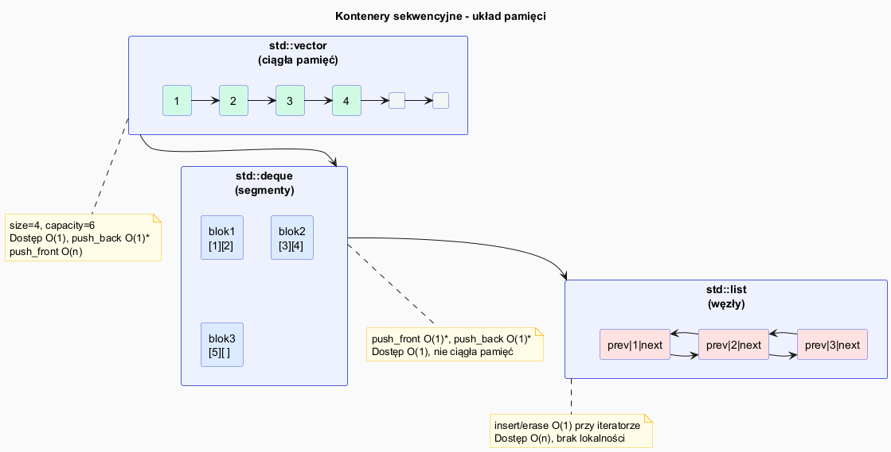

# STL – Kontenery sekwencyjne

## Slajd 1: Przegląd kontenerów sekwencyjnych

Kontenery sekwencyjne przechowują elementy **w określonej kolejności** ustalonej przez programistę
(nie przez wartość klucza).

| Kontener | Pamięć | Dostęp | `push_back` | `push_front` | `insert` środek |
|---|---|---|---|---|---|
| `vector` | ciągła | O(1) | O(1) amort. | O(n) | O(n) |
| `deque` | segmenty | O(1) | O(1) amort. | O(1) amort. | O(n) |
| `list` | węzły | O(n) | O(1) | O(1) | O(1) |
| `forward_list` | węzły | O(n) | — | O(1) | O(1) |
| `array<T,N>` | ciągła | O(1) | — | — | — |

> **Zasada kciuka:** używaj `vector` dopóki nie masz powodu do czegoś innego.

**Tabela złożoności to punkt startowy, nie jedyne kryterium.** W praktycznych
benchmarkach **lokalność pamięci** (cache friendliness) często dominuje nad
teoretyczną złożonością. `vector` z elementami ułożonymi liniowo w pamięci bywa
szybszy niż `list` nawet dla operacji z lepszą złożonością — procesor prefetchuje
kolejne elementy tablicy, podczas gdy wskaźniki listy prowadzą do losowych adresów.
Współczesny procesor pobiera dane w cache line (64 bajty) — dla `vector<int>` to 16
elementów naraz; dla `list` każdy węzeł może być w innym cache line. Dlatego
`vector` jest domyślnym wyborem — zmień go na inny kontener dopiero gdy profiler
(np. `perf` lub Valgrind/Callgrind) pokaże konkretny problem.

---

## Slajd 2: `std::vector` — ciągła tablica dynamiczna

```cpp
#include <vector>

std::vector<int> v;             // pusty
std::vector<int> v2(5, 0);     // 5 zer
std::vector<int> v3 = {1, 2, 3, 4, 5};

// Dostęp
v3[2];          // 3 – brak sprawdzania zakresu
v3.at(2);       // 3 – rzuca std::out_of_range gdy out of bounds

// Dodawanie
v3.push_back(6);         // na koniec
v3.emplace_back(7);      // konstruuje w miejscu (bez kopii)

// Rozmiar i pojemność
v3.size();      // liczba elementów
v3.capacity();  // zarezerwowana pamięć
v3.reserve(20); // zarezerwuj miejsce na 20 (bez zmiany size)
v3.shrink_to_fit(); // zwolnij nadmiar pamięci

// Usuwanie
v3.pop_back();          // usuń ostatni
v3.erase(v3.begin());   // usuń pierwszy
v3.clear();             // usuń wszystko
```

**`emplace_back` vs `push_back` — dlaczego warto preferować `emplace_back`.**
`push_back(obj)` wymaga przekazania istniejącego obiektu — jeśli tworzysz go tymczasowo
(`v.push_back(MyClass(arg1, arg2))`), tworzony jest tymczasowy obiekt, a potem
**przenoszony** do wektora (dzięki move semantics). `emplace_back(arg1, arg2)` pomija
tworzenie tymczasowego — konstruktor wywoływany jest **bezpośrednio w pamięci wektora**
(placement new). Dla typów z tanim move (większość) różnica jest pomijalną; dla typów
bez konstruktora przenoszącego lub z kosztownym kopiowaniem — `emplace_back` jest
wyraźnie szybsze. Dodatkowa zaleta: `emplace_back` działa nawet gdy konstruktor jest
`explicit`, bo przekazujesz argumenty, nie obiekt.

---

## Slajd 3: Mechanizm podwajania — amortyzowany O(1)

Gdy `size == capacity`, `push_back` powoduje **realokację**:

```
Stan:  [1][2][3]    size=3, capacity=3
push_back(4):
  1. Alokuj nową tablicę capacity=6
  2. Skopiuj 1,2,3 do nowej tablicy  ← O(n) raz na n operacji
  3. Dodaj 4
  Wynik: [1][2][3][4][_][_]  size=4, capacity=6

push_back(5): O(1) – jest miejsce
push_back(6): O(1) – jest miejsce
push_back(7): znów realokacja → capacity=12
```

Całkowity koszt n operacji `push_back`:
$$ \underbrace{n}_{\text{same push\_back}} + \underbrace{1+2+4+\ldots+n}_{\text{kopie przy realokacjach}} = n + 2n = O(n) $$

Średni koszt jednej operacji: **O(1)** — stąd "amortyzowany O(1)".

> Jeśli znasz docelowy rozmiar, użyj `reserve()` — eliminuje wszystkie realokacje.

**Dlaczego `reserve()` jest krytyczny dla wydajności?** Bez `reserve`, seria `push_back`
na pusty `vector` z n elementami spowoduje O(log n) realokacji, każda kopiując/przenosząc
rosnącą ilość danych. Z `reserve(n)` przed pętlą — zero realokacji, bo pamięć jest
zarezerwowana z góry. W systemach real-time lub kodzie krytycznym `reserve` eliminuje
nieprzewidywalne „szczyty" czasu. Przykład: `vector` z milionem stringów bez `reserve`
wykona ~20 realokacji, kopiując łącznie ~2 miliony stringów; z `reserve(1'000'000)` —
zero kopii przy growth. `capacity()` po `reserve` może być większe niż żądane —
implementacja może zaokrąglić w górę. `shrink_to_fit()` to niewiążąca prośba do
implementacji o zwolnienie nadmiaru; po nim `capacity() == size()`.

---

## Slajd 4: `std::deque` — kolejka dwustronna

```cpp
#include <deque>

std::deque<int> d = {2, 3, 4};

d.push_front(1);    // O(1) – dodaj na początek: [1,2,3,4]
d.push_back(5);     // O(1) – dodaj na koniec:  [1,2,3,4,5]
d.pop_front();      // O(1) – usuń z początku:  [2,3,4,5]
d.pop_back();       // O(1) – usuń z końca:     [2,3,4]

d[1];               // O(1) – dostęp przez indeks
```

Wewnętrznie `deque` przechowuje dane w **stałych blokach** (chunks) —
nie jest ciągła w pamięci jak `vector`. Dostęp O(1) jest możliwy dzięki
mapie wskaźników na bloki.

**Jak działa O(1) dostęp w `deque` mimo nieci**ągłej pamięci.** `deque`
przechowuje wewnętrzną **mapę wskaźników** (tablicę wskaźników na bloki stałego rozmiaru).
Dostęp `d[i]` to: oblicz numer bloku i offset wewnątrz bloku → dwa dereferencje wskaźnika
— nadal O(1), ale wolniejsze niż `vector[i]` (jedno dereferencje). Bloki są alokowane
osobno, więc `push_front` nigdy nie przesuwa istniejących elementów — wystarczy w bloku
na początku jest miejsce lub alokowany nowy blok. To sprawia, że `deque` jest naturalnym
wyborem dla kolejek (BFS w grafach) i `std::queue` wewnętrznie używa `deque` domyślnie.
Wadą jest większy narzut pamięciowy i słabsza lokalność od `vector`.

**Kiedy używać deque zamiast vector:**
- potrzebujesz O(1) `push_front` (kolejka, BFS)
- przechowujesz duże elementy i realokacja `vector` byłaby kosztowna

---

## Slajd 5: `std::list` — lista dwukierunkowa

```cpp
#include <list>

std::list<int> lst = {1, 2, 3, 4, 5};

// O(1) insert/erase w dowolnym miejscu (gdy mamy iterator)
auto it = std::find(lst.begin(), lst.end(), 3);
lst.insert(it, 99);     // wstaw 99 przed 3: [1,2,99,3,4,5]
lst.erase(it);          // usuń 3:           [1,2,99,4,5]

// Specjalne operacje listy
lst.sort();             // własna wersja sort (nie std::sort!)
lst.reverse();
lst.unique();           // usuń kolejne duplikaty
lst.splice(lst.begin(), lst2); // przenieś całą lst2 do lst (O(1)!)
```

**Kiedy warto:** częste wstawianie/usuwanie w środku przy stabilnych iteratorach.  
**Kiedy nie warto:** prawie zawsze — `vector` z `erase` jest często szybszy w praktyce
ze względu na lokalność pamięci (cache).

**Dlaczego `list::insert` jest O(1) a nie O(n)?** W `list` wstawianie to **operacja
chirurgii wskaźników**: zmień 4 wskaźniki (next/prev nowego węzła + next węzła przed
i prev węzła po). Nie ma przesuwania elementów, nie ma realokacji. Ale żeby to zrobić,
musisz już **mieć iterator** w odpowiednie miejsce — znalezienie go to O(n). W przeciwieństwie
do `vector::insert`, gdzie nawet posiadanie iteratora nie pomaga — i tak trzeba przesunąć
elementy za punktem wstawiania. `list::splice` przenosi węzły między listami w O(1) —
to operacja niemożliwa dla `vector`: zmiana właściciela kilku węzłów to po prostu aktualizacja
kilku wskaźników. Jest to użyteczne w implementacjach LRU cache czy schedulerów.

---

## Slajd 6: `std::array` — bezpieczna tablica stałego rozmiaru

```cpp
#include <array>

std::array<int, 5> a = {1, 2, 3, 4, 5};  // rozmiar jest częścią typu!

a[2];           // 3
a.at(2);        // 3 z kontrolą zakresu
a.size();       // 5 – constexpr, znany w czasie kompilacji
a.front();      // 1
a.back();       // 5
a.data();       // int* – wskaźnik na surową tablicę (kompatybilność z C)

// Pełna integracja z algorytmami STL:
std::sort(a.begin(), a.end());
std::fill(a.begin(), a.end(), 0);
```

Zalety nad tablicą C (`int arr[5]`):
- Nie gubi rozmiaru przy przekazaniu do funkcji
- Ma `begin()`/`end()`, działa z algorytmami STL
- Można kopiować przez `=`
- `at()` sprawdza zakres

**`std::array` — zero-overhead wrapper nad tablicą C.** Tablica C `int arr[5]`
przekazana do funkcji jako `int*` gubi swój rozmiar — funkcja nie wie, ile elementów
ma iterować (stąd osobny parametr `size`). `std::array<int,5>` **nie** gubi rozmiaru:
`size()` jest metodą `constexpr`, a rozmiar jest wbudowany w typ. Ponieważ rozmiar
jest parametrem szablonu, `std::array<int,5>` i `std::array<int,6>` to **dwa różne typy**
— nie można ich pomylić ani przypisać bez konwersji. `data()` zwraca `T*` — wskaźnik
kompatybilny z API C, więc `array` jest idealnym zastępcą tablicy C wszędzie tam,
gdzie potrzebujesz przekazać dane do funkcji `void* process(int* data, size_t len)`.
Rozmiar musi być znany w czasie kompilacji — jeśli nie, używaj `vector`.

---

## Slajd 7: Porównanie złożoności

| Operacja | `vector` | `deque` | `list` | `array` |
|---|---|---|---|---|
| Dostęp `[i]` | O(1) | O(1) | O(n) | O(1) |
| `push_back` | O(1)* | O(1)* | O(1) | — |
| `push_front` | O(n) | O(1)* | O(1) | — |
| `insert` środek | O(n) | O(n) | **O(1)†** | — |
| `erase` środek | O(n) | O(n) | **O(1)†** | — |
| `find` | O(n) | O(n) | O(n) | O(n) |
| Lokalność pamięci | **dobra** | średnia | zła | **dobra** |

\* amortyzowany  
† wymaga posiadania iteratora do miejsca

**Lokalność pamięci — dlaczego „zła" może zabić O(1).** Tabela pokazuje, że `list` ma
O(1) insert/erase, ale „zła" lokalność pamięci. Na współczesnych procesorach dostęp do
losowego adresu w pamięci (cache miss) to ~100 cykli, podczas gdy dostęp do elementu
w cache to ~4 cykle. Dla `vector` iteracja to sekwencyjny dostęp — prefetcher CPU
przewiduje kolejne adresy i ładuje z wyprzedzeniem. Dla `list` każdy `->next` to
potencjalny cache miss — przy milionowej liście iteracja jest 5-10x wolniejsza niż
`vector`, mimo identycznej złożoności O(n). Dlatego `std::list` jest rzadko pierwszym
wyborem w nowoczesnym C++ — sprawdź `vector` + `erase` lub `std::deque` najpierw.

---

## Slajd 8: Drzewko decyzyjne — który kontener wybrać?

```
Czy rozmiar jest znany w czasie kompilacji?
│
├── TAK → std::array<T, N>
│
└── NIE
    │
    ├── Czy potrzebujesz szybkiego push_front?
    │   ├── TAK → std::deque
    │   └── NIE
    │       │
    │       ├── Czy często wstawiasz/usuwasz w środku
    │       │   i nie potrzebujesz dostępu przez indeks?
    │       │   ├── TAK → std::list (lub forward_list)
    │       │   └── NIE → std::vector  ← domyślny wybór
    │       │
    │       └── (specjalne: kolejka → queue/deque, stos → stack/vector)
```

---

## Pliki źródłowe

| Plik | Opis |
|------|------|
| [`src/main.cpp`](src/main.cpp) | Demonstracja wszystkich kontenerów sekwencyjnych |
| [`sequence_diagram.puml`](sequence_diagram.puml) | Schemat pamięci i porównanie kontenerów |
| [`sequence_diagram.png`](sequence_diagram.png) | Wygenerowany diagram PNG |


