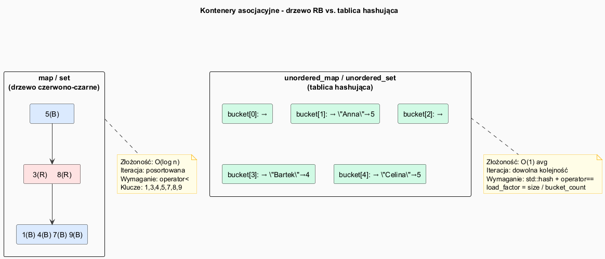

# STL – Kontenery asocjacyjne

## Slajd 1: Przegląd — posortowane vs nieuporządkowane

Kontenery asocjacyjne przechowują elementy **powiązane z kluczem** i umożliwiają
szybkie wyszukiwanie po kluczu.

| Kontener | Implementacja | Złożoność | Wymaga |
|---|---|---|---|
| `map` | drzewo czerwono-czarne | O(log n) | `operator<` |
| `set` | drzewo czerwono-czarne | O(log n) | `operator<` |
| `multimap` | drzewo RB (duplikaty) | O(log n) | `operator<` |
| `multiset` | drzewo RB (duplikaty) | O(log n) | `operator<` |
| `unordered_map` | tablica hashująca | O(1) avg | `std::hash<K>` + `operator==` |
| `unordered_set` | tablica hashująca | O(1) avg | `std::hash<K>` + `operator==` |
| `unordered_multimap` | tablica hashująca | O(1) avg | jak wyżej |
| `unordered_multiset` | tablica hashująca | O(1) avg | jak wyżej |

---

## Slajd 2: `std::map` — słownik z posortowanymi kluczami

```cpp
#include <map>

std::map<std::string, int> oceny;

// Wstawianie
oceny["Anna"]   = 5;                         // operator[]
oceny.insert({"Bartek", 4});                 // insert z parą
oceny.emplace("Celina", 5);                  // emplace – bez kopii

// Dostęp
int o = oceny["Anna"];                       // 5
int o2 = oceny.at("Anna");                   // 5, rzuca gdy brak klucza
// UWAGA: oceny["NowyKlucz"] TWORZY wpis z wartością domyślną!

// Szukanie – bezpieczne
auto it = oceny.find("Anna");
if (it != oceny.end())
    std::cout << it->first << ": " << it->second << "\n";

// C++20: contains
if (oceny.contains("Anna")) { /* ... */ }

// Iteracja – ALFABETYCZNA (map jest posortowana)
for (const auto& [klucz, wartosc] : oceny)
    std::cout << klucz << " → " << wartosc << "\n";
```

---

## Slajd 3: `std::set` — zbiór unikalnych kluczy

```cpp
#include <set>

std::set<int> s = {5, 3, 1, 4, 1, 5, 9};  // duplikaty są ignorowane!
// s zawiera: {1, 3, 4, 5, 9}

s.insert(7);        // {1, 3, 4, 5, 7, 9}
s.erase(3);         // {1, 4, 5, 7, 9}

bool znaleziono = s.count(4) > 0;       // true (count zwraca 0 lub 1)
bool znaleziono2 = s.contains(4);       // C++20, to samo

// lower_bound / upper_bound – zakres elementów
auto lo = s.lower_bound(4);   // iterator na 4 (pierwszy >= 4)
auto hi = s.upper_bound(7);   // iterator na 9 (pierwszy > 7)
for (auto it = lo; it != hi; ++it)
    std::cout << *it << " ";  // 4 5 7

// Użycie jako filtr duplikatów z vector:
std::vector<int> v = {3, 1, 4, 1, 5, 9, 2, 6, 5};
std::set<int> uniq(v.begin(), v.end());
```

---

## Slajd 4: `std::unordered_map` — szybki słownik hashujący

```cpp
#include <unordered_map>

std::unordered_map<std::string, int> wordCount;

std::string slowa[] = {"apple", "banana", "apple", "cherry", "banana", "apple"};
for (const auto& s : slowa)
    ++wordCount[s];   // zliczanie słów

for (const auto& [slowo, ile] : wordCount)
    std::cout << slowo << ": " << ile << "\n";
// Kolejność NIE jest gwarantowana (zależy od hashy)

// Parametry hashowania
std::cout << "load_factor: " << wordCount.load_factor() << "\n";
std::cout << "bucket_count: " << wordCount.bucket_count() << "\n";
wordCount.reserve(100);     // zarezerwuj dla 100 elementów bez rehash
```

---

## Slajd 5: Własna funkcja haszująca

Dla własnych typów jako kluczy `unordered_map` wymaga `std::hash<T>`:

```cpp
#include <unordered_map>

struct Punkt {
    int x, y;
    bool operator==(const Punkt& o) const { return x == o.x && y == o.y; }
};

// Specjalizacja std::hash<Punkt>
namespace std {
    template<>
    struct hash<Punkt> {
        size_t operator()(const Punkt& p) const noexcept {
            // Kombinacja hashy obu pól (technika boost::hash_combine)
            size_t h1 = std::hash<int>{}(p.x);
            size_t h2 = std::hash<int>{}(p.y);
            return h1 ^ (h2 << 1);
        }
    };
}

std::unordered_map<Punkt, std::string> nazwy;
nazwy[{0, 0}] = "Poczatek";
nazwy[{3, 4}] = "Odleglosc 5";
```

---

## Slajd 6: `insert` / `emplace` / `find` — idiomy użycia

```cpp
std::map<std::string, int> m;

// insert – zwraca pair<iterator, bool>
auto [it, wstawiono] = m.insert({"klucz", 42});
if (!wstawiono)
    std::cout << "Klucz już istniał, wartość: " << it->second << "\n";

// emplace – konstruuje parę w miejscu (bez tymczasowych obiektów)
m.emplace("inny", 99);

// try_emplace (C++17) – wstawia tylko jeśli klucz nie istnieje
m.try_emplace("klucz", 100);  // nie nadpisze "klucz"!

// insert_or_assign (C++17) – wstawia lub nadpisuje
m.insert_or_assign("klucz", 100);  // nadpisze

// Usuwanie podczas iteracji (bezpieczny wzorzec):
for (auto it = m.begin(); it != m.end(); ) {
    if (it->second < 50)
        it = m.erase(it);   // erase zwraca następny iterator
    else
        ++it;
}
```

---

## Slajd 7: `map` vs `unordered_map` — kiedy który?

| Kryterium | `map` | `unordered_map` |
|---|---|---|
| Złożoność find/insert | **O(log n)** | **O(1)** avg, O(n) worst |
| Iteracja w kolejności | **TAK** (posortowana) | NIE |
| Pamięć | wskaźniki w drzewie | tablica + listy |
| Stabilność iteratorów | insert nie unieważnia | rehash unieważnia wszystkie |
| Klucz musi mieć | `operator<` | `std::hash` + `operator==` |
| Kiedy używać | iteracja w kolejności, `lower_bound` | maksymalna szybkość lookup |

```cpp
// map lepszy gdy:
std::map<int,int> m;
auto zakres = m.equal_range(5);          // znajdź wszystkie 5
auto lo = m.lower_bound(10);             // pierwsza para >= 10

// unordered_map lepszy gdy:
std::unordered_map<std::string, int> um;
um.reserve(1000);                        // mniej rehashów
```

---

## Pliki źródłowe

| Plik | Opis |
|------|------|
| [`src/main.cpp`](src/main.cpp) | Demonstracja map, set, unordered_map, własnego hashu |
| [`associative_diagram.puml`](associative_diagram.puml) | Drzewo RB vs. tablica hashująca |
| [`associative_diagram.png`](associative_diagram.png) | Wygenerowany diagram PNG |


