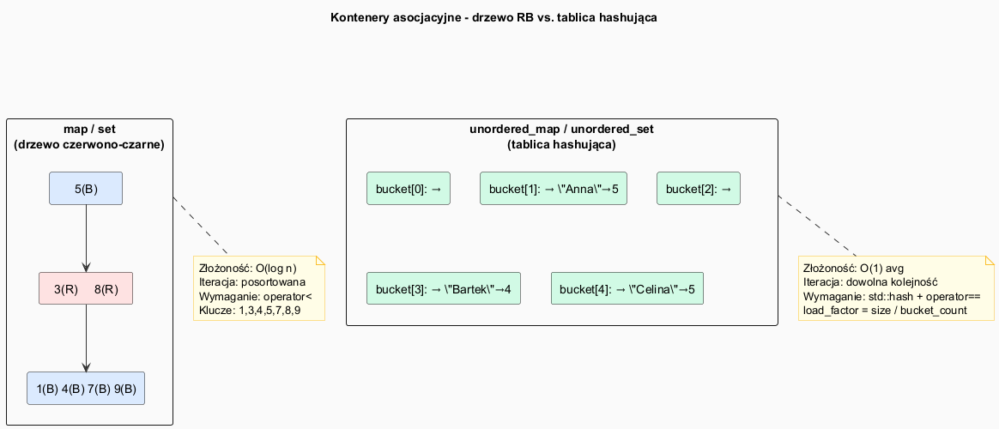

# STL – Kontenery asocjacyjne

## Slajd 1: Przegląd — posortowane vs nieuporządkowane

Kontenery asocjacyjne przechowują elementy **powiązane z kluczem** i umożliwiają
szybkie wyszukiwanie po kluczu.

| Kontener | Implementacja | Złożoność | Wymaga |
|---|---|---|---|
| `map` | drzewo czerwono-czarne | O(log n) | `operator<` |
| `set` | drzewo czerwono-czarne | O(log n) | `operator<` |
| `multimap` | drzewo RB (duplikaty) | O(log n) | `operator<` |
| `multiset` | drzewo RB (duplikaty) | O(log n) | `operator<` |
| `unordered_map` | tablica hashująca | O(1) avg | `std::hash<K>` + `operator==` |
| `unordered_set` | tablica hashująca | O(1) avg | `std::hash<K>` + `operator==` |
| `unordered_multimap` | tablica hashująca | O(1) avg | jak wyżej |
| `unordered_multiset` | tablica hashująca | O(1) avg | jak wyżej |

**Drzewo czerwono-czarne vs. tablica hashująca — dwa fundamentalnie różne kompromisy.**
**Drzewo RB** (`map`, `set`) gwarantuje O(log n) w każdym przypadku i utrzymuje klucze
posortowane — iteracja po `map` zawsze daje elementy w kolejności leksykograficznej.
Wymaga `operator<` (lub komparatora) — porównanie parami. **Tablica hashująca**
(`unordered_map`, `unordered_set`) daje O(1) średnio, ale O(n) w najgorszym przypadku
(gdy hash wszystkich kluczy koliduje do jednego bucketu). Wymaga `std::hash<K>` i
`operator==`. Kolejność elementów jest nieokreślona i może zmieniać się po rehash.
Wybór: jeśli potrzebujesz iterować po kluczach w kolejności lub używać `lower_bound`
— `map`; jeśli liczy się tylko szybkość lookup — `unordered_map`.

---

## Slajd 2: `std::map` — słownik z posortowanymi kluczami

```cpp
#include <map>

std::map<std::string, int> oceny;

// Wstawianie
oceny["Anna"]   = 5;                         // operator[]
oceny.insert({"Bartek", 4});                 // insert z parą
oceny.emplace("Celina", 5);                  // emplace – bez kopii

// Dostęp
int o = oceny["Anna"];                       // 5
int o2 = oceny.at("Anna");                   // 5, rzuca gdy brak klucza
// UWAGA: oceny["NowyKlucz"] TWORZY wpis z wartością domyślną!

// Szukanie – bezpieczne
auto it = oceny.find("Anna");
if (it != oceny.end())
    std::cout << it->first << ": " << it->second << "\n";

// C++20: contains
if (oceny.contains("Anna")) { /* ... */ }

// Iteracja – ALFABETYCZNA (map jest posortowana)
for (const auto& [klucz, wartosc] : oceny)
    std::cout << klucz << " → " << wartosc << "\n";
```

**Pułapka `operator[]` w `map` — niejawne tworzenie wpisów.** `oceny["NowyKlucz"]`
robi **dwie rzeczy**: jeśli klucz istnieje, zwraca referencję do wartości; jeśli nie
istnieje, **wstawia nowy wpis** z wartością domyślną (dla `int` to 0) i zwraca
referencję do niego. To niezamierzone tworzenie wpisów jest częstą przyczyną subtelnych
błędów — po `if (m["klucz"] == 0)` mapa zawiera nowy wpis nawet jeśli klucz nie istniał.
Bezpieczna alternatywa: `m.find("klucz")` zwraca `m.end()` gdy klucza nie ma, bez
modyfikacji mapy. `m.at("klucz")` rzuca `std::out_of_range` gdy brak klucza — przydatne
gdy brak jest błędem programisty. `m.contains("klucz")` (C++20) to najczytelniejszy
sposób sprawdzenia istnienia bez żadnych efektów ubocznych.

---

## Slajd 3: `std::set` — zbiór unikalnych kluczy

```cpp
#include <set>

std::set<int> s = {5, 3, 1, 4, 1, 5, 9};  // duplikaty są ignorowane!
// s zawiera: {1, 3, 4, 5, 9}

s.insert(7);        // {1, 3, 4, 5, 7, 9}
s.erase(3);         // {1, 4, 5, 7, 9}

bool znaleziono = s.count(4) > 0;       // true (count zwraca 0 lub 1)
bool znaleziono2 = s.contains(4);       // C++20, to samo

// lower_bound / upper_bound – zakres elementów
auto lo = s.lower_bound(4);   // iterator na 4 (pierwszy >= 4)
auto hi = s.upper_bound(7);   // iterator na 9 (pierwszy > 7)
for (auto it = lo; it != hi; ++it)
    std::cout << *it << " ";  // 4 5 7

// Użycie jako filtr duplikatów z vector:
std::vector<int> v = {3, 1, 4, 1, 5, 9, 2, 6, 5};
std::set<int> uniq(v.begin(), v.end());
```

**`lower_bound` i `upper_bound` — zapytania zakresowe jako supermoc `set`.** Drzewo
RB utrzymuje elementy posortowane, co umożliwia **zapytania zakresowe** niemożliwe w
`unordered_set`. `lower_bound(k)` to pierwszy element `>= k`, `upper_bound(k)` to
pierwszy `> k`. Razem dają zakres `[lo, hi)` wszystkich elementów z przedziału.
Czas: O(log n) — znacznie lepszy niż liniowe skanowanie. Praktyczne zastosowania:
znajdź wszystkich użytkowników w przedziale ID; najkrótszą/najdłuższą wartość w oknie;
sprawdź czy istnieje element z zakresu. `equal_range(k)` to wygodny skrót zwracający
parę `(lower_bound, upper_bound)`, przydatny dla `multiset` gdzie wiele elementów może
mieć tę samą wartość. Tego nie zrobi żaden `unordered_set`.

---

## Slajd 4: `std::unordered_map` — szybki słownik hashujący

```cpp
#include <unordered_map>

std::unordered_map<std::string, int> wordCount;

std::string slowa[] = {"apple", "banana", "apple", "cherry", "banana", "apple"};
for (const auto& s : slowa)
    ++wordCount[s];   // zliczanie słów

for (const auto& [slowo, ile] : wordCount)
    std::cout << slowo << ": " << ile << "\n";
// Kolejność NIE jest gwarantowana (zależy od hashy)

// Parametry hashowania
std::cout << "load_factor: " << wordCount.load_factor() << "\n";
std::cout << "bucket_count: " << wordCount.bucket_count() << "\n";
wordCount.reserve(100);     // zarezerwuj dla 100 elementów bez rehash
```

**Jak działa rehashing i dlaczego `reserve` jest ważny.** `load_factor` to stosunek
liczby elementów do liczby bucketów. Gdy przekroczy próg (domyślnie `max_load_factor()
= 1.0`), `unordered_map` wykonuje **rehash**: alokuje nową, większą tablicę bucketów
i przepisuje wszystkie elementy (przelicza hashe). Rehash to O(n) i **unieważnia
wszystkie iteratory**. `reserve(n)` ustawia `bucket_count` tak, by pomieścić `n`
elementów bez rehash — analogicznie do `vector::reserve`. Jeśli wiesz, że wstawisz
~1000 elementów, `reserve(1000)` eliminuje wielokrotne rehash. Bez `reserve`, seria
insertów może spowodować logarytmiczną liczbę rehashów — amortyzowany O(1) na insert,
ale z nieprzewidywalnymi skokami czasu, co jest problematyczne w systemach real-time.

---

## Slajd 5: Własna funkcja haszująca

Dla własnych typów jako kluczy `unordered_map` wymaga `std::hash<T>`:

```cpp
#include <unordered_map>

struct Punkt {
    int x, y;
    bool operator==(const Punkt& o) const { return x == o.x && y == o.y; }
};

// Specjalizacja std::hash<Punkt>
namespace std {
    template<>
    struct hash<Punkt> {
        size_t operator()(const Punkt& p) const noexcept {
            // Kombinacja hashy obu pól (technika boost::hash_combine)
            size_t h1 = std::hash<int>{}(p.x);
            size_t h2 = std::hash<int>{}(p.y);
            return h1 ^ (h2 << 1);
        }
    };
}

std::unordered_map<Punkt, std::string> nazwy;
nazwy[{0, 0}] = "Poczatek";
nazwy[{3, 4}] = "Odleglosc 5";
```

**Dlaczego dobra funkcja haszująca wymaga „efektu lawinowego".** XOR dwóch hashy
(`h1 ^ h2`) to minimum — dla par `(x, y)` i `(y, x)` daje ten sam hash, co powoduje
kolizje. Technika `h1 ^ (h2 << 1)` jest lepsza, ale nadal nie idealna. Najlepsza
prosta metoda to technika **boost::hash_combine**: `seed ^= h + 0x9e3779b9 + (seed<<6) + (seed>>2)`.
Stała `0x9e3779b9` to φ (złoty podział) w reprezentacji 32-bitowej — jej użycie
rozrywa wzorce bitowe, redukując kolizje. Dobra funkcja haszująca ma cechę **efektu
lawinowego**: zmiana jednego bitu wejścia zmienia ~50% bitów wyjściowego hasha.
`std::hash<int>` w wielu implementacjach to tożsamość (`hash(42) == 42`) — dla kluczy
int w `unordered_map` to może prowadzić do złego rozkładu i kolizji; specjalizacja z
lepszym mieszaniem bitów eliminuje problem.

---

## Slajd 6: `insert` / `emplace` / `find` — idiomy użycia

```cpp
std::map<std::string, int> m;

// insert – zwraca pair<iterator, bool>
auto [it, wstawiono] = m.insert({"klucz", 42});
if (!wstawiono)
    std::cout << "Klucz już istniał, wartość: " << it->second << "\n";

// emplace – konstruuje parę w miejscu (bez tymczasowych obiektów)
m.emplace("inny", 99);

// try_emplace (C++17) – wstawia tylko jeśli klucz nie istnieje
m.try_emplace("klucz", 100);  // nie nadpisze "klucz"!

// insert_or_assign (C++17) – wstawia lub nadpisuje
m.insert_or_assign("klucz", 100);  // nadpisze

// Usuwanie podczas iteracji (bezpieczny wzorzec):
for (auto it = m.begin(); it != m.end(); ) {
    if (it->second < 50)
        it = m.erase(it);   // erase zwraca następny iterator
    else
        ++it;
}
```

**`try_emplace` i `insert_or_assign` (C++17) — eliminacja podwójnego lookup.** Przed
C++17 bezpieczne wstawianie wyglądało tak: `auto it = m.find(k); if (it == end) m.insert(...)`.
To **dwa przeszukania drzewa** dla jednej operacji. `try_emplace(k, args...)` robi to
w jednym przejściu — jeśli klucza nie ma, wstawia z konstruktorem `args...`; jeśli jest,
zwraca iterator na istniejący element (bez modyfikacji). `insert_or_assign(k, v)` analogicznie
w jednym przejściu wstawia lub nadpisuje. Usuwanie podczas iteracji wymaga szczególnej
ostrożności: `m.erase(it)` zwraca iterator do następnego elementu, więc `it = m.erase(it)`
jest bezpieczne. `for (auto it = m.begin(); it != m.end(); it = m.erase(it) if condition
else ++it)` to kanoniczny wzorzec filtrowania mapy w miejscu.

---

## Slajd 7: `map` vs `unordered_map` — kiedy który?

| Kryterium | `map` | `unordered_map` |
|---|---|---|
| Złożoność find/insert | **O(log n)** | **O(1)** avg, O(n) worst |
| Iteracja w kolejności | **TAK** (posortowana) | NIE |
| Pamięć | wskaźniki w drzewie | tablica + listy |
| Stabilność iteratorów | insert nie unieważnia | rehash unieważnia wszystkie |
| Klucz musi mieć | `operator<` | `std::hash` + `operator==` |
| Kiedy używać | iteracja w kolejności, `lower_bound` | maksymalna szybkość lookup |

```cpp
// map lepszy gdy:
std::map<int,int> m;
auto zakres = m.equal_range(5);          // znajdź wszystkie 5
auto lo = m.lower_bound(10);             // pierwsza para >= 10

// unordered_map lepszy gdy:
std::unordered_map<std::string, int> um;
um.reserve(1000);                        // mniej rehashów
```

**Kiedy O(log n) jest szybsze od O(1) w praktyce.** Asymptotyka to nie wszystko —
dla małych `n` (np. n < 100) `map` może być szybszy od `unordered_map` bo drzewo RB
to kilkadziesiąt węzłów mieszczących się w cache. `unordered_map` ma stały narzut:
obliczenie hasha, znalezienie bucketu, porównanie przez `operator==`, potencjalnie
lista kolizji. Dla kluczy `std::string` hash to O(długość stringa). Dla kluczy
`int` — porównanie w drzewie RB to pojedyncza instrukcja, hash do `unordered_map`
może być droższy. Benchmark przed optymalizacją: w wielu aplikacjach webowych `map`
na ~50 routach jest szybszy niż `unordered_map` z powodu małego n i ciepłego cache.
Reguła: dla n > 1000 z intensywnym wyszukiwaniem — `unordered_map`; dla n < 100 lub
potrzeby iteracji w kolejności — `map`.

---

## Pliki źródłowe

| Plik | Opis |
|------|------|
| [`src/main.cpp`](src/main.cpp) | Demonstracja map, set, unordered_map, własnego hashu |
| [`associative_diagram.puml`](associative_diagram.puml) | Drzewo RB vs. tablica hashująca |
| [`associative_diagram.png`](associative_diagram.png) | Wygenerowany diagram PNG |


