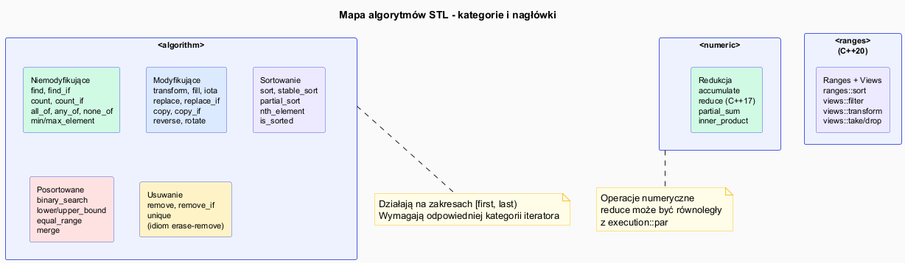

# STL – Algorytmy

## Slajd 1: Filozofia algorytmów STL

Algorytmy STL działają na **zakresach** `[first, last)` niezależnie od kontenera.
Nie wiedzą nic o kontenerze — rozmawiają tylko z iteratorami.

```cpp
// Schemat: algorytm(zakres [, predykat/funktor])
std::sort(v.begin(), v.end());
std::sort(v.begin(), v.end(), std::greater<int>{});  // malejąco
std::find_if(v.begin(), v.end(), [](int x){ return x > 3; });
```

Nagłówki:
- `<algorithm>` — większość algorytmów
- `<numeric>` — `accumulate`, `reduce`, `partial_sum`, `iota`
- `<ranges>` — C++20 Ranges

---

## Slajd 2: Algorytmy niemodyfikujące

Nie zmieniają zawartości kontenera — tylko czytają.

```cpp
std::vector<int> v = {3, 1, 4, 1, 5, 9, 2, 6};

// Wyszukiwanie
auto it = std::find(v.begin(), v.end(), 4);      // iterator na 4
auto it2 = std::find_if(v.begin(), v.end(),
    [](int x){ return x > 5; });                  // iterator na 9

// Zliczanie
int ile = std::count(v.begin(), v.end(), 1);       // 2
int ile2 = std::count_if(v.begin(), v.end(),
    [](int x){ return x % 2 == 0; });              // 3

// Predykaty
bool wszystkie = std::all_of(v.begin(), v.end(),
    [](int x){ return x > 0; });                   // true
bool zaden = std::none_of(v.begin(), v.end(),
    [](int x){ return x < 0; });                   // true
bool ktorykolwiek = std::any_of(v.begin(), v.end(),
    [](int x){ return x > 8; });                   // true (9)

// Minimum i maksimum
auto [lo, hi] = std::minmax_element(v.begin(), v.end());
std::cout << "min=" << *lo << " max=" << *hi << "\n";  // 1 9
```

---

## Slajd 3: Algorytmy modyfikujące

Zmieniają wartości w zakresie lub kopiują do nowego zakresu.

```cpp
std::vector<int> v = {1, 2, 3, 4, 5};
std::vector<int> out(5);

// Transformacja
std::transform(v.begin(), v.end(), out.begin(),
    [](int x){ return x * x; });               // out = {1,4,9,16,25}

// Transformacja in-place
std::transform(v.begin(), v.end(), v.begin(),
    [](int x){ return x * 2; });               // v = {2,4,6,8,10}

// Wypełnianie
std::fill(v.begin(), v.end(), 0);              // v = {0,0,0,0,0}
std::iota(v.begin(), v.end(), 1);              // v = {1,2,3,4,5}

// Zastępowanie
std::replace(v.begin(), v.end(), 3, 99);       // zastąp 3 przez 99
std::replace_if(v.begin(), v.end(),
    [](int x){ return x % 2 == 0; }, 0);      // parzyste → 0

// Kopiowanie z filtrem
std::copy_if(v.begin(), v.end(),
    std::back_inserter(out),
    [](int x){ return x > 0; });              // kopiuj dodatnie
```

---

## Slajd 4: Sortowanie

```cpp
std::vector<int> v = {5, 2, 8, 1, 9, 3};

// Pełne sortowanie (quicksort/heapsort, nie stabilne)
std::sort(v.begin(), v.end());                          // rosnąco
std::sort(v.begin(), v.end(), std::greater<int>{});     // malejąco
std::sort(v.begin(), v.end(),
    [](int a, int b){ return std::abs(a) < std::abs(b); }); // po |x|

// Stabilne sortowanie (zachowuje kolejność równych elementów)
std::stable_sort(v.begin(), v.end());

// Częściowe: n najmniejszych elementów na początku
std::partial_sort(v.begin(), v.begin() + 3, v.end());  // 3 najmniejsze

// n-ty element: element który byłby na n-tej pozycji po sort
std::nth_element(v.begin(), v.begin() + 2, v.end());
// v[2] == wartość która byłaby na indeksie 2 po sort

// Sprawdzenie czy posortowane
bool ok = std::is_sorted(v.begin(), v.end());
```

---

## Slajd 5: Szukanie w posortowanych zakresach

Na posortowanych danych dostępne są algorytmy **O(log n)**:

```cpp
std::vector<int> v = {1, 2, 3, 4, 5, 6, 7, 8, 9};

// Czy element istnieje?
bool jest = std::binary_search(v.begin(), v.end(), 5);  // true

// Pierwsza pozycja >= wartości
auto lo = std::lower_bound(v.begin(), v.end(), 4);  // iterator na 4

// Pierwsza pozycja > wartości
auto hi = std::upper_bound(v.begin(), v.end(), 6);  // iterator na 7

// Razem: zakres równych elementów
auto [first, last] = std::equal_range(v.begin(), v.end(), 5);
// [first, last) to zakres wszystkich piątek

// Scalanie dwóch posortowanych zakresów
std::vector<int> a = {1, 3, 5}, b = {2, 4, 6}, c;
std::merge(a.begin(), a.end(), b.begin(), b.end(),
           std::back_inserter(c));  // c = {1,2,3,4,5,6}
```

---

## Slajd 6: Redukcja — `accumulate` i `reduce`

```cpp
#include <numeric>

std::vector<int> v = {1, 2, 3, 4, 5};

// accumulate (C++98) – sekwencyjny, deterministyczny
int suma   = std::accumulate(v.begin(), v.end(), 0);          // 15
int iloczyn = std::accumulate(v.begin(), v.end(), 1,
    [](int a, int b){ return a * b; });                        // 120

// Konkatenacja stringów
std::vector<std::string> slowa = {"Hello", " ", "World"};
std::string zdanie = std::accumulate(slowa.begin(), slowa.end(), std::string{});

// reduce (C++17) – może być równoległy, kolejność nieustalona
#include <execution>
int suma2 = std::reduce(std::execution::par,
                        v.begin(), v.end(), 0);

// partial_sum – sumy prefiksowe
std::vector<int> prefix(v.size());
std::partial_sum(v.begin(), v.end(), prefix.begin());
// prefix = {1, 3, 6, 10, 15}
```

---

## Slajd 7: Idiom erase-remove

`std::remove` i `std::remove_if` nie usuwają elementów z kontenera —
przesuwają "złe" elementy na koniec i zwracają nowy koniec zakresu.
Faktyczne usunięcie wymaga `erase`.

```cpp
std::vector<int> v = {1, 2, 3, 4, 2, 5, 2};

// Krok 1: remove przesuwa wartości (v = {1,3,4,5,?,?,?})
auto new_end = std::remove(v.begin(), v.end(), 2);

// Krok 2: erase usuwa "śmieci"
v.erase(new_end, v.end());
// v = {1, 3, 4, 5}

// Jednolinijkowy idiom erase-remove:
v.erase(std::remove(v.begin(), v.end(), 2), v.end());

// C++20: std::erase (upraszcza idiom)
std::erase(v, 2);                                         // usuń wszystkie 2
std::erase_if(v, [](int x){ return x % 2 == 0; });       // usuń parzyste
```

---

## Slajd 8: C++17 Execution Policies i C++20 Ranges

```cpp
#include <execution>
#include <algorithm>

std::vector<int> v(1'000'000);
std::iota(v.begin(), v.end(), 0);

// Sekwencyjny (domyślny)
std::sort(std::execution::seq, v.begin(), v.end());

// Równoległy (wątki, kolejność elementów równych może się różnić)
std::sort(std::execution::par, v.begin(), v.end());

// Równoległy + wektoryzowany (SIMD)
std::sort(std::execution::par_unseq, v.begin(), v.end());
```

```cpp
// C++20 Ranges – algorytmy bez begin/end
#include <ranges>

std::vector<int> v = {5, 3, 1, 4, 2};
std::ranges::sort(v);                        // cały kontener
std::ranges::sort(v, std::greater{});        // malejąco

auto it = std::ranges::find(v, 3);

// Potoki (pipelines) – leniwe
auto wynik = v
    | std::views::filter([](int x){ return x > 2; })
    | std::views::transform([](int x){ return x * 10; });
```

---

## Pliki źródłowe

| Plik | Opis |
|------|------|
| [`src/main.cpp`](src/main.cpp) | Demonstracja algorytmów: sort, find, transform, reduce, erase-remove |
| [`algorithms_diagram.puml`](algorithms_diagram.puml) | Mapa kategorii algorytmów STL |
| [`algorithms_diagram.png`](algorithms_diagram.png) | Wygenerowany diagram PNG |


