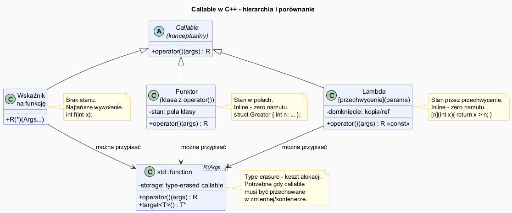

# STL – Funktory i Lambdy

## Slajd 1: Czym jest funktor

Funktor (obiekt wywoływalny, *callable*) to obiekt, który zachowuje się jak funkcja
dzięki przeciążeniu `operator()`.

```cpp
// Zwykła funkcja – nie ma stanu
bool wiekszy_niz_5(int x) { return x > 5; }

// Funktor – ma stan
struct WiekszyNiz {
    int prog;
    explicit WiekszyNiz(int p) : prog(p) {}
    bool operator()(int x) const { return x > prog; }
};

std::vector<int> v = {1, 3, 5, 7, 9};

// Użycie funkcji – próg jest na stałe
std::count_if(v.begin(), v.end(), wiekszy_niz_5);    // próg = 5 tylko

// Użycie funktora – próg konfigurowalny
WiekszyNiz wn{4};
std::count_if(v.begin(), v.end(), wn);               // próg = 4
std::count_if(v.begin(), v.end(), WiekszyNiz{7});    // próg = 7
```

Funktor jest **parametryzowany przez konstruktor** — to jego kluczowa przewaga
nad zwykłą funkcją.

**Funktor vs wskaźnik na funkcję — kwestia inline.** Gdy przekazujesz zwykłą funkcję
jako argument szablonu, kompilator widzi **wskaźnik na funkcję** — wywołanie przez
wskaźnik to pośrednie skoku, którego kompilator często nie może zinlineować. Funktor
to typ konkretny: kompilator wie dokładnie, który `operator()` wywołać, i może go
**zinlineować** — produkując kod identyczny z ręcznie napisaną pętlą. To dlatego
Stepanov twierdził, że generyczne algorytmy mogą być równie szybkie jak specjalizowane:
`std::sort` z funktorem komparatora kompiluje się do kodu jakbyś wpisał komparator
bezpośrednio w pętlę sortowania. Właśnie z tego powodu algorytmy STL są szablonami
a nie polimorfizmem wirtualnym — szablony umożliwiają inline w czasie kompilacji.

---

## Slajd 2: Standardowe funktory w `<functional>`

C++ dostarcza gotowe funktory dla typowych operacji:

```cpp
#include <functional>

// Arytmetyczne
std::plus<int>{}(3, 4)          // 7
std::minus<int>{}(10, 3)        // 7
std::multiplies<int>{}(3, 4)    // 12
std::divides<double>{}(7, 2)    // 3.5
std::negate<int>{}(5)           // -5

// Porównania
std::less<int>{}(3, 5)          // true
std::greater<int>{}(5, 3)       // true
std::equal_to<int>{}(3, 3)      // true

// Logiczne
std::logical_and<bool>{}(true, false)   // false
std::logical_not<bool>{}(true)          // false

// Typowe użycie:
std::sort(v.begin(), v.end(), std::greater<int>{});   // malejąco
std::accumulate(v.begin(), v.end(), 1, std::multiplies<int>{}); // iloczyn
```

**Przezroczyste funktory `std::less<>` (C++14) i heterogeniczne wyszukiwanie.**
`std::less<int>{}` porównuje dwa `int`. `std::less<>{}` (bez argumentu szablonu) to
**przezroczysty funktor** — akceptuje dowolne typy, które można porównać przez `<`.
Dla kontenerów (`std::map`, `std::set`) z komparatorem `std::less<>` można wywołać
`find(string_view)` bez tworzenia tymczasowego `std::string` — **heterogeniczne
wyszukiwanie**. Przykład: `std::set<std::string, std::less<>>` + `s.find("literal")`
nie konstruuje `std::string` z literału — wyszukuje bezpośrednio. Dla dużych zbiorów
z częstym wyszukiwaniem przez string literal to eliminuje alokacje. Domyślny
`std::less<std::string>` nie ma tej właściwości — wymaga pełnego `std::string`.

---

## Slajd 3: Lambda — składnia i domknięcie

Lambda to anonimowy funktor tworzony w miejscu użycia.

```
[ przechwycenie ] ( parametry ) -> typ_zwracany { ciało }
```

```cpp
// Podstawowa lambda
auto kwadrat = [](int x) { return x * x; };
std::cout << kwadrat(5);  // 25

// Przechwycenie zmiennych z otoczenia (domknięcie)
int prog = 7;

// Przechwycenie przez wartość – kopia w momencie tworzenia
auto przez_wartosc = [prog](int x) { return x > prog; };

// Przechwycenie przez referencję – dostęp do oryginału
auto przez_ref = [&prog](int x) { return x > prog; };
prog = 10;
przez_ref(8);   // false – widzi nową wartość prog=10
przez_wartosc(8); // true – nadal widzi stare prog=7

// Przechwycenie wszystkiego przez wartość [=] lub referencję [&]
auto wszystko_val = [=](int x) { return x + prog; };  // kopia prog
auto wszystko_ref = [&](int x) { return x + prog; };  // ref do prog
```

**Przechwycenie przez referencję — ryzyko wiszących referencji.** Przechwycenie `[&]`
lub `[&zmienna]` przechowuje **referencję** do zmiennej ze stosu. Jeśli lambda żyje
dłużej niż zmienna (np. jest przechowywana w `std::function`, przekazana do wątku,
zapisana w callbacku), referencja staje się **wiszącą** — dostęp to UB. Typowe
niebezpieczne wzorce: zwracanie lambdy przechwytującej `[&]` lokalne zmienne,
przekazywanie `[&]` lambdy do `std::async` lub `std::thread`, zapisywanie `[&]` lambdy
w wektorze który przeżywa zakres. Bezpieczna reguła: dla lambd wychodzących poza bieżący
zakres używaj `[=]` (kopia) zamiast `[&]`. Dla lambd używanych tylko lokalnie `[&]`
jest bezpieczne i bardziej efektywne (bez kopiowania).

---

## Slajd 4: Lambda generyczna i `constexpr`

```cpp
// Lambda generyczna (C++14) – auto jako parametr
auto dodaj = [](auto a, auto b) { return a + b; };
dodaj(1, 2);        // int
dodaj(1.5, 2.5);    // double
dodaj(std::string{"Hello "}, std::string{"World"});  // string

// constexpr lambda (C++17) – wykonanie w czasie kompilacji
constexpr auto potega2 = [](int n) constexpr {
    int wynik = 1;
    for (int i = 0; i < n; ++i) wynik *= 2;
    return wynik;
};
static_assert(potega2(10) == 1024);  // sprawdzane w czasie kompilacji

// Lambda mutowalną [=] mutable – możliwość modyfikacji kopii
int licznik = 0;
auto zliczaj = [licznik]() mutable { return ++licznik; };
zliczaj();  // 1
zliczaj();  // 2
std::cout << licznik;  // 0 – oryginał niezmieniony!

// Rekurencyjna lambda (C++23: dedukcja this, wcześniej przez std::function)
std::function<int(int)> silnia = [&silnia](int n) -> int {
    return n <= 1 ? 1 : n * silnia(n - 1);
};
```

**Dlaczego przechwycone przez `[=]` zmienne są `const` domyślnie?** Lambda przez wartość
`[x]` tworzy kopię `x` jako **pole const** w anonimowej strukturze — nie możesz jej
modyfikować (stąd `mutable`). To celowy projekt: lambda domyślnie nie powinna mieć
**efektów ubocznych** na przechwyconych kopiach, co ułatwia wnioskowanie o kodzie.
`mutable` odblokowuje modyfikację kopii, ale original **nadal jest niezmieniony** —
to odróżnia `mutable` lambda od `[&]`. Rekurencyjna lambda przez `std::function` ma
koszt type erasure (patrz slajd 5) — w C++23 możesz użyć **dedukcji `this`**:
`[](this auto& self, int n) -> int { return n <= 1 ? 1 : n * self(n-1); }` eliminując
`std::function` i zachowując inline.

---

## Slajd 5: `std::function` — opakowanie na dowolny callable

`std::function<R(Args...)>` przechowuje **dowolny callable**: funkcję, funktor, lambdę, metodę.

```cpp
#include <functional>

// Deklaracja: std::function<typ_zwracany(parametry)>
std::function<int(int, int)> op;

// Można przypisać funkcję, funktor lub lambdę:
op = std::plus<int>{};
std::cout << op(3, 4);  // 7

op = [](int a, int b){ return a * b; };
std::cout << op(3, 4);  // 12

// Przechowywanie w kontenerze (niemożliwe dla surowych lambd)
std::vector<std::function<int(int)>> transformacje;
transformacje.push_back([](int x){ return x * 2; });
transformacje.push_back([](int x){ return x + 10; });
transformacje.push_back([](int x){ return x * x; });

int wartosc = 5;
for (auto& f : transformacje)
    wartosc = f(wartosc);  // 5 → 10 → 20 → 400
```

> **Koszt:** `std::function` używa **type erasure** — wiąże się z alokacją na stercie
> i wirtualnym wywołaniem. Dla hot path preferuj szablony lub lambdy bezpośrednio.

**`std::function` — type erasure i SBO.** Type erasure to technika pozwalająca
przechowywać obiekty różnych typów przez wspólny interfejs bez wirtualnej dziedziczenia.
`std::function` trzyma callable w buforze wewnętrznym (SBO — **Small Buffer Optimization**
— zazwyczaj ~16-32 bajty). Jeśli callable mieści się w buforze — zero alokacji; jeśli
jest większy (duże przechwycenie) — alokacja na stercie. Wywołanie `operator()` to
pośrednie wywołanie przez wskaźnik na tablicę wirtualną — niemożliwe do zinlineowania.
Dlatego `std::function` w hot-path jest od 3x do 10x wolniejsze od bezpośredniego
wywołania lambdy. Alternatywy: `template <typename F> void algo(F&& f)` zachowuje typ
i umożliwia inline; `std::move_only_function` (C++23) dla callables bez copy constructor.

---

## Slajd 6: `std::bind` i dlaczego lambdy go wyparły

```cpp
#include <functional>

// std::bind – częściowa aplikacja argumentów (C++11)
auto dodaj10 = std::bind(std::plus<int>{}, std::placeholders::_1, 10);
std::cout << dodaj10(5);   // 15
std::cout << dodaj10(20);  // 30

// To samo z lambdą – czytelniejsze:
auto dodaj10_lambda = [](int x){ return x + 10; };

// Wiązanie metody klasy
struct Kalkulator {
    int baza;
    int oblicz(int x) const { return baza + x; }
};
Kalkulator k{100};
auto metoda = std::bind(&Kalkulator::oblicz, &k, std::placeholders::_1);
std::cout << metoda(42);  // 142

// Lambda jest prostsza:
auto metoda_lambda = [&k](int x){ return k.oblicz(x); };
```

**`std::bind` — dlaczego lambdy go wyparły.** `std::bind` był odpowiedzią C++11 na
brak lambd w C++03 — pozwalał tworzyć częściowo zastosowane funkcje. Problem: składnia
z `std::placeholders::_1`, `_2` staje się nieprzejrzysta przy wielu argumentach lub
reorderingu. Lambda wyraża to samo w naturalnej składni C++. Co gorsza, `std::bind`
ma subtelne pułapki: domyślnie **kopiuje** argumenty, nawet `reference_wrapper`
wymaga jawnego `std::ref()`. Lambda `[&k](int x){ return k.oblicz(x); }` jest
jednoznaczna w kwestii przechwycenia. Jedyne uzasadnione zastosowanie `std::bind` dziś:
wiązanie metody wirtualnej do `std::function` w istniejącym kodzie korzystającym ze
starszego API. W nowym kodzie — zawsze lambda.

---

## Slajd 7: Porównanie — funktor vs lambda vs `std::function`

| | Funktor | Lambda | `std::function` |
|---|---|---|---|
| Stan | tak (pola) | tak (przechwycenie) | tak (dowolny callable) |
| Typ | znany | anonimowy (auto) | wymazany (type erasure) |
| Koszt wywołania | inline | inline | wirtualne (wolniejsze) |
| Wielokrotne użycie | tak (klasa) | ograniczone | tak |
| W kontenerze | tak | nie (bezpośrednio) | **tak** |
| Rekurencja | łatwa | przez `std::function` | tak |
| Kiedy używać | złożona logika z wieloma polami | predykaty w miejscu | przechowywanie callables |

---

## Pliki źródłowe

| Plik | Opis |
|------|------|
| [`src/main.cpp`](src/main.cpp) | Demonstracja funktorów, lambd, `std::function`, `std::bind` |
| [`functors_diagram.puml`](functors_diagram.puml) | Hierarchia callable w C++ |
| [`functors_diagram.png`](functors_diagram.png) | Wygenerowany diagram PNG |


