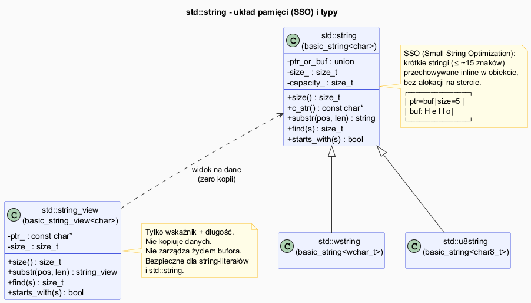

# STL – `std::string` i przetwarzanie tekstu

## Slajd 1: `std::string` vs C-string i SSO

`std::string` to klasa zarządzająca dynamicznym buforem znaków.

```cpp
// C-string – surowy wskaźnik, ręczne zarządzanie
const char* cstr = "Hello";
char buf[6] = "Hello";  // rozmiar musi być znany!

// std::string – zarządza pamięcią automatycznie
std::string s = "Hello";
s += " World";    // automatyczna realokacja
s.size();         // 11 – bez terminalnego '\0'
s.length();       // synonim size()
s.c_str();        // const char* – kompatybilność z C API
```

**SSO (Small String Optimization):**
Większość implementacji przechowuje krótkie stringi (≤ 15–22 znaków)
bezpośrednio w obiekcie — **bez alokacji na stercie**.

```
std::string s = "Hi";        // SSO: dane w buforze inline obiektu
std::string s2 = "To jest już dłuższy tekst..."; // alokacja na stercie
```

**SSO — dlaczego krótkie stringi to inne ścieżki kodu.** Każda dynamiczna alokacja
pamięci (operator `new`) to co najmniej ~50-100 ns — wywołanie do systemu operacyjnego,
synchronizacja alokatora. SSO eliminuje alokację dla krótkich stringów przechowując
dane w samym obiekcie `std::string` (zazwyczaj 16-32 bajty na stosie). W libstdc++
próg to **15 znaków**, w libc++ (clang) **22 znaki**. Oznacza to, że typowe nazwy,
identyfikatory i krótkie etykiety nie alokują pamięci dynamicznej — cały obiekt żyje
na stosie. `s.size() <= 15` to wskazówka, że string prawdopodobnie używa SSO, ale nie
ma standardowego API do sprawdzenia. Konsekwencja: przekazywanie `std::string` przez
wartość dla krótkich stringów jest tanie — nie jest to kopowanie bufora sterty.

---

## Slajd 2: Kluczowe operacje

```cpp
std::string s = "Ala ma kota";

// Dostęp
s[0];             // 'A' – bez kontroli zakresu
s.at(0);          // 'A' – z kontrolą (rzuca out_of_range)
s.front();        // 'A'
s.back();         // 'a'

// Wyszukiwanie
s.find("ma");             // 4 – pozycja lub std::string::npos
s.find("psa");            // std::string::npos
s.rfind("a");             // 10 – ostatnie wystąpienie
s.find_first_of("aeiou"); // 0 – pierwsza samogłoska

// Wycinanie i modyfikacja
s.substr(4, 2);           // "ma" – od pozycji 4, długość 2
s.replace(4, 2, "nie ma"); // "Ala nie ma kota"
s.erase(4, 7);             // usuń 7 znaków od pos 4
s.insert(4, "nie ");       // wstaw w pozycji 4

// Porównanie
s == "Ala ma kota";        // true
s.compare("Ala");          // > 0 (leksykograficznie)
```

**Bezpieczne sprawdzanie wyniku `find` — nie porównuj do `int`!** `std::string::find`
zwraca `std::string::npos` gdy nie znajdzie wzorca. `npos` to `static const size_t(-1)`,
czyli maksymalna wartość `size_t` (np. `18446744073709551615` na 64-bit). Błąd: `if (s.find("x") >= 0)` — zawsze true, bo `size_t` jest unsigned! Poprawny wzorzec:
`if (s.find("x") != std::string::npos)`. C++23 `contains` eliminuje ten problem:
`if (s.contains("x"))`. `substr(pos, len)` rzuca `std::out_of_range` gdy `pos > size()` —
zawsze sprawdzaj wynik `find` przed `substr`. `rfind` szuka od końca — para `find` +
`rfind` umożliwia wyodrębnienie rozszerzenia pliku: `s.substr(s.rfind('.') + 1)`.

---

## Slajd 3: Konwersje liczbowe

```cpp
// string → liczba
std::string s = "42";
int i     = std::stoi(s);      // 42
long l    = std::stol("123");
double d  = std::stod("3.14");
float f   = std::stof("1.5");

// Obsługa błędów
try {
    int x = std::stoi("abc");  // rzuca std::invalid_argument
} catch (const std::invalid_argument& e) {
    std::cout << "Błąd: " << e.what() << "\n";
}
try {
    int x = std::stoi("99999999999");  // rzuca std::out_of_range
} catch (const std::out_of_range& e) {
    std::cout << "Zakres: " << e.what() << "\n";
}

// liczba → string
std::string s2 = std::to_string(42);     // "42"
std::string s3 = std::to_string(3.14);   // "3.140000"
```

**`stoi`/`stod` vs `std::from_chars` — wyjątki vs bez-alokacyjna alternatywa.**
`std::stoi` rzuca `std::invalid_argument` lub `std::out_of_range` — wygodne, ale
obsługa wyjątków ma koszt przy złych danych. `std::from_chars` (C++17, `<charconv>`)
to alternatywa **bez wyjątków i bez alokacji**: `auto [ptr, ec] = std::from_chars(s.data(), s.data() + s.size(), i)`. Zwraca `std::errc` zamiast rzucać. Jest też
szybsza — zaprojektowana dla parsowania w hot-path (np. JSON parser, deserializacja).
Dla podobnych zastosowań `std::to_chars` zastępuje `to_string` i `sprintf` — formatuje
bez alokacji, w dostarczonym buforze. Zasada: w kodzie obsługi błędów lub UI — `stoi`
z try-catch jest czytelniejszy; w kodzie wydajnościowym lub serwerowym — `from_chars`.

---

## Slajd 4: `std::string_view` (C++17) — widok bez kopii

`string_view` to lekki, **nieposiadający zasobów** widok na ciąg znaków.
Nie kopiuje — przechowuje tylko wskaźnik i długość.

```cpp
#include <string_view>

void wyswietl(std::string_view sv) {
    std::cout << sv << " (dł=" << sv.size() << ")\n";
    // sv.data() – wskaźnik na oryginał, BRAK '\0' gwarantowanego!
}

std::string s = "Hello World";
wyswietl(s);              // zero kopii
wyswietl("Hello World");  // działa z C-stringiem
wyswietl({s.data(), 5});  // tylko "Hello"

// Wszystkie operacje odczytu std::string dostępne w string_view:
std::string_view sv = "Ala ma kota";
sv.substr(4, 2);    // string_view na "ma" – zero kopii!
sv.find("ma");      // 4

// UWAGA: string_view nie zarządza życiem danych!
std::string_view niebezpieczny() {
    std::string s = "tymczasowy";
    return s;    // UB! s zostaje zniszczony, string_view zwisa
}
```

**Typowe pułapki `string_view` — wiszące wskaźniki.** `string_view` to tylko
wskaźnik + długość — żadna własność. Trzy scenariusze niebezpieczne: (1) **Zwracanie
`string_view` lokalnego `std::string`** — jak w przykładzie powyżej — string jest
niszczony na wyjściu z funkcji, view wskazuje na zwolnioną pamięć. (2) **`auto sv = std::string("temp");`** — tworzenie `string_view` z tymczasowym stringiem, który od
razu jest niszczony (lifetime extension nie działa przez `auto`). (3) **Przechowywanie
`string_view` po tym jak oryginalny string jest realokowany** przez `push_back` czy
`resize`. Bezpieczna reguła: `string_view` jako **parametr funkcji** jest zawsze
bezpieczny (string żyje przed i po wywołaniu); jako **pole klasy lub wartość zwracana**
— zawsze przemyśl żywotność oryginału.

---

## Slajd 5: `std::stringstream` — budowanie i parsowanie

```cpp
#include <sstream>

// Budowanie stringa
std::ostringstream oss;
oss << "Wynik: " << 42 << " temp: " << 36.6 << "°C";
std::string wynik = oss.str();
std::cout << wynik << "\n";

// Parsowanie stringa
std::string dane = "Jan 30 95.5";
std::istringstream iss(dane);
std::string imie;
int wiek;
double waga;
iss >> imie >> wiek >> waga;
std::cout << imie << " ma " << wiek << " lat i " << waga << " kg\n";

// Tokenizacja po spacji
std::string zdanie = "to jest zdanie ze slowami";
std::istringstream tokeny(zdanie);
std::string token;
while (tokeny >> token)
    std::cout << "[" << token << "] ";
std::cout << "\n";
```

**`stringstream` — kiedy warto, kiedy nie.** `std::stringstream` jest wygodny do
budowania stringów z wielu wartości różnych typów (`<<` działa dla każdego z `operator<<`).
Jednak **pełna reinicjalizacja** strumienia (`iss.str(nowy); iss.clear()`) jest
konieczna przy ponownym użyciu — `clear()` resetuje flagi błędów, `str()` ustawia
nową zawartość. Tokenizacja `iss >> token` rozdziela po **whitespace** (spacje, tabulacje,
newline) — dla niestandardowych delimitów używaj `std::getline(iss, token, ';')`.
Warto też znać `std::format` (C++20) jako alternatywę do budowania stringów — jest
szybsze od `ostringstream` bo operuje na stałym formacie. Dla krytycznej wydajności
formatowania stringów: `fmt::format` (biblioteka fmtlib) lub `std::format` to
wielokrotnie szybsze od `stringstream` i `sprintf`.

---

## Slajd 6: C++20 — nowe metody `string`

```cpp
std::string s = "Hello World";

// starts_with / ends_with (C++20)
s.starts_with("Hello");   // true
s.ends_with("World");     // true
s.starts_with("World");   // false

// contains (C++23, ale w wielu implementacjach od C++20)
// Wcześniej:  s.find("llo") != std::string::npos
// Od C++23:   s.contains("llo")  // true

// string_view ma starts_with/ends_with już od C++20:
std::string_view sv = "Hello World";
sv.starts_with("Hello");  // true

// Formatowanie (C++20) – <format>
#include <format>
std::string msg = std::format("Imię: {}, Wiek: {}", "Anna", 30);
std::cout << msg << "\n";  // Imię: Anna, Wiek: 30
```

**`std::format` — type-safe zastępca `printf` i `sprintf`.** `printf("%s ma %d lat", name, age)` jest niebezpieczny: brak sprawdzenia typów w czasie kompilacji, przekazanie
`int` zamiast `const char*` to UB. `std::format("{} ma {} lat", name, age)` jest
sprawdzane przez kompilator — niezgodność typów to błąd kompilacji. Format specifiers
są czytelniejsze: `{:.2f}` zamiast `"%.2f"`, `{:>10}` zamiast `%-10s`. `std::format`
zwraca `std::string` zamiast pisać do bufora — brak przepełnienia bufora (błąd numer 1
`sprintf`). `std::print` (C++23) idzie dalej: `std::print("Imię: {}\n", name)` to
bezpośrednie wypisanie bez tworzenia pośredniego `std::string`, wydajniejsze od
`std::cout << std::format(...)`.

---

## Pliki źródłowe

| Plik | Opis |
|------|------|
| [`src/main.cpp`](src/main.cpp) | Demonstracja `string`, `string_view`, `stringstream` |
| [`string_diagram.puml`](string_diagram.puml) | Schemat SSO i hierarchia typów string |
| [`string_diagram.png`](string_diagram.png) | Wygenerowany diagram PNG |


