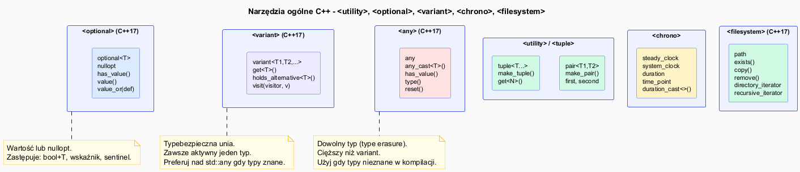

# STL – Narzędzia ogólne

## Slajd 1: `std::pair` i `std::tuple`

```cpp
#include <utility>
#include <tuple>

// pair – para dwóch wartości (różnych typów)
std::pair<std::string, int> p = {"Anna", 30};
std::cout << p.first << " " << p.second << "\n";

auto p2 = std::make_pair("Bartek", 25);   // dedukcja typów

// Structured bindings (C++17) – dekonstrukcja
auto [imie, wiek] = p;
std::cout << imie << " " << wiek << "\n";

// tuple – krotka n wartości
std::tuple<std::string, int, double> t = {"Celina", 35, 165.5};
std::cout << std::get<0>(t) << " " << std::get<1>(t) << "\n";

auto [name, age, height] = t;   // structured binding

// Przydatne funkcje
auto t2 = std::make_tuple(1, "text", 3.14);
std::cout << std::tuple_size_v<decltype(t2)> << "\n";  // 3
```

**Structured bindings — szerszy zakres niż tylko `pair` i `tuple`.** C++17 structured
bindings (`auto [a, b] = ...`) działają dla trzech kategorii typów: (1) `std::pair`,
`std::tuple` i typy z `std::get<>` + `std::tuple_size` (protokół get); (2) tablic
`int arr[3]` — `auto [x, y, z] = arr`; (3) struktur i klas agregowanych z publicznymi
polami — `struct Point { int x, y; }; auto [px, py] = point`. Binding agregatu jest
szczególnie przydatny przy zwracaniu wielu wartości ze struktur. Dla własnego typu
implementacja protokołu `std::get<N>` i specjalizacja `std::tuple_size`/`std::tuple_element`
umożliwia użycie structured bindings. `auto& [k, v] = *map_iter` to kanoniczny wzorzec
iteracji po `map` z named bindings.

---

## Slajd 2: `std::optional<T>` (C++17)

`optional` przechowuje **wartość lub jej brak** — bezpieczna alternatywa dla
zwracania wskaźnika, wartości sentinel (`-1`, `""`) lub pary `{bool, T}`.

```cpp
#include <optional>

// Funkcja która może nie zwrócić wyniku
std::optional<int> znajdz(const std::vector<int>& v, int cel) {
    auto it = std::find(v.begin(), v.end(), cel);
    if (it == v.end())
        return std::nullopt;  // brak wartości
    return *it;
}

std::vector<int> v = {1, 3, 5, 7};

auto wynik = znajdz(v, 5);
if (wynik.has_value())                    // lub: if (wynik)
    std::cout << "Znaleziono: " << *wynik << "\n";

// value_or – wartość domyślna gdy brak
auto r = znajdz(v, 99).value_or(-1);     // -1 gdy nie znaleziono
std::cout << r << "\n";

// value() rzuca std::bad_optional_access gdy nullopt
try {
    auto x = znajdz(v, 99).value();
} catch (const std::bad_optional_access& e) {
    std::cout << "Wyjątek: " << e.what() << "\n";
}
```

**`std::optional` — monadyczne operacje (C++23) i zastosowania.** `optional` eliminuje
„magiczne" wartości sentinel: `find` zwracające `-1`, `parse` zwracające `nullptr`,
funkcje z parametrem `bool* ok`. Dostęp przez `*opt` lub `opt->field` bez sprawdzenia
to UB gdy `opt` jest nullopt — zawsze poprzedź `if (opt)` lub użyj `value_or`.
C++23 dodaje monadyczne operacje: `opt.and_then(f)` wywołuje `f(*opt)` jeśli jest
wartość (f musi zwracać `optional`); `opt.transform(f)` mapuje wartość przez `f`;
`opt.or_else(g)` zwraca `opt` jeśli ma wartość, inaczej wywołuje `g`. To umożliwia
łańcuchowanie: `findUser(id).and_then(getAddress).transform(formatAddress).value_or("brak")`.
`optional` zajmuje `sizeof(T) + 1` (plus padding) — niewielki narzut.

---

## Slajd 3: `std::variant<T...>` (C++17)

`variant` to **typebezpieczna unia** — przechowuje dokładnie jeden z typów listy.

```cpp
#include <variant>

std::variant<int, double, std::string> v;

v = 42;
std::cout << std::get<int>(v) << "\n";        // 42

v = 3.14;
std::cout << std::get<double>(v) << "\n";     // 3.14

v = std::string{"Hello"};
std::cout << std::get<std::string>(v) << "\n"; // Hello

// Sprawdzenie aktywnego typu
std::cout << v.index() << "\n";              // 2 (string jest na pozycji 2)
if (std::holds_alternative<std::string>(v))
    std::cout << "To jest string\n";

// std::visit – wywołanie funkcji dla aktywnego typu
std::visit([](const auto& val){
    std::cout << "Wartość: " << val << "\n";
}, v);

// Wzorzec visitor z overload
struct Visitor {
    void operator()(int n)               const { std::cout << "int: " << n << "\n"; }
    void operator()(double d)            const { std::cout << "double: " << d << "\n"; }
    void operator()(const std::string& s) const { std::cout << "string: " << s << "\n"; }
};
std::visit(Visitor{}, v);
```

**`std::variant` i `std::monostate` — variant z domyślnym stanem.** `variant<int, string>`
nie jest domyślnie konstruowalny gdy `int` nie ma domyślnego konstruktora (a ma — wartość 0).
Ale `variant<MójTypBezDomKonstr, string>` — nie. `std::monostate` to pusty typ
reprezentujący „brak wartości" — `variant<monostate, int, string>` jest domyślnie
konstruowalny i reprezentuje stan „nie zainicjalizowany". To wzorzec analogiczny do
`optional`, ale dla wariantu. `std::get<T>(v)` rzuca `std::bad_variant_access` gdy
aktywny typ jest inny — bezpieczniejsze jest `std::get_if<T>(&v)` zwracające wskaźnik
lub null. `std::visit` z przeciążonym lambdą (`overload pattern`) jest idiomatycznym
wzorcem — `std::visit(overloaded{[](int i){...}, [](string s){...}}, v)` eliminuje
klasy Visitor dla prostych przypadków.

---

## Slajd 4: `std::any` (C++17)

`any` przechowuje **dowolny typ** z kontrolą w czasie wykonania (type erasure).

```cpp
#include <any>

std::any a = 42;
std::cout << std::any_cast<int>(a) << "\n";   // 42

a = std::string{"Hello"};
std::cout << std::any_cast<std::string>(a) << "\n";

a = 3.14;

// Bezpieczne wyłuskanie przez wskaźnik
if (auto* p = std::any_cast<double>(&a))
    std::cout << "double: " << *p << "\n";

// Wyjątek przy złym typie
try {
    std::any_cast<int>(a);   // rzuca std::bad_any_cast
} catch (const std::bad_any_cast& e) {
    std::cout << "bad_any_cast: " << e.what() << "\n";
}

// Sprawdzenie typu
std::cout << a.type().name() << "\n";   // zależne od kompilatora
std::cout << "has_value: " << a.has_value() << "\n";
a.reset();  // wyczyść
```

> `any` jest znacznie cięższy niż `variant` — używaj `variant` gdy typy są znane w czasie kompilacji.

**Kiedy `any`, kiedy `variant` — dwie różne filozofie.** `variant<A,B,C>` to **zamknięty
zbiór typów** — kompilator wymusza obsługę wszystkich przypadków w `std::visit`.
`any` to **otwarty zbiór** — możesz przechować cokolwiek, ale tracisz statyczne
gwarancje. `variant` jest preferowany gdy: typy znane w czasie kompilacji (parser
tokenów, wynik operacji, konfiguracja). `any` ma sens dla: heterogenicznych kontenerów
pluginów, konfiguracji o nieznanych kluczach, interfejsów między bibliotekami z różnymi
typami. Koszt: `any` używa type erasure z alokacją na stercie (chyba że typ mieści się
w SBO — zazwyczaj ~8-16 bajtów). Dostęp przez `any_cast<T>(&a)` (wskaźnik) jest
bezpieczny (zwraca nullptr przy złym typie); przez `any_cast<T>(a)` (wartość) rzuca
wyjątek. Typ można odczytać przez `a.type()` — zwraca `std::type_info`.

---

## Slajd 5: `std::chrono` — pomiar czasu

```cpp
#include <chrono>

using namespace std::chrono;

// Pomiar czasu wykonania
auto start = steady_clock::now();

// ... kod do zmierzenia ...
volatile long suma = 0;
for (long i = 0; i < 10'000'000; ++i) suma += i;

auto stop = steady_clock::now();
auto czas = duration_cast<milliseconds>(stop - start);
std::cout << "Czas: " << czas.count() << " ms\n";

// Czas z różnymi jednostkami
auto t = 2h + 30min + 15s;
std::cout << duration_cast<seconds>(t).count() << " sekund\n";  // 9015

// Czas systemowy
auto teraz = system_clock::now();
auto czas_t = system_clock::to_time_t(teraz);
std::cout << std::ctime(&czas_t);  // czytelna data/czas

// Literały (C++14)
auto deadline = steady_clock::now() + 500ms;
```

**Trzy typy zegarów — kiedy który?** `std::chrono::system_clock` mierzy czas ścienny
(wall clock) — może cofać się przy synchronizacji NTP lub zmianie czasu systemowego.
Nie używaj go do pomiaru czasu wykonania. `std::chrono::steady_clock` to **zegar
monotonicznie rosnący** — nigdy nie cofa się, idealny do pomiaru elapsed time i
timeoutów. `std::chrono::high_resolution_clock` to zazwyczaj alias na `steady_clock`
lub `system_clock` (zależy od implementacji) z największą dostępną rozdzielczością —
ale nie zawsze jest to steady! Bezpieczna reguła: pomiaru czasu wykonania → zawsze
`steady_clock`. Czas systemowy/daty → `system_clock`. `duration_cast` to konwersja
między jednostkami — bez niejawnej utraty precyzji: `cast<seconds>` obcina milisekundy.
Literały `1s`, `500ms`, `2h` z `using namespace std::chrono_literals` czynią kod
czytelnym i typesafe.

---

## Slajd 6: `std::filesystem` (C++17)

```cpp
#include <filesystem>
namespace fs = std::filesystem;

// Informacje o ścieżce
fs::path p = "/home/user/projekt/main.cpp";
std::cout << p.filename()   << "\n";  // main.cpp
std::cout << p.stem()       << "\n";  // main
std::cout << p.extension()  << "\n";  // .cpp
std::cout << p.parent_path()<< "\n";  // /home/user/projekt

// Tworzenie katalogów
fs::create_directories("output/data");

// Sprawdzenie istnienia
if (fs::exists("plik.txt"))
    std::cout << "Rozmiar: " << fs::file_size("plik.txt") << " B\n";

// Iteracja po katalogu
for (const auto& entry : fs::directory_iterator(".")) {
    if (entry.is_regular_file())
        std::cout << entry.path().filename() << "\n";
}

// Rekurencyjna iteracja
for (const auto& entry : fs::recursive_directory_iterator("src")) {
    if (entry.path().extension() == ".cpp")
        std::cout << entry.path() << "\n";
}

// Kopiowanie, przenoszenie, usuwanie
fs::copy("plik.txt", "kopia.txt");
fs::rename("stara.txt", "nowa.txt");
fs::remove("niepotrzebny.txt");
```

**Obsługa błędów w `std::filesystem` — dwa tryby.** Każda operacja `fs::` ma dwie
wersje: rzucającą wyjątek i przyjmującą `std::error_code& ec`. `fs::copy("a", "b")`
rzuca `fs::filesystem_error` gdy plik nie istnieje. `fs::copy("a", "b", ec)` ustawia
`ec` i nie rzuca — bezpieczne w kod bez wyjątków lub gdy błąd jest oczekiwany.
`fs::filesystem_error` zawiera dwie ścieżki (`path1()`, `path2()`) i `code()` —
przydatne do debugowania: `"cannot copy [a] to [b]: permission denied"`. `fs::exists`
może rzucić gdy brak uprawnień do sprawdzenia — użyj wersji z `ec` w niepewnym
środowisku. `fs::path` operuje poprawnie na separatorach niezależnie od systemu
(`/` vs `\`) — `p / "subdir" / "file.txt"` działa na Windows i Linux. Nigdy nie
buduj ścieżek przez konkatenację stringów.

---

## Pliki źródłowe

| Plik | Opis |
|------|------|
| [`src/main.cpp`](src/main.cpp) | Demonstracja `optional`, `variant`, `any`, `chrono`, `filesystem` |
| [`utilities_diagram.puml`](utilities_diagram.puml) | Mapa narzędzi ogólnych C++17/20 |
| [`utilities_diagram.png`](utilities_diagram.png) | Wygenerowany diagram PNG |


