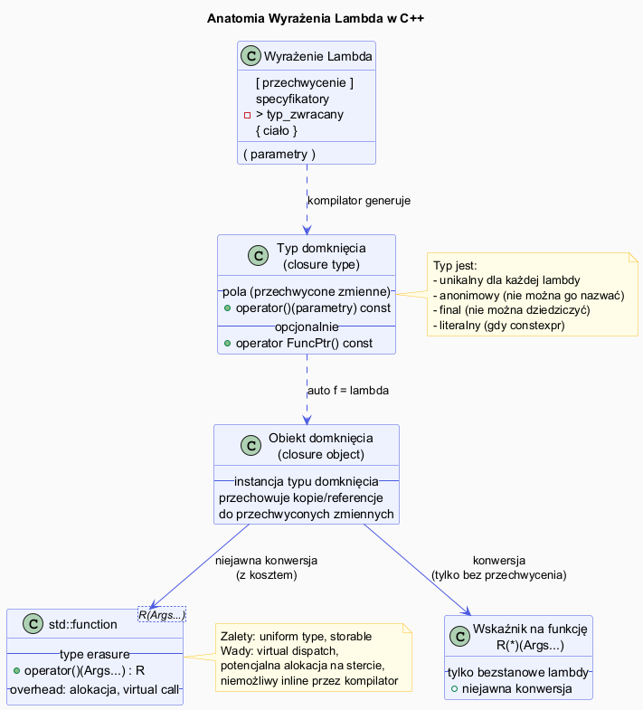

# Lambda – Składnia i Komponenty



## Slajd 1: Anatomia lambdy — wszystkie elementy

```
[ przechwycenie ] ( parametry ) specyfikatory -> typ_zwracany { ciało }
       ①               ②              ③              ④            ⑤
```

Każdy element składni ma swój powód istnienia. **Lista przechwycenia** `[]` jest jedynym
obowiązkowym elementem — jawna deklaracja, co lambda „bierze" ze środowiska. Komitet C++
celowo wymusił jawność: zmniejsza to ryzyko przypadkowego przechwycenia dużych obiektów
lub tworzenia wiszących referencji. **Parametry** i **typ zwracany** są opcjonalne dzięki
dedukcji typów. **Specyfikatory** (`mutable`, `constexpr`, `noexcept`) modyfikują semantykę
generowanego `operator()`.

| Element | Wymagany | Opis |
|---------|----------|------|
| `[ przechwycenie ]` | **TAK** | Co przechwycić z otaczającego scope'u |
| `( parametry )` | nie (C++11: wymagane gdy specyfikatory; C++23: zawsze opcjonalne) | Lista parametrów jak w zwykłej funkcji |
| specyfikatory | nie | `mutable`, `constexpr`, `noexcept`, `[[nodiscard]]` |
| `-> typ` | nie | Jawny typ zwracany (deduowany gdy pominięty) |
| `{ ciało }` | **TAK** | Treść funkcji |

```cpp
// Minimalna lambda:
[]{}                                           // brak parametrów, nic nie robi

// Typowe formy:
[](int x){ return x * 2; }                    // jeden parametr
[](int a, int b) -> int { return a + b; }     // jawny typ zwracany
[prog](int x){ return x > prog; }             // przechwycenie przez wartość
[&sum](int x){ sum += x; }                    // przechwycenie przez referencję
```

---

## Slajd 2: Typ domknięcia (closure type)

Każda lambda tworzy **unikalny, anonimowy typ** zwany typem domknięcia (*closure type*).

```cpp
auto f = [](int x){ return x * 2; };
auto g = [](int x){ return x * 2; };  // INNY typ niż f!

// typeof(f) != typeof(g)  –  nawet jeśli ciało identyczne

// Możliwości przechowywania lambdy:
auto h = [](int x){ return x + 1; };            // auto – najlepiej

std::function<int(int)> sf = [](int x){ return x + 1; }; // type-erased

// Bezstanowa lambda → konwersja na wskaźnik na funkcję:
int (*fp)(int) = [](int x){ return x + 1; };   // OK – brak przechwycenia

// Lambdy ze stanem NIE konwertują się na function pointer:
int n = 5;
// int (*fp2)(int) = [n](int x){ return x + n; };  // BŁĄD kompilacji
```

**Dlaczego unikalny typ?**
Pozwala kompilatorowi generować optymalny kod — każda lambda jest własną klasą
z możliwością pełnego inline'owania, bez overhead'u tablic wirtualnych.

**Praktyczna implikacja:** Jeśli masz dwie lambdy o identycznym kodzie, ich typy są różne
i nie można ich zamiennie używać bez `std::function`. Oznacza to też, że kontener
`std::vector<[typ lambdy]>` jest niemożliwy do zadeklarowania bez `auto` lub type erasure.
Jest to celowy trade-off: unikalność typów umożliwia pełne inlinowanie w szablonach
(każda instancja szablonu dla innej lambdy jest oddzielnie optymalizowana), kosztem
niemożności tworzenia jednorodnych kolekcji lambd bez wspólnego interfejsu.

---

## Slajd 3: Dedukcja typu zwracanego

Jeśli pominiesz `-> typ`, kompilator dedukuje typ jak dla `auto`:

```cpp
// Jeden return – dedukcja prosta
auto f1 = [](int x){ return x * 2; };        // deduuje int
auto f2 = [](double x){ return x * 2.0; };   // deduuje double
auto f3 = [](int x){ return x > 0; };        // deduuje bool

// Wiele return – muszą mieć ten sam typ
auto f4 = [](int x){
    if (x > 0) return x;
    return -x;                                // OK – oba int
};

// Konflikt typów – błąd bez jawnego typu:
// auto f5 = [](int x){
//     if (x > 0) return x;          // int
//     return 0.0;                   // double  ← BŁĄD
// };

// Rozwiązanie – jawny typ:
auto f5 = [](int x) -> double {
    if (x > 0) return x;
    return 0.0;                               // niejawna konwersja int→double
};

// Lambda zwracająca void (niejawnie):
auto f6 = [](int x){ std::cout << x; };      // deduuje void
```

**Reguła dedukcji:** Kompilator stosuje zasadę `decltype(auto)` do ciała lambdy —
identyczną regułę jak dla funkcji z `auto` typem zwracanym (C++14). Gdy lambda ma
wiele instrukcji `return`, wszystkie muszą zwracać dokładnie ten sam typ lub być
niejawnie konwertowalne do wspólnego — w przeciwnym razie kompilator zgłosi błąd.
Jawne `-> typ` pozwala na niejawne konwersje i jednoznacznie komunikuje zamiar programisty.

---

## Slajd 4: Specyfikator `mutable`

Domyślnie ciało lambdy jest `const` — nie możesz modyfikować przechwyconych kopii.
`mutable` znosi to ograniczenie:

```cpp
int x = 10;

// Domyślnie – przechwycone kopie są const:
auto f1 = [x]() {
    // x = 20;  // BŁĄD – operator() jest const
    return x;
};

// Z mutable – można modyfikować kopię (oryginał niezmieniony):
auto f2 = [x]() mutable {
    x = 20;   // OK – modyfikuje lokalną kopię
    return x;
};

std::cout << f2();  // 20
std::cout << x;     // 10 – oryginał niezmieniony!

// Klasyczny przykład: licznik z mutable
auto licznik = [n = 0]() mutable { return ++n; };
std::cout << licznik();  // 1
std::cout << licznik();  // 2
std::cout << licznik();  // 3
```

**Model semantyczny `mutable`:** Lambda bez `mutable` generuje `operator() const` — wszystkie
pola domknięcia są traktowane jako `const`. Dodanie `mutable` usuwa ten kwalifikator,
generując niekonst `operator()`. Ważne: `mutable` dotyczy wyłącznie **kopii** zmiennych
w domknięciu, nie oryginalnych zmiennych ze scope'u zewnętrznego. Dlatego jest użyteczny
do implementacji liczników, generatorów i stanowych iteratorów — stan żyje w domknięciu,
nie w zmiennych zewnętrznych. Bez `mutable` taki licznik byłby niemożliwy przy przechwyceniu
przez wartość.

---

## Slajd 5: Specyfikator `noexcept` i `constexpr`

```cpp
// noexcept – lambda nie rzuca wyjątków
auto bezpieczna = [](int x) noexcept { return x * 2; };
static_assert(noexcept(bezpieczna(5)));

// constexpr (C++17) – wykonanie w czasie kompilacji
constexpr auto potega = [](int base, int exp) constexpr {
    int wynik = 1;
    for (int i = 0; i < exp; ++i) wynik *= base;
    return wynik;
};

static_assert(potega(2, 10) == 1024);     // sprawdzane w czasie kompilacji
constexpr int p = potega(3, 4);           // p = 81, obliczone w czasie kompilacji
std::cout << potega(5, 3);                // 125, może być też runtime

// Lambda jest implicit constexpr gdy jest ona constexpr-able (C++17):
auto f = [](int x){ return x * x; };     // automatycznie constexpr jeśli możliwe
constexpr int y = f(7);                  // OK w C++17
```

---

## Slajd 6: Lambdy a szablony – `auto` jako parametr (C++14)

W C++14 parametry lambdy mogą być `auto` — tworząc lambdę generyczną:

```cpp
// C++14: lambda generyczna
auto dodaj = [](auto a, auto b) { return a + b; };

std::cout << dodaj(1, 2);                          // 3 (int)
std::cout << dodaj(1.5, 2.5);                      // 4.0 (double)
std::cout << dodaj(std::string{"Hello"}, " World"); // Hello World

// Odpowiednik funktora szablonowego:
struct Dodaj {
    template<typename A, typename B>
    auto operator()(A a, B b) const { return a + b; }
};

// Lambda generyczna z ograniczeniem (C++20 concept):
auto tylko_liczby = []<std::integral T>(T a, T b) { return a + b; };
```

**Mechanizm monomorfizacji:** Parametr `auto a` to skrótowy zapis szablonowego `operator()`.
Każde wywołanie z nowymi typami tworzy **oddzielną instancję szablonu** — tak samo jak
jawny `template<typename A, typename B>`. `dodaj(1, 2)` i `dodaj(1.5, 2.5)` generują dwie
różne funkcje w kodzie maszynowym, każda optymalnie skompilowana dla swoich typów.
To **monomorfizacja** — pełna wydajność (inlining, brak boxing) kosztem potencjalnie
większej binarki przy wielu kombinacjach typów. Warto pamiętać, że `auto a, auto b` to
**dwa niezależne** parametry szablonu — dla wymuszenia tego samego typu użyj `[]<typename T>(T a, T b)`.

---

## Slajd 7: Operator wywołania – kiedy lambda jest wywoływana

```cpp
auto f = [](int x, int y) -> int { return x + y; };

// Trzy sposoby "wywołania" (semantycznie identyczne):
int r1 = f(3, 4);              // operator() – naturalny sposób
int r2 = f.operator()(3, 4);  // jawne wywołanie operatora (rzadkie)

// W szablonie – każda lambda to unikalna instancja:
template<typename F>
void zastosuj(F func, int x) {
    std::cout << func(x) << "\n";
}

zastosuj([](int x){ return x * 2; }, 5);   // 10
zastosuj([](int x){ return x + 100; }, 5); // 105
// Oba wywołania generują różny kod – pełny inline, zero overhead

// Porównaj z std::function:
void zastosuj_sf(std::function<int(int)> func, int x) {
    std::cout << func(x) << "\n";  // wywołanie wirtualne, alokacja możliwa
}
```

**Zero-overhead abstraction:** Każde wywołanie `zastosuj` z inną lambdą tworzy osobną
instancję szablonu. Kompilator generuje wyspecjalizowaną wersję `zastosuj` z w pełni
zinlinowanym `func(x)` — dosłownie taką samą jak kod bez lambdy. Jest to wzorcowy
przykład zasady „zero-overhead abstractions" Bjarne'a Stroustrupa: lambdy w szablonach
nie kosztują nic w runtime. Wersja ze `std::function` traci tę właściwość: każde
wywołanie wymaga dereferencji wskaźnika, uniemożliwiając optymalizatorowi wgląd w ciało.

---

## Slajd 8: Inicjalizatory przechwycenia (C++14)

Pozwalają tworzyć nowe zmienne w liście przechwycenia:

```cpp
// [nazwa = wyrażenie] – inicjalizuje nową zmienną w domknięciu
int x = 10;
auto f = [y = x * 2](int n){ return n + y; };  // y = 20, nie x
std::cout << f(5);  // 25

// Przechwycenie przez przeniesienie (move-only types)
auto ptr = std::make_unique<int>(42);
// auto g = [ptr](){...}  // BŁĄD – unique_ptr nie jest kopiowalny
auto g = [p = std::move(ptr)](){ return *p; };  // OK – move do domknięcia

// Transformacja podczas przechwycenia:
std::string name = "   hello world   ";
auto h = [s = name](){ /* użyj s */ };  // kopia
auto k = [s = std::move(name)](){ return s; };  // move – name jest puste po tym

// Generowanie stanu:
auto licznik = [i = 0]() mutable { return i++; };
```

**Inicjalizatory przechwycenia** rozwiązują dwa problemy naraz. Po pierwsze, umożliwiają
przechwycenie typów niemożliwych do skopiowania (jak `unique_ptr`) przez `std::move` —
co było niemożliwe zwykłym `[ptr]`. Po drugie, pozwalają transformować lub nadać
przechwyconemu elementowi inną nazwę niż zmienna zewnętrzna, poprawiając czytelność.
Wyrażenie inicjalizatora jest obliczane **w miejscu tworzenia lambdy** (nie przy wywołaniu),
co czyni je analogicznym do listy inicjalizatorów konstruktora. Przy `std::move` warto
pamiętać: po stworzeniu lambdy oryginalna zmienna jest w stanie moved-from (pustym).
