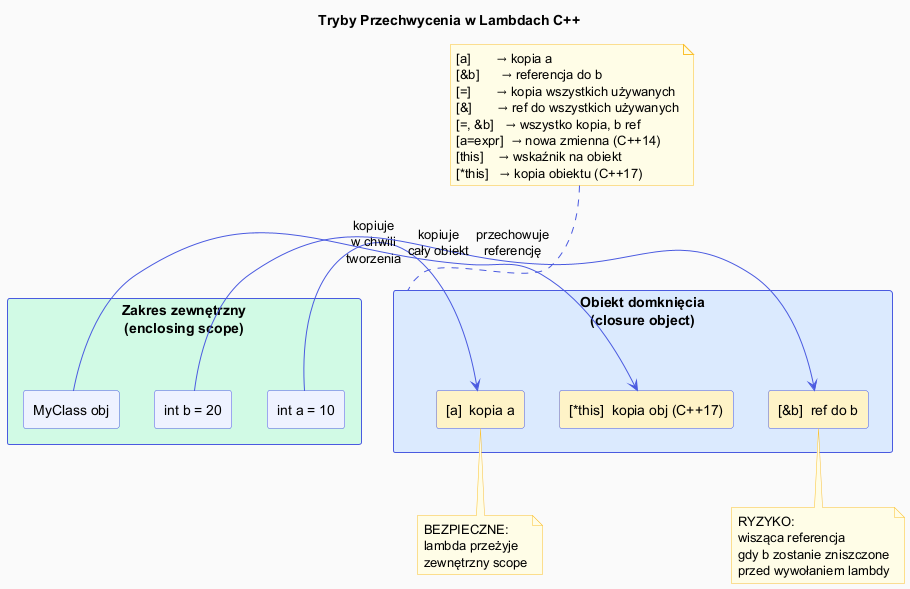

# Lambda – Przechwycenie i Domknięcia



## Slajd 1: Czym jest domknięcie (closure)

**Domknięcie** (*closure*) to funkcja wraz ze środowiskiem — zestawem zmiennych
z otaczającego zakresu, które funkcja „zapamiętuje".

```cpp
int prog = 5;                               // zmienna w zewnętrznym scope

auto sprawdz = [prog](int x){              // domknięcie – przechwytuje prog
    return x > prog;
};

// sprawdz "zamknęło" prog w sobie – może być przekazane dowolnie dalej
std::vector<int> v = {1, 3, 5, 7, 9};
std::count_if(v.begin(), v.end(), sprawdz); // działa nawet jeśli prog już nie istnieje
```

Domknięcie = typ domknięcia (klasa) + obiekt domknięcia (instancja).
Przechwycone zmienne stają się **polami tej klasy**.

**Formalnie:** W teorii języków programowania domknięcie to para `(kod, środowisko)`.
W C++ „środowiskiem" jest obiekt domknięcia — instancja anonimowej klasy. Kluczowa
właściwość: domknięcie jest **wartością** — można je kopiować, przechowywać i przekazywać
jak każdy inny obiekt. Różni się od wskaźnika na funkcję tym, że niesie swój stan ze sobą,
zamiast polegać na zmiennych globalnych lub dodatkowych parametrach. Kopiowanie domknięcia
kopiuje cały stan (przechwycone pola) — dwie kopie są od siebie niezależne.

---

## Slajd 2: Tryby przechwycenia – przegląd

| Zapis | Tryb | Opis |
|-------|------|------|
| `[]` | brak | Nic nie przechwytuje; dostęp tylko do globalnych/statycznych |
| `[=]` | kopia wszystkiego | Kopiuje wszystkie zmienne lokalne używane w ciele |
| `[&]` | referencja do wszystkiego | Referencja do wszystkich zmiennych lokalnych |
| `[x]` | kopia konkretnej | Tylko `x` przez wartość |
| `[&x]` | referencja konkretna | Tylko `x` przez referencję |
| `[=, &x]` | mieszane | Wszystko przez wartość, ale `x` przez referencję |
| `[&, x]` | mieszane | Wszystko przez referencję, ale `x` przez wartość |
| `[x = expr]` | inicjalizator (C++14) | Nowa zmienna inicjalizowana wyrażeniem |
| `[this]` | wskaźnik na obiekt | Dostęp do pól i metod klasy (przez this) |
| `[*this]` | kopia obiektu (C++17) | Kopia całego obiektu (bezpieczniejsza) |

---

## Slajd 3: Przechwycenie przez wartość `[x]` i `[=]`

```cpp
int a = 10, b = 20;

// Przechwycenie konkretnej zmiennej przez wartość
auto f1 = [a](int x){ return x + a; };

// Przechwycenie wszystkiego przez wartość (wszystkich używanych zmiennych)
auto f2 = [=](int x){ return x + a + b; };

a = 100; b = 200;  // modyfikacja oryginałów

std::cout << f1(1);  // 11 – kopia a=10 z chwili tworzenia
std::cout << f2(1);  // 31 – kopie a=10, b=20 z chwili tworzenia
```

**Kiedy używać kopii:**
- Gdy lambda może przeżyć zmienną lokalną
- Gdy chcesz „zamrozić" wartość w momencie tworzenia
- Gdy lambda jest przekazywana do innego wątku

**Koszt:** Każda przechwycona zmienna jest kopiowana do obiektu domknięcia.
Dla dużych obiektów to może być drogie → preferuj `[x = std::move(x)]`.

**Semantyka migawki (snapshot):** Przechwycenie przez wartość tworzy **migawkę** stanu
w momencie tworzenia lambdy. Późniejsze zmiany oryginałów nie wpływają na lambdę —
jak zdjęcie. Jest to szczególnie ważne w programowaniu współbieżnym: lambda z `[=]`
niesie własne kopie danych, eliminując wyścigi danych (data races) na zmiennych zewnętrznych.
Pamiętaj jednak, że kopiowany jest **obiekt** — jeśli przechwycony obiekt zawiera wskaźniki,
lambda dzieli zasoby wskazywane z oryginałem (płytka kopia, shallow copy).

---

## Slajd 4: Przechwycenie przez referencję `[&x]` i `[&]`

```cpp
int suma = 0;

// Przechwycenie przez referencję – lambda modyfikuje oryginał
std::vector<int> v = {1, 2, 3, 4, 5};
std::for_each(v.begin(), v.end(), [&suma](int x){ suma += x; });
std::cout << suma;  // 15 – oryginał zmodyfikowany

// Konkretna referencja:
int licznik = 0;
auto zlicz = [&licznik](){ ++licznik; };
zlicz(); zlicz(); zlicz();
std::cout << licznik;  // 3

// [&] – przechwytuje WSZYSTKO przez referencję
int min_val = INT_MAX, max_val = INT_MIN;
std::for_each(v.begin(), v.end(), [&](int x){
    if (x < min_val) min_val = x;
    if (x > max_val) max_val = x;
});
std::cout << "min=" << min_val << " max=" << max_val << "\n";
```

**Kiedy używać referencji:**
- Gdy chcesz modyfikować oryginalną zmienną
- Gdy lambda jest używana natychmiast (nie przechowywana)
- Gdy obiekt jest duży i kosztowny do kopiowania

**Model aliasingu:** Przechwycenie przez referencję tworzy **alias** do oryginalnej zmiennej
— modyfikacje przez lambdę są widoczne w oryginalnym scope i odwrotnie. Implementacyjnie
kompilator przechowuje wskaźnik/referencję w obiekcie domknięcia. Kluczowa konsekwencja:
oryginalne zmienne **muszą żyć dłużej** niż lambda — jeśli przekazujesz lambdę do funkcji
lub przechowujesz ją w kontenerze, a oryginalne zmienne zostaną zniszczone wcześniej,
mamy Undefined Behavior. `[&]` jest bezpieczne dla lambd używanych natychmiast (predykaty STL),
ryzykowne dla lambd przechowywanych długoterminowo (callbacki, std::function).

---

## Slajd 5: Pułapka – wisząca referencja (dangling reference)

To najczęstszy błąd z lambdami — przechwycenie przez referencję zmiennej, która przestała istnieć:

```cpp
// NIEBEZPIECZNE: lambda przechowywana dłużej niż zmienne lokalne
std::function<int()> zrob_lambda() {
    int x = 42;
    return [&x]() { return x; };  // ← x będzie zniszczone przed wywołaniem!
    // Po return x już nie istnieje – UB!
}

auto f = zrob_lambda();
f();  // Undefined Behavior – x nie istnieje

// BEZPIECZNE: przechwycenie przez wartość
std::function<int()> zrob_lambda_ok() {
    int x = 42;
    return [x]() { return x; };  // kopia x survives return
}

auto g = zrob_lambda_ok();
std::cout << g();  // 42 – OK
```

**Reguła:** Gdy lambda może przeżyć scope tworzenia → używaj `[=]` lub konkretnych kopii.

**Dlaczego UB, nie błąd kompilacji?** Kompilator nie może w ogólnym przypadku udowodnić,
że lambda nie przeżyje zmiennych, do których ma referencję — jest to problem nierozstrzygalny
(analogiczny do halting problem). Dlatego C++ składa odpowiedzialność na programiście.
Narzędzia takie jak AddressSanitizer (`-fsanitize=address`) wykrywają te błędy w runtime.
Analizatory statyczne (clang-tidy: `bugprone-dangling-handle`, `cppcoreguidelines-avoid-dangling`)
mogą wychwycić niektóre wzorce, ale nie wszystkie. W kodzie produkcyjnym: zawsze
dokumentuj zakładany czas życia lambdy z `[&]`.

---

## Slajd 6: Pułapka – lambdy w pętlach

Klasyczny błąd: przechwycenie zmiennej pętli przez referencję:

```cpp
std::vector<std::function<int()>> lambdy;

// BŁĄD: wszystkie lambdy dzielą referencję do tej samej zmiennej i
for (int i = 0; i < 5; ++i) {
    lambdy.push_back([&i](){ return i; });
}
// Po pętli i = 5 (lub UB po zniszczeniu i)
for (auto& f : lambdy) std::cout << f() << " ";  // 5 5 5 5 5  – nie 0 1 2 3 4!

// POPRAWNE: kopia przez wartość
std::vector<std::function<int()>> lambdy2;
for (int i = 0; i < 5; ++i) {
    lambdy2.push_back([i](){ return i; });  // każda lambda dostaje własną kopię i
}
for (auto& f : lambdy2) std::cout << f() << " ";  // 0 1 2 3 4 – poprawnie

// Alternatywnie – inicjalizator przechwycenia (C++14):
std::vector<std::function<int()>> lambdy3;
for (int i = 0; i < 5; ++i) {
    lambdy3.push_back([val = i](){ return val; });  // jawna kopia
}
```

**Dlaczego pętla z `[&i]` daje błędny wynik?** Wszystkie lambdy przechowują referencję
do **tej samej zmiennej** `i` — nie do jej wartości z danej iteracji. Po zakończeniu pętli
`i == 5`, więc wszystkie lambdy zwracają `5`. Jeśli lambdy przeżyją scope for-pętli,
`i` jest zniszczone i mamy UB. Jest to klasyczny błąd znany też w innych językach
(JavaScript `var` w pętli z `setTimeout`, Python z `default arguments`). Rozwiązanie:
przechwytuj zmienną pętli przez wartość `[i]` lub używaj `[val = i]` dla maksymalnej
jasności intencji — nazwa `val` komunikuje, że to jest konkretna wartość, nie referencja.

---

## Slajd 7: Przechwycenie `this` w klasach

```cpp
class Licznik {
    int wartosc_ = 0;
    std::string nazwa_;
public:
    Licznik(std::string n) : nazwa_(n) {}

    // [this] – dostęp przez wskaźnik (C++11)
    auto zrob_inkrement() {
        return [this]() {
            ++wartosc_;  // równoważne this->wartosc_++
            return wartosc_;
        };
    }

    // [=] w C++11/14 niejawnie przechwytuje this!
    // (zmienione w C++20: [=] nie przechwytuje this)
    auto zrob_info() {
        return [this]() {
            return nazwa_ + ": " + std::to_string(wartosc_);
        };
    }

    // [*this] (C++17) – kopia całego obiektu (bezpieczniejsze)
    auto zrob_snapshot() {
        return [*this]() {  // kopia obiektu Licznik
            return nazwa_ + "=" + std::to_string(wartosc_);
        };
    }
};

Licznik c{"klik"};
auto ink = c.zrob_inkrement();
auto snap = c.zrob_snapshot();  // kopia stanu z momentu tworzenia

ink();  // wartosc_ = 1
ink();  // wartosc_ = 2
std::cout << c.zrob_info()();   // "klik: 2"
std::cout << snap();            // "klik: 0" – zamrożony stan
```
**Problem z `[this]` w asynchronicznym kodzie:** `[this]` przechwytuje wskaźnik. Jeśli
obiekt zostanie zniszczony przed wywołaniem callbacku (np. w asynchronicznym I/O, systemach
zdarzeń GUI, coroutines), dereferencja wskaźnika to UB — często manifestujące się
trudnymi do debugowania crashami. `[*this]` (C++17) kopiuje **cały obiekt** do domknięcia
— callback jest bezpieczny niezależnie od czasu życia oryginału, kosztem kopiowania.
Alternatywa dla kosztownych obiektów: idiom `[self = shared_from_this()]` — lambda
przedłuża czas życia obiektu przez `shared_ptr`. Wzorzec powszechny w Boost.Asio i
podobnych bibliotekach asynchronicznych.
---

## Slajd 8: `[=]` vs `[&]` vs lista – dobre praktyki

```cpp
// REGUŁA 1: Preferuj konkretne przechwycenie nad [=] lub [&]
// Czytelnik od razu widzi, co lambda używa
int a = 1, b = 2, c = 3;

auto niejasne = [=](int x){ return x + a; };  // Co jeszcze przechwycono?
auto jasne    = [a](int x){ return x + a; };  // Jasne – tylko a

// REGUŁA 2: [&] jest OK dla lambd krótko żyjących (algorytmy STL)
std::vector<int> v = {1,2,3,4,5};
int suma = 0;
std::for_each(v.begin(), v.end(), [&suma](int x){ suma += x; }); // OK

// REGUŁA 3: [=] lub kopia dla lambd długo żyjących (callbacki, async)
auto callback = [a, b](){ return a + b; };  // bezpieczne do przekazywania

// REGUŁA 4: [*this] zamiast [this] dla asynchronicznych operacji
// (unika dangling pointer gdy obiekt zostanie zniszczony)
```
