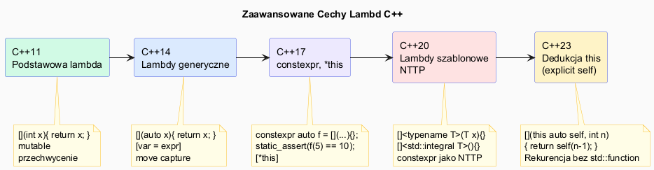

# Lambda – Zaawansowane Cechy



## Slajd 1: Lambdy generyczne – `auto` parametry (C++14)

W C++14 parametry lambdy mogą być `auto`, tworząc **szablonowy `operator()`**:

```cpp
// Lambda generyczna (C++14)
auto dodaj = [](auto a, auto b) { return a + b; };

// Kompilator generuje (konceptualnie):
struct __lambda {
    template<typename A, typename B>
    auto operator()(A a, B b) const { return a + b; }
};

// Użycie z różnymi typami:
std::cout << dodaj(1, 2);                              // int: 3
std::cout << dodaj(1.5, 2.5);                          // double: 4.0
std::cout << dodaj(std::string{"Hello "}, "World");    // string: Hello World

// Idealne do algorytmów STL z różnymi typami:
std::vector<std::pair<int, std::string>> v = {{3,"c"},{1,"a"},{2,"b"}};
std::sort(v.begin(), v.end(),
    [](const auto& x, const auto& y){ return x.first < y.first; });
```

---

## Slajd 2: Lambdy szablonowe (C++20)

C++20 wprowadza **explicite szablonowe** lambdy, gdy `auto` jest za mało:

```cpp
// C++20: jawne parametry szablonu
auto suma_wektora = []<typename T>(const std::vector<T>& v) -> T {
    return std::accumulate(v.begin(), v.end(), T{});
};

std::vector<int>    vi = {1, 2, 3, 4, 5};
std::vector<double> vd = {1.1, 2.2, 3.3};

std::cout << suma_wektora(vi);  // 15
std::cout << suma_wektora(vd);  // 6.6

// Wymuszenie tego samego typu dla obu parametrów
auto rowne = []<typename T>(T a, T b) { return a == b; };
rowne(1, 2);            // OK: oba int
rowne(1.0, 2.0);        // OK: oba double
// rowne(1, 2.0);       // BŁĄD: int vs double (T jest jedno)

// Z concepts (C++20) – ograniczenie typów:
auto tylko_calkowite = []<std::integral T>(T a, T b) { return a + b; };
tylko_calkowite(3, 4);       // OK
// tylko_calkowite(1.5, 2.5);  // BŁĄD – double nie jest integral
```

---

## Slajd 3: `std::function` – typ ogólny dla callables

`std::function<R(Args...)>` to **kontener na dowolny callable** z mechanizmem type erasure:

```cpp
#include <functional>

// Deklaracja
std::function<int(int, int)> op;

// Można przypisać cokolwiek wywoływalnego:
op = std::plus<int>{};              // funktor
std::cout << op(3, 4);             // 7

op = [](int a, int b){ return a * b; };  // lambda
std::cout << op(3, 4);             // 12

op = [](int a, int b){ return a - b; };  // nowa lambda
std::cout << op(10, 3);            // 7

// Przechowywanie w kontenerze (niemożliwe dla surowych lambd różnych typów)
std::vector<std::function<int(int)>> pipeline;
pipeline.push_back([](int x){ return x * 2; });
pipeline.push_back([](int x){ return x + 10; });
pipeline.push_back([](int x){ return x * x; });

int wynik = 5;
for (auto& f : pipeline) wynik = f(wynik);
std::cout << wynik;  // ((5*2)+10)^2 = 400

// KOSZT std::function:
// - Alokacja na stercie dla dużych obiektów domknięcia (SBO ~16-32B)
// - Wywołanie przez wirtualny dispatch (wskaźnik na funkcję)
// - Uniemożliwia inlining
// → Używaj auto zamiast std::function gdy to możliwe
```

---

## Slajd 4: Rekurencyjna lambda

Lambda nie ma nazwy, więc nie może łatwo wywołać siebie. Są trzy sposoby:

```cpp
// Sposób 1: przez std::function (najprostszy, z overhead'em)
std::function<int(int)> silnia = [&silnia](int n) -> int {
    return n <= 1 ? 1 : n * silnia(n - 1);
};
std::cout << silnia(10);  // 3628800

// Sposób 2: przekazanie lambdy jako parametru (C++14, zero overhead)
auto silnia2 = [](auto self, int n) -> int {
    return n <= 1 ? 1 : n * self(self, n - 1);
};
std::cout << silnia2(silnia2, 10);  // 3628800

// Sposób 3 (C++23): dedukcja this – najelegantszy
// auto silnia3 = [](this auto self, int n) -> int {
//     return n <= 1 ? 1 : n * self(n - 1);
// };
// std::cout << silnia3(10);

// Praktyczny przykład: rekurencyjny obchód drzewa
struct Wezel {
    int wartosc;
    std::vector<Wezel> dzieci;
};

std::function<int(const Wezel&)> suma_drzewa = [&suma_drzewa](const Wezel& w) -> int {
    int s = w.wartosc;
    for (const auto& dziecko : w.dzieci)
        s += suma_drzewa(dziecko);
    return s;
};

Wezel drzewo{1, {{2, {{4,{}},{5,{}}}},{3,{{6,{}}}}}};
std::cout << suma_drzewa(drzewo);  // 1+2+3+4+5+6 = 21
```

---

## Slajd 5: Lambda jako parametr szablonu (IIFE)

**IIFE** (*Immediately Invoked Function Expression*) — tworzenie i wywołanie w jednym miejscu:

```cpp
// Inicjalizacja złożonej stałej bez pomocniczej funkcji
const int wynik = []{
    int sum = 0;
    for (int i = 1; i <= 100; ++i) sum += i;
    return sum;
}();  // ← () natychmiast wywołuje
std::cout << wynik;  // 5050

// IIFE z parametrami
const std::string sformatowany = [](int v, int max){
    if (v < 0) return std::string("ujemny");
    if (v > max) return std::string("przekroczony");
    return std::to_string(v) + "/" + std::to_string(max);
}(42, 100);

// Inicjalizacja const w switch-like logice
const std::string opis = [](int kod) -> std::string {
    switch(kod) {
        case 200: return "OK";
        case 404: return "Not Found";
        case 500: return "Internal Error";
        default:  return "Unknown";
    }
}(200);
```

---

## Slajd 6: Lambda w template non-type parameter (C++20)

```cpp
// C++20: lambda może być użyta jako NTTP
template<auto Pred>
int zlicz_jesli(const std::vector<int>& v) {
    int n = 0;
    for (int x : v) if (Pred(x)) ++n;
    return n;
}

// Użycie: lambda jest wartością szablonu (kompilator może inline'ować)
constexpr auto jest_parzysta = [](int x){ return x % 2 == 0; };
constexpr auto jest_ujemna   = [](int x){ return x < 0; };

std::vector<int> v = {-3, 2, -1, 4, 5, 6};
std::cout << zlicz_jesli<jest_parzysta>(v);  // 3
std::cout << zlicz_jesli<jest_ujemna>(v);    // 2
```

---

## Slajd 7: Kompozycja lambd

```cpp
// Kompozycja f∘g: compose(f, g)(x) = f(g(x))
auto compose = [](auto f, auto g) {
    return [f, g](auto x){ return f(g(x)); };
};

auto podwoj    = [](int x){ return x * 2; };
auto dodaj10   = [](int x){ return x + 10; };
auto kw        = [](int x){ return x * x; };

auto podwoj_potem_dodaj = compose(dodaj10, podwoj);
std::cout << podwoj_potem_dodaj(5);  // (5*2)+10 = 20

// Wielokrotna kompozycja (fold expression, C++17)
template<typename F, typename... Fs>
auto compose_all(F first, Fs... rest) {
    if constexpr (sizeof...(rest) == 0)
        return first;
    else
        return [first, rest...](auto x){ return first(compose_all(rest...)(x)); };
}

auto pipeline = compose_all(kw, dodaj10, podwoj);
std::cout << pipeline(3);  // ((3*2)+10)^2 = 256
```

---

## Slajd 8: `std::bind` vs lambda – dlaczego lambdy wygrały

```cpp
bool wiekszy_niz(int x, int prog) { return x > prog; }

// std::bind – nieczytelny, trudny do debugowania
auto b = std::bind(wiekszy_niz, std::placeholders::_1, 5);

// Lambda – czytelna, optymalizowalna, jawna
auto l = [](int x){ return x > 5; };

// Skomplikowane bind vs lambda:
// Bind:
auto b2 = std::bind(std::multiplies<int>{},
                    std::bind(std::plus<int>{}, std::placeholders::_1, 3),
                    2);
// Lambda (czytelna):
auto l2 = [](int x){ return (x + 3) * 2; };

// Rekomendacja (Scott Meyers, Effective Modern C++ – Item 34):
// "Lambdy są prawie zawsze lepsze od std::bind"
// Wyjątek: polimorficzny callable z bind (przed C++14 generycznymi lambdami)
```
