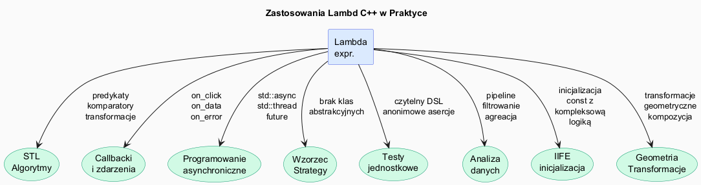

# Lambda – Zastosowania Praktyczne



## Slajd 1: Lambdy z algorytmami STL – podstawowe wzorce

To najczęstsze zastosowanie lambd — jako predykaty, transformacje i operacje:

```cpp
#include <algorithm>
#include <numeric>
#include <vector>
#include <string>

std::vector<int> v = {5, 2, 8, 1, 9, 3, 7, 4, 6};

// SORTOWANIE z własnym kryterium
std::sort(v.begin(), v.end(), [](int a, int b){ return a > b; }); // malejąco

// Sortowanie po wartości bezwzględnej
std::vector<int> w = {-5, 3, -1, 4, -8, 2};
std::sort(w.begin(), w.end(), [](int a, int b){ return std::abs(a) < std::abs(b); });

// FILTROWANIE
auto nieparzyste = std::count_if(v.begin(), v.end(), [](int x){ return x % 2 != 0; });

// TRANSFORMACJA
std::vector<double> wyniki;
std::transform(v.begin(), v.end(), std::back_inserter(wyniki),
               [](int x) -> double { return std::sqrt(x); });

// AKUMULACJA z lambdą (iloczyn)
long long iloczyn = std::accumulate(v.begin(), v.end(), 1LL,
                                    [](long long acc, int x){ return acc * x; });

// WYSZUKIWANIE
auto it = std::find_if(v.begin(), v.end(), [](int x){ return x > 6 && x % 2 == 0; });

// PARTYCJONOWANIE
std::stable_partition(v.begin(), v.end(), [](int x){ return x % 2 == 0; });
```

**Dlaczego lambdy są lepsze od nazwanych funkcji dla jednorazowych predykatów?**
Predykat `[](int a, int b){ return a > b; }` jest zdefiniowany dokładnie tam, gdzie jest
używany — czytelnik nie musi szukać definicji w innym miejscu. Kompilator widzi pełną
definicję w momencie instancjonowania szablonu algorytmu i może zinlinować predykat
do zerowego overhead. Nazwana funkcja jako wskaźnik nie daje tej gwarancji — wywołanie
odbywa się przez adres. Lambda to też **kapsułka stanu**: gdy predykat potrzebuje
konfiguracji (progu, wzorca), lambda niesie go w domknięciu — nazwana funkcja musiałaby
korzystać z globalnego stanu lub dodatkowych parametrów niewidocznych dla algorytmu STL.

---

## Slajd 2: Lambdy jako callbacki – systemy zdarzeń

Lambdy naturalnie pasują do wzorca obserwatora i systemów zdarzeń:

```cpp
// Prosty system zdarzeń
class Button {
    std::vector<std::function<void()>> on_click_;
    std::string label_;
public:
    explicit Button(std::string l) : label_(std::move(l)) {}

    void on_click(std::function<void()> handler) {
        on_click_.push_back(std::move(handler));
    }

    void click() {
        std::cout << "[" << label_ << " kliknięty]\n";
        for (auto& h : on_click_) h();
    }
};

// Rejestracja callbacków:
Button btn_save{"Zapisz"};
int zapisow = 0;

btn_save.on_click([&zapisow]{
    ++zapisow;
    std::cout << "Zapisano plik (łącznie: " << zapisow << " razy)\n";
});

btn_save.on_click([]{
    std::cout << "Odświeżono widok\n";
});

btn_save.click();  // Oba callbacki wywołane
btn_save.click();  // Licznik rośnie
```

**Wzorzec obserwatora z lambdami vs klasy:** Tradycyjny wzorzec Observer wymaga interfejsu
`IObserver` z metodą `update()` i osobnej klasy dla każdego handlera. Z lambdami każdy
handler to anonimowy callable — zero boilerplate'u, handler zdefiniowany w miejscu rejestracji.
`std::function<void()>` pełni rolę type erasure, pozwalając przechowywać handlery różnych
typów w jednym wektorze. Koszt: każde wywołanie handlera przez `std::function` to virtual
dispatch. Dla systemów wysokiej wydajności (silnik gry, real-time audio) rozważ szablonowe
callbacki lub konkretne wektory lambd tego samego typu.

---

## Slajd 3: Lambdy w programowaniu asynchronicznym

```cpp
#include <future>
#include <thread>
#include <chrono>

// std::async z lambdą – obliczenie w osobnym wątku
auto future1 = std::async(std::launch::async, []{
    std::this_thread::sleep_for(std::chrono::milliseconds(100));
    return 42;
});

auto future2 = std::async(std::launch::async, []{
    return std::string{"wynik z wątku"};
});

// Pobieranie wyników:
std::cout << future1.get() << "\n";       // 42
std::cout << future2.get() << "\n";       // "wynik z wątku"

// Przekazanie danych do wątku przez kopię:
std::vector<int> dane = {1, 2, 3, 4, 5};
auto fut = std::async(std::launch::async,
    [data = std::move(dane)](){           // move – bezpieczne przez wątki
        return std::accumulate(data.begin(), data.end(), 0);
    });
std::cout << fut.get() << "\n";  // 15

// Uwaga: przy [&] w wątkach – ryzyko data race!
// Zawsze preferuj przechwycenie przez wartość w wątkach.
```

**Model bezpieczeństwa wątkowego z lambdami:** Lambda z `[=]` lub konkretnymi kopiami
jest **thread-safe by default** — każdy wątek operuje na własnych kopiach danych, bez
współdzielenia. Lambda z `[&]` wymaga synchronizacji (mutex, atomic) dla każdej
współdzielonej zmiennej. Podstawowa reguła: traktuj lambdę przekazywaną do `std::async`
lub `std::thread` jak osobną funkcję działającą w izolacji — wszystkie potrzebne dane
powinny być skopiowane do domknięcia. Warto też pamiętać, że `std::future::get()` jest
blokujące — gdy wiele `future` odczytuje wyniki sekwencyjnie, tracisz równoległość.
Dla prawdziwego równoległego wykonania zapisz wszystkie `future` przed wywołaniem `get()`.

---

## Slajd 4: Lambdy jako strategie (wzorzec Strategy)

Wzorzec Strategy przez lambdy jest lżejszy niż przez wirtualne klasy:

```cpp
// Tradycyjny wzorzec Strategy – klasy abstrakcyjne
class Sorter {
public:
    virtual void sort(std::vector<int>&) const = 0;
    virtual ~Sorter() = default;
};

// Wzorzec Strategy przez lambdy – bez klas abstrakcyjnych
using SortStrategy = std::function<void(std::vector<int>&)>;

class DataProcessor {
    SortStrategy strategie_;
public:
    explicit DataProcessor(SortStrategy s) : strategie_(std::move(s)) {}

    void przetworz(std::vector<int>& v) {
        strategie_(v);
        // ... dalsze przetwarzanie
    }
};

// Wiele strategii bez hierarchii klas:
DataProcessor asc_processor{[](auto& v){ std::sort(v.begin(), v.end()); }};
DataProcessor desc_processor{[](auto& v){ std::sort(v.begin(), v.end(), std::greater<int>{}); }};
DataProcessor abs_processor{[](auto& v){
    std::sort(v.begin(), v.end(), [](int a, int b){ return std::abs(a) < std::abs(b); });
}};

std::vector<int> v1 = {5,2,8,1,3}, v2 = v1, v3 = v1;
asc_processor.przetworz(v1);   // {1,2,3,5,8}
desc_processor.przetworz(v2);  // {8,5,3,2,1}
abs_processor.przetworz(v3);   // wg |x|
```

**Lambda-Strategy vs Virtual-Strategy — porównanie:**

| Aspekt | Wirtualne klasy | Lambda / `std::function` |
|--------|----------------|--------------------------|
| Boilerplate | interfejs + klasa dla każdej strategii | inline callable |
| Polimorfizm | runtime (v-table) | runtime (`std::function`) |
| Overhead wywołania | v-table dispatch | function ptr dispatch |
| Samodzielność | klasa z nazwą, łatwa do reużycia | anonimowa, lokalna |
| Stan | pola klasy | przechwycone zmienne |
| Testowanie | instancja klasy | lambda jako arg testu |

Lambdy nie zastępują wzorca Strategy w pełni — gdy strategia jest złożona, wielokrotnie
reużywana lub wymaga polimorfizmu przez wskaźnik bazowy, klasy wirtualne mają sens.
Lambda sprawdza się dla strategii jednorazowych lub konfigurowanych inline.

---

## Slajd 5: Lambdy w parsowaniu i przetwarzaniu danych

```cpp
#include <sstream>
#include <map>

// Pipeline przetwarzania tekstu z lambdami
auto split = [](const std::string& s, char delim) {
    std::vector<std::string> tokens;
    std::istringstream ss(s);
    std::string token;
    while (std::getline(ss, token, delim)) tokens.push_back(token);
    return tokens;
};

auto trim = [](std::string s) {
    s.erase(0, s.find_first_not_of(" \t\n\r"));
    s.erase(s.find_last_not_of(" \t\n\r") + 1);
    return s;
};

auto to_upper = [](std::string s) {
    std::transform(s.begin(), s.end(), s.begin(), ::toupper);
    return s;
};

// Użycie:
std::string csv = "  Alice , 30 , Engineer  ";
auto pola = split(csv, ',');
std::transform(pola.begin(), pola.end(), pola.begin(),
               [&](std::string s){ return trim(std::move(s)); });

// Grupowanie przez lambdę:
std::vector<std::string> slowa = {"anna", "bartek", "agata", "beata", "celina"};
std::map<char, std::vector<std::string>> grupy;
for (const auto& s : slowa)
    grupy[s[0]].push_back(s);
// grupy['a'] = {"anna","agata"}, grupy['b'] = {"bartek","beata"}, ...
```

**Lambdy jako komponenty pipeline'u:** Zdefiniowanie `split`, `trim`, `to_upper` jako
zmiennych z lambdami (zamiast globalnych funkcji) ma kilka zalet: lambdy żyją w tym samym
scope co ich użycie, można je łatwo parametryzować przez inicjalizatory przechwycenia,
i mogą być przekazywane jako callable do wyższych rzędów funkcji. Wzorzec ten jest
szczególnie użyteczny przy ETL (Extract-Transform-Load) i przetwarzaniu strumieniowym:
każdy krok pipeline'u to lambda, którą można łatwo zamieniać lub testować w izolacji.

---

## Slajd 6: Lambdy w dziedzinie grafiki i geometrii

```cpp
// Transformacje geometryczne jako lambdy
struct Point { double x, y; };

auto obrot = [](double kat) {
    double c = std::cos(kat), s = std::sin(kat);
    return [c, s](Point p) -> Point {
        return {p.x * c - p.y * s, p.x * s + p.y * c};
    };
};

auto przesuniecie = [](double dx, double dy) {
    return [dx, dy](Point p) -> Point { return {p.x + dx, p.y + dy}; };
};

auto skalowanie = [](double sx, double sy) {
    return [sx, sy](Point p) -> Point { return {p.x * sx, p.y * sy}; };
};

// Kompozycja transformacji:
std::vector<Point> figura = {{1,0}, {0,1}, {-1,0}, {0,-1}};

auto obrot90  = obrot(M_PI / 2);
auto przesuń  = przesuniecie(5, 3);

std::transform(figura.begin(), figura.end(), figura.begin(),
    [&](Point p){ return przesuń(obrot90(p)); });
```

**Fabryki lambd i currying:** Funkcje `obrot`, `przesuniecie` i `skalowanie` to lambdy
zwracające lambdy — wzorzec currying (częściowe zastosowanie argumentów). `obrot(M_PI/2)`
oblicza `cos` i `sin` **raz** przy tworzeniu i przechwytuje wyniki, zamiast obliczać je
przy każdym wywołaniu transformacji. Jest to przykład efektywnego zastosowania domknięć:
wstępne obliczenie kosztownych wartości jest ukryte w domknięciu, a API transformacji
pozostaje proste — `transform(figura, obrot90)`. Takie fabryki lambd są idiomem
popularnym w programowaniu funkcyjnym i bibliotekach geometrii 2D/3D.

---

## Slajd 7: Lambdy w testach jednostkowych

Lambdy ułatwiają pisanie czytelnych testów:

```cpp
// Framework testowy z lambdami (uproszczony)
struct TestCase {
    std::string nazwa;
    std::function<bool()> test;
};

void uruchom_testy(const std::vector<TestCase>& testy) {
    int ok = 0, fail = 0;
    for (const auto& t : testy) {
        if (t.test()) { ++ok; std::cout << "[OK]   " << t.nazwa << "\n"; }
        else          { ++fail; std::cout << "[FAIL] " << t.nazwa << "\n"; }
    }
    std::cout << ok << "/" << (ok+fail) << " testów zaliczonych\n";
}

// Definicja testów jako lambdy – czytelny DSL:
uruchom_testy({
    {"Dodawanie", []{ return (2 + 2) == 4; }},
    {"Odejmowanie", []{ return (10 - 3) == 7; }},
    {"Vector sort", []{
        std::vector<int> v = {3,1,2};
        std::sort(v.begin(), v.end());
        return v == std::vector<int>{1,2,3};
    }},
    {"String upper", []{
        std::string s = "hello";
        std::transform(s.begin(), s.end(), s.begin(), ::toupper);
        return s == "HELLO";
    }},
});
```

**Lambdy jako test cases:** Każdy test to lambda `bool()` — zwięzła, samodzielna jednostka.
Framework nie wymaga znajomości klas dziedziczących po `TestCase` ani makr preprocesora.
Testy tworzone inline w tablicy inicjalizacyjnej są czytelne jak specyfikacja wymagań.
Warto zauważyć, że lambdy z ciałem wieloliniowym (`Vector sort`, `String upper`) mogą
zawierać pełen kod przygotowujący (setup) i asercji — bez konieczności osobnych metod
`setUp()`/`tearDown()`. To wzorzec stosowany w nowoczesnych frameworkach testowych jak
Catch2, doctest i Google Test (gdzie lambdy można osadzać w `SECTION` blokach).

---

## Slajd 8: Lambdy w dziedzinie finansów i analizy danych

```cpp
// Analiza portfela inwestycyjnego z lambdami
struct Akcja { std::string symbol; double cena; int ilosc; };

std::vector<Akcja> portfel = {
    {"AAPL", 185.5, 10},
    {"GOOGL", 140.2, 5},
    {"MSFT", 415.3, 8},
    {"TSLA", 250.1, 3}
};

// Wartość całkowita portfela
double wartosc = std::accumulate(portfel.begin(), portfel.end(), 0.0,
    [](double acc, const Akcja& a){ return acc + a.cena * a.ilosc; });

// Najdroższa akcja
auto najdrozsza = std::max_element(portfel.begin(), portfel.end(),
    [](const Akcja& a, const Akcja& b){ return a.cena < b.cena; });

// Akcje powyżej progu wartości
double prog = 1500.0;
std::vector<Akcja> drogie;
std::copy_if(portfel.begin(), portfel.end(), std::back_inserter(drogie),
    [prog](const Akcja& a){ return a.cena * a.ilosc > prog; });

// Sortowanie po wartości pozycji (malejąco)
std::sort(portfel.begin(), portfel.end(),
    [](const Akcja& a, const Akcja& b){
        return (a.cena * a.ilosc) > (b.cena * b.ilosc);
    });
```

**Lambdy jako DSL dla zapytań:** Przykład powyżej pokazuje, jak lambdy tworzą swoisty
język zapytań nad kolekcjami — podobny do SQL: `copy_if` (WHERE), `accumulate` (SUM),
`max_element` (MAX), `sort` (ORDER BY). Każde kryterium jest wyrażone inline, co ułatwia
zrozumienie intencji bez skakania po plikach. Klucz do wydajności: zmienna `prog`
przechwycona przez wartość jest bezpośrednio dostępna w obiekcie domknięcia — kompilator
może ją wyoptymalizować do rejestru. Powtarzające się wyrażenia `a.cena * a.ilosc` można
wyeliminować przez `[](const Akcja& a){ return a.cena * a.ilosc; }` jako pomocniczą lambdę,
demonstrując kompozycję prostych callable w złożone zapytania.
