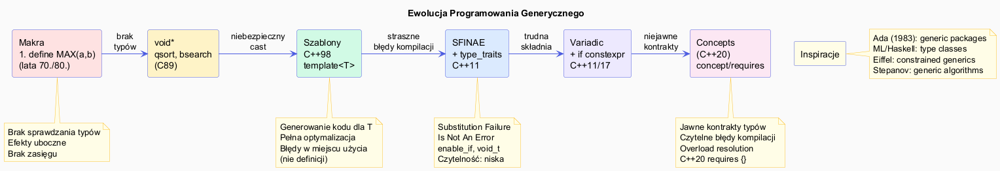

# Szablony – Historia i Motywacja



## Slajd 1: Życie przed szablonami – makra preprocesora

Przed C++98 jedynym sposobem na „generyczny" kod w C było użycie makr:

```c
/* C – generyczność przez makra (lata 70./80.) */
#define MAX(a, b)   ((a) > (b) ? (a) : (b))
#define SWAP(T, a, b) do { T tmp = a; a = b; b = tmp; } while(0)

/* Użycie: */
int x = MAX(3, 5);          /* OK */
double y = MAX(1.5, 2.5);   /* OK */
int z = MAX(i++, j++);      /* BŁĄD: i i j inkrementowane DWUKROTNIE! */
```

**Problemy makr:**
- Brak sprawdzania typów — kompilator nie widzi semantyki
- Trudny debuging — stack trace wskazuje na makro, nie wywołanie
- Brak zasięgu — makra są globalne, łatwo o kolizje nazw
- Efekty uboczne przy wielokrotnej ewaluacji argumentów

---

## Slajd 2: `void*` jako ersatz generyczności

Drugim podejściem było `void*` — technika z biblioteki C (qsort, bsearch):

```c
/* C-style "generyczny" stos przez void* */
struct Stack {
    void** data;
    int    size;
    int    capacity;
};

void stack_push(Stack* s, void* item) { s->data[s->size++] = item; }
void* stack_pop(Stack* s)             { return s->data[--s->size]; }

/* Użycie – wymaga rzutowań, brak bezpieczeństwa typów */
Stack s;
int val = 42;
stack_push(&s, &val);
int* result = (int*)stack_pop(&s);  /* Ręczne rzutowanie, UB gdy pomylisz typ */
```

```cpp
/* C++98 bez szablonów – to samo z klasami */
class IntStack {  /* Dla int */
    int* data; int size;
public:
    void push(int x);
    int  pop();
};

class DoubleStack {  /* Kopiuj–wklej dla double! */
    double* data; int size;
public:
    void push(double x);
    double pop();
};
/* Explosion: IntStack, DoubleStack, StringStack... */
```

---

## Slajd 3: Inspiracje – Ada, ML i programowanie generyczne

Koncepcja szablonów nie powstała w próżni. Kluczowe inspiracje:

| Język | Rok | Mechanizm |
|-------|-----|-----------|
| **Ada** | 1983 | `generic package Stack is ...` — jawne generyczne pakiety |
| **ML / SML** | 1973/1984 | Polimorfizm parametryczny — `'a list`, `'a -> 'b` |
| **Haskell** | 1990 | Klasy typów (*type classes*) — przyszłe concepts |
| **Eiffel** | 1985 | Generyczność z ograniczeniami (`G -> COMPARABLE`) |
| **C++** | **1991** | `template<typename T>` — Bjarne Stroustrup |

```
Ada:                         C++ (analogia):
generic                      template<typename T>
  type Item is private;      class Stack {
package Stack is               T* data;
  procedure Push(X: Item);   public:
  function Pop return Item;    void push(T x);
end Stack;                     T    pop();
                             };
```

Kluczowy wkład **Aleksandra Stepanova**: udowodnienie, że algorytmy generyczne
mogą być *tak samo szybkie* jak specjalizowane — co obaliło powszechne przekonanie.

---

## Slajd 4: C++98 – pierwsze szablony

Bjarne Stroustrup wprowadził szablony do C++ w 1991 roku; weszły do standardu C++98:

```cpp
// C++98: szablon funkcji
template<typename T>
T maksimum(T a, T b) {
    return a > b ? a : b;
}

// C++98: szablon klasy
template<typename T>
class Stos {
    std::vector<T> dane_;
public:
    void push(const T& x) { dane_.push_back(x); }
    T    pop()            { T x = dane_.back(); dane_.pop_back(); return x; }
    bool empty() const    { return dane_.empty(); }
};

// Użycie – kompilator generuje kod dla każdego T:
Stos<int>         si;
Stos<std::string> ss;
Stos<double>      sd;
// Trzy różne klasy wygenerowane w czasie kompilacji
```

**Rewolucja:** Jeden kod → wiele instancji → pełna optymalizacja dla każdego typu.

---

## Slajd 5: Problemy wczesnych szablonów – błędy i SFINAE

Szablony C++98 miały poważne słabości:

```cpp
// Problem 1: Błędy kompilacji były STRASZNE
template<typename T>
void sortuj(T& kol) {
    std::sort(kol.begin(), kol.end());
}

sortuj(42);  /* BŁĄD – komunikat zajmuje 50 linii! */
/* Kompilator mówi o brakującym begin() na int,
   a nie o tym, że int nie jest kontenerem */

// Problem 2: Brak możliwości odrzucenia niepasujących typów
template<typename T>
T policz(T a, T b) { return a + b; }
// Kompilator przyjmie int*, std::string*, cokolwiek...
// Błąd dopiero przy instancjacji
```

Rozwiązaniem było **SFINAE** (Substitution Failure Is Not An Error) — technika z 1998 r.:

```cpp
// SFINAE (C++98/C++11) – warunkowe włączanie przeciążeń
template<typename T>
typename std::enable_if<std::is_arithmetic<T>::value, T>::type
dodaj(T a, T b) { return a + b; }
// Ta funkcja istnieje TYLKO gdy T jest typem arytmetycznym
// Dla std::string – nie istnieje (SFINAE, nie błąd)
```

---

## Slajd 6: Ewolucja szablonów – C++11 do C++20

| Standard | Nowości szablonów |
|----------|-------------------|
| **C++98** | Szablony funkcji i klas, specjalizacja, explicit instantiation |
| **C++03** | Poprawki, brak nowych funkcji |
| **C++11** | Variadic templates `<Ts...>`, `auto` return, `decltype`, `nullptr`, rvalue refs, extern templates |
| **C++14** | Generic lambdas, variable templates `template<T> constexpr T pi = ...` |
| **C++17** | Class template argument deduction (CTAD), `if constexpr`, fold expressions, `std::void_t` |
| **C++20** | **Concepts** (`concept`, `requires`), abbreviated function templates (`auto` params), `consteval` |
| **C++23** | `if consteval`, explicit `this`, dedukcja szablonu dla aliasów |

```
Makra (C)  →  void* (C)  →  Templates C++98  →  SFINAE C++11  →  Concepts C++20
  ↓               ↓              ↓                   ↓                  ↓
Brak typów    Brak typów     Niskie błędy       Czytelniejsze     Jasne kontrakty
              Niebezpieczne  Niejawny kontrakt  ale nadal złożone  Piękne błędy
```

---

## Slajd 7: Concepts – idea zanim powstały

Koncepcja „concepts" istniała jako pomysł od lat 90. i była planowana na C++0x:

- **1994** – Stepanov w STL używa nieformalnych „requirements" (InputIterator, Sortable...)
- **2003** – propozycja `concept` do C++0x (Douglas Gregor, Jeremy Siek, Bjarne Stroustrup)
- **2009** – propozycja odrzucona — zbyt skomplikowana
- **2011** – C++11 bez concepts; w zamian SFINAE i type traits
- **2013** – Concepts Lite — uproszczona propozycja (Andrew Sutton)
- **2020** – **Concepts wchodzą do standardu jako część C++20**

```cpp
// Nieformalny „concept" z dokumentacji STL C++98:
// template<typename T>
// T max(T a, T b);
// Wymagania (napisane w komentarzu!):
//   T musi być LessThanComparable
//   T musi być CopyConstructible

// C++20 – to samo formalnie:
template<std::totally_ordered T>
T max(T a, T b) { return a > b ? a : b; }
// Kompilator WYMUSI te wymagania, nie tylko dokumentacja!
```
