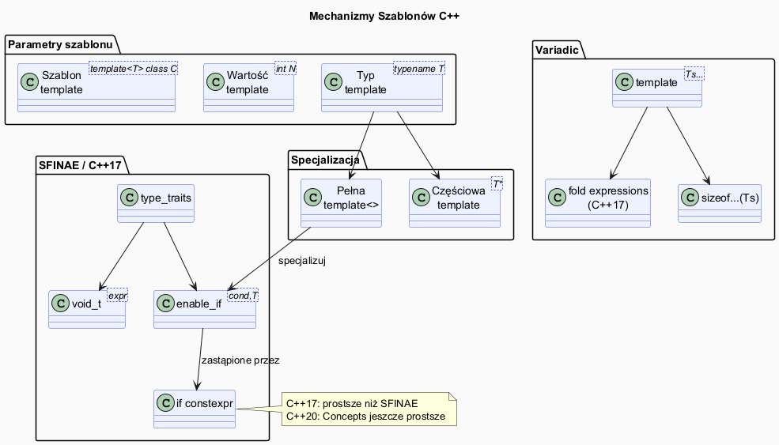

# Szablony – Składnia i Mechanizmy



## Slajd 1: Szablony funkcji – podstawy

```cpp
// Deklaracja szablonu funkcji
template<typename T>          // lista parametrów szablonu
T maksimum(T a, T b) {        // T to parametr szablonu
    return a > b ? a : b;
}

// Jawna specyfikacja typu
int x  = maksimum<int>(3, 7);
// Dedukcja typu przez kompilator
double y = maksimum(1.5, 2.5);  // T = double, automatycznie

// Szablon z wieloma parametrami
template<typename T, typename U>
auto dodaj(T a, U b) -> decltype(a + b) {  // C++11
    return a + b;
}

// C++14 – uproszczona dedukcja zwracanego typu
template<typename T, typename U>
auto dodaj14(T a, U b) {   // kompilator dedukuje typ zwracany
    return a + b;
}
```

**Instancjacja szablonu:** Kompilator generuje osobny kod dla każdego kombinacji typów.
Każda taka wersja to **instancja szablonu** (template instantiation).

---

## Slajd 2: Szablony klas

```cpp
// Szablon klasy – kontener generyczny
template<typename T, int N = 10>  // parametr typu + parametr wartościowy z domyślną
class TablicaStatyczna {
    T dane_[N];
    int rozmiar_ = 0;
public:
    void dodaj(const T& x) {
        if (rozmiar_ < N) dane_[rozmiar_++] = x;
    }
    T&       operator[](int i)       { return dane_[i]; }
    const T& operator[](int i) const { return dane_[i]; }
    int rozmiar() const { return rozmiar_; }
};

// Użycie:
TablicaStatyczna<int>     t1;       // int, N=10
TablicaStatyczna<double, 5> t2;     // double, N=5
TablicaStatyczna<std::string, 3> t3;

// C++17: Class Template Argument Deduction (CTAD)
// Kompilator może dedukować parametry szablonu klasy
std::pair p{1, 2.0};         // zamiast std::pair<int,double>
std::vector v{1, 2, 3};      // zamiast std::vector<int>
```

---

## Slajd 3: Parametry szablonu – trzy rodzaje

```cpp
// 1. PARAMETRY TYPU (najczęstsze)
template<typename T>
void f1(T x);

template<class T>      // 'class' i 'typename' są równoważne (poza kontekstem)
void f2(T x);

// 2. PARAMETRY WARTOŚCIOWE (non-type template parameters)
template<int N>
struct Stala { static constexpr int wartosc = N; };

template<auto V>       // C++17: dowolna wartość stałokompilacyjna
struct AutoStala { static constexpr auto wartosc = V; };

// 3. PARAMETRY SZABLONOWE (template template parameters)
template<template<typename> class Kontener>
class Algorytm {
    Kontener<int> dane_;  // Kontener może być std::vector, std::list...
};

// Przykład NTTP w praktyce:
template<std::size_t N>
class Bufor {
    char dane_[N];
public:
    static constexpr std::size_t rozmiar = N;
};

Bufor<1024> duzy;
Bufor<64>   maly;
// Kompilator generuje dwie różne klasy – żadnych alokacji sterty!
```

---

## Slajd 4: Specjalizacja szablonów

```cpp
// Szablon ogólny (primary template)
template<typename T>
struct Drukuj {
    static void drukuj(const T& x) {
        std::cout << x;
    }
};

// Pełna specjalizacja (explicit / full specialization)
template<>
struct Drukuj<bool> {                         // T = bool – specjalna implementacja
    static void drukuj(bool x) {
        std::cout << (x ? "true" : "false");
    }
};

// Częściowa specjalizacja (partial specialization) – tylko dla klas
template<typename T>
struct Drukuj<std::vector<T>> {               // T* – wskaźnik na cokolwiek
    static void drukuj(const std::vector<T>& v) {
        std::cout << "[";
        for (int i = 0; i < (int)v.size(); ++i) {
            if (i) std::cout << ", ";
            Drukuj<T>::drukuj(v[i]);
        }
        std::cout << "]";
    }
};

// Użycie:
Drukuj<int>::drukuj(42);                    // => 42
Drukuj<bool>::drukuj(true);                 // => true  (specjalizacja)
Drukuj<std::vector<int>>::drukuj({1,2,3});  // => [1, 2, 3]
```

---

## Slajd 5: SFINAE – Substitution Failure Is Not An Error

```cpp
// Zasada SFINAE: nieudana podstawianie T = błąd w sygnatrurze
// → ta przeciążona wersja jest IGNOROWANA, nie powoduje błędu kompilacji

// enable_if – standardowy mechanizm SFINAE
template<typename T>
std::enable_if_t<std::is_integral_v<T>, std::string>
opisz(T x) { return "calkowity: " + std::to_string(x); }

template<typename T>
std::enable_if_t<std::is_floating_point_v<T>, std::string>
opisz(T x) { return "zmiennoprzecinkowy: " + std::to_string(x); }

// Bez enable_if kompilator nie wiedziałby, którą wersję wybrać

// std::void_t – wykrywanie istnienia składowych (C++17)
template<typename T, typename = void>
struct MaMetodeDodaj : std::false_type {};

template<typename T>
struct MaMetodeDodaj<T, std::void_t<decltype(std::declval<T>().dodaj(0))>>
    : std::true_type {};

// if constexpr (C++17) – prostszy zamiennik SFINAE w wielu przypadkach
template<typename T>
void przetworz(T x) {
    if constexpr (std::is_integral_v<T>) {
        std::cout << "int: " << x * 2 << "\n";
    } else if constexpr (std::is_floating_point_v<T>) {
        std::cout << "float: " << x * 3.14 << "\n";
    } else {
        std::cout << "inny: " << x << "\n";
    }
}
```

---

## Slajd 6: Variadic templates i fold expressions

```cpp
// Variadic templates (C++11) – szablon na dowolną liczbę argumentów
template<typename... Ts>       // Ts – paczka typów (parameter pack)
void drukuj(Ts... args) {
    // Rekurencja – klasyczny sposób rozwinięcia paczki
    ((std::cout << args << " "), ...);   // fold expression (C++17)
    std::cout << "\n";
}

// Fold expressions (C++17) – zwięzłe rozwinięcie paczki
template<typename... Ts>
auto suma(Ts... args) {
    return (... + args);       // unarny fold lewostronny: (((a+b)+c)+d)
}

template<typename... Ts>
bool wszystkie_prawdziwe(Ts... args) {
    return (... && args);      // fold na &&
}

// sizeof... – liczba elementów w paczce
template<typename... Ts>
void info(Ts&&... args) {
    std::cout << "Liczba argumentow: " << sizeof...(args) << "\n";
    (std::cout << ... << args) << "\n";   // fold expression binarny
}

// Praktyczne zastosowanie – perfect forwarding
template<typename F, typename... Args>
auto wywolaj(F&& f, Args&&... args) {
    return std::forward<F>(f)(std::forward<Args>(args)...);
}
```

---

## Slajd 7: Type traits – metaprogramowanie typami

```cpp
#include <type_traits>

// type traits: metafunkcje działające na typach w czasie kompilacji

// Pytania o właściwości typów:
static_assert(std::is_integral_v<int>);
static_assert(std::is_floating_point_v<double>);
static_assert(std::is_pointer_v<int*>);
static_assert(!std::is_pointer_v<int>);
static_assert(std::is_same_v<int, int>);
static_assert(!std::is_same_v<int, double>);

// Transformacje typów:
using ConstInt = std::add_const_t<int>;        // const int
using PlainInt = std::remove_const_t<ConstInt>;// int
using RefToInt = std::add_lvalue_reference_t<int>; // int&
using NoRef    = std::remove_reference_t<int&>;    // int

// std::conditional – wybór typu w czasie kompilacji
template<bool Warunek, typename T, typename U>
using Wybierz = std::conditional_t<Warunek, T, U>;

using Typ = Wybierz<sizeof(int) == 4, int32_t, int64_t>;

// std::decay – usuwa referencje i kwalifikatory cv
template<typename T>
auto kopiuj(T&& x) {
    std::decay_t<T> kopia = std::forward<T>(x);
    return kopia;
}
```

---

## Slajd 8: Dedukcja typów i `decltype`

```cpp
// auto – dedukcja w inicjalizacji
auto x = 42;        // int
auto y = 3.14;      // double
auto& r = x;        // int&
auto* p = &x;       // int*

// decltype – typ wyrażenia (bez obliczania)
int a = 1;
decltype(a)   b = 2;      // int
decltype(a+b) c = 3;      // int (typ wyrażenia a+b)
decltype((a)) d = a;      // int& (l-wartość w nawiasach → referencja!)

// decltype(auto) – dedukcja z zachowaniem referencji (C++14)
template<typename Container, typename Index>
decltype(auto) at(Container& c, Index i) {
    return c[i];   // zwraca T& (nie T), jeśli operator[] zwraca T&
}

// Wzorzec detect pattern (C++17 + if constexpr)
template<typename T>
auto serialize(const T& obj) {
    if constexpr (requires { obj.to_string(); })
        return obj.to_string();   // jeśli ma metodę to_string
    else
        return std::to_string(obj); // fallback dla liczb
}

// C++20: requires w szablonie (przedsmak Concepts)
template<typename T>
    requires std::is_arithmetic_v<T>
T kwadrat(T x) { return x * x; }
```
