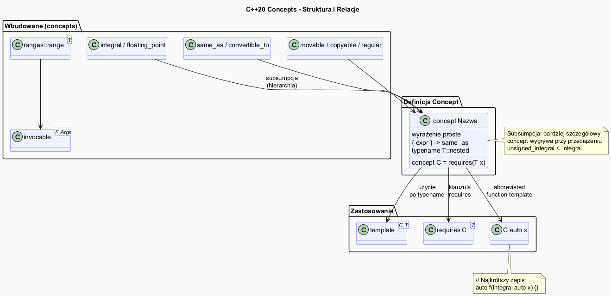

# Concepts – C++20



## Slajd 1: Motywacja – dlaczego Concepts?

Problem: Szablony C++ bez concepts mają **niejasne komunikaty błędów**:

```cpp
// Bez concepts – stary styl (C++17):
template<typename T>
T policz(T a, T b) { return a + b; }

policz("hello", "world");   // ??? Dwa wskaźniki... kompiluje się!
// Wynik: niezdefiniowane zachowanie (dodaje wskaźniki)

// A gdy dodamy std::sort do czegoś bez operatora<:
struct Foo {};
std::sort(v.begin(), v.end());  // v = vector<Foo>
// Błąd: 50-100 linii o operator<, compare, swap...
// Nikt nie wie, co jest nie tak!
```

```cpp
// Z Concepts – styl C++20:
template<std::addable T>       // jawny wymóg
T policz(T a, T b) { return a + b; }

policz("hello", "world");
// Błąd kompilacji: "pointer does not satisfy concept 'addable'"
// Jeden wiersz! Wiadomo, co trzeba naprawić.
```

Concepts to **formalne kontrakty typów** – kompilator sprawdza je *w miejscu wywołania*,
nie wewnątrz szablonu.

**Błąd w miejscu wywołania, nie w implementacji.** W starym stylu kompilator raportował
błąd dopiero gdy próbował **zinstanicjować** ciało szablonu z konkretnym typem — stąd
komunikaty wskazujące na wewnętrzne szczegóły `std::sort` czy `std::less`. Z Concepts
kompilator sprawdza wymagania **przed** wejściem do ciała szablonu, w miejscu wywołania,
i natychmiast informuje: „ten argument nie spełnia wymogu `sortable`". To jak różnica
między błędem na granicy modułu a błędem wewnątrz biblioteki. Dodatkowa korzyść: IDE
może podświetlać naruszenia concepts **podczas pisania kodu**, bez uruchamiania kompilatora.

---

## Slajd 2: Składnia concept – definiowanie

```cpp
#include <concepts>

// Definicja concept – wyrażenie bool w czasie kompilacji
template<typename T>
concept Addable = requires(T a, T b) {
    { a + b } -> std::convertible_to<T>;   // a+b musi być konwertowalny do T
};

// Concept prostszy – tylko sprawdzenie warunku
template<typename T>
concept Calkowity = std::is_integral_v<T>;   // alias na type_trait

// Concept z wieloma wymaganiami
template<typename T>
concept Kontener = requires(T c) {
    c.begin();        // musi mieć begin()
    c.end();          // musi mieć end()
    c.size();         // musi mieć size()
    typename T::value_type;   // musi mieć zagnieżdżony typ value_type
};

// Concept z requirements na składowe
template<typename T>
concept Serializowalny = requires(T x, std::ostream& os) {
    { x.serialize() }  -> std::convertible_to<std::string>;
    { os << x }        -> std::same_as<std::ostream&>;
};
```

**Wyrażenie `requires` jako nieewaluowany kontekst.** Blok `requires(T x) { ... }`
jest obliczany **wyłącznie w czasie kompilacji** — kod wewnątrz nigdy nie jest
wykonywany, nie tworzone są żadne obiekty. `T x` to fikcyjny parametr: kompilator
sprawdza tylko, czy wyrażenia byłyby poprawne składniowo i typowo, gdyby `x` istniał.
Klamra `{ a + b } -> std::convertible_to<T>` weryfikuje dwa rzeczy: (1) `a + b` musi
być poprawnym wyrażeniem i (2) jego typ musi być konwertowalny do `T`. Można definiować
concepts bez `requires`, używając tylko type traits: `concept Calkowity = std::is_integral_v<T>`
— to prostsze gdy wymaganie da się wyrazić istniejącymi narzędziami metaprogramowania.

---

## Slajd 3: Klauzula `requires` – cztery sposoby użycia

```cpp
// Sposób 1: requires po template<>
template<typename T>
    requires std::integral<T>
T policz(T a, T b) { return a + b; }

// Sposób 2: requires po sygnaturze
template<typename T>
T policz2(T a, T b) requires std::integral<T>
{ return a + b; }

// Sposób 3: concept zamiast typename
template<std::integral T>
T policz3(T a, T b) { return a + b; }

// Sposób 4: abbreviated function template (C++20) – najkrótszy
auto policz4(std::integral auto a, std::integral auto b) {
    return a + b;
}

// Wszystkie cztery są równoważne!
// policz(3, 4);    // OK
// policz(3.5, 4.5); // BŁĄD: double nie spełnia integral
```

**Kiedy używać którego stylu.** Styl **abbreviated** (`std::integral auto a`) jest
najkrótszy i najlepszy do prostych, czytelnych interfejsów — jednocześnie dokumentuje
i egzekwuje wymagania. Styl z `requires` po szablonie lub po sygnaturze jest lepszy
gdy wymaganie jest złożone (`requires Kontener<T> && Comparable<T>`) i nie mieści się
w liście parametrów szablonu. Styl z concept zamiast `typename` (`template<std::integral T>`)
jest czytelny i często preferowany gdy szablon ma wiele parametrów i chcemy, by każdy
miał swój concept. Ważne: przy abbreviated templates każdy `auto` to **niezależny**
parametr — `void f(auto a, auto b)` akceptuje dwa różne typy, w przeciwieństwie do
`template<typename T> void f(T a, T b)` gdzie oba muszą być tym samym typem.

---

## Slajd 4: Wyrażenia `requires` – szczegóły

```cpp
// requires expression – blok sprawdzający właściwości T
template<typename T>
concept Iterator = requires(T it) {
    // Proste wymaganie – wyrażenie musi być poprawne
    *it;
    ++it;

    // Wymaganie typowe – musi istnieć zagnieżdżony typ
    typename T::value_type;

    // Wymaganie złożone – wyrażenie i typ wyniku
    { *it } -> std::same_as<typename T::value_type&>;

    // Wymaganie wyjątku (noexcept)
    { ++it } noexcept;
};

// Zagnieżdżone requires
template<typename T>
concept ForwardIterator = Iterator<T>
    && requires(T it) {
        it++;          // post-increment też musi działać
        T{it};         // musi być copy-constructible
    };

// Disjunkcja i koniunkcja concepts
template<typename T>
concept Liczba = std::integral<T> || std::floating_point<T>;

template<typename T>
concept Calkowity32bit = std::integral<T> && (sizeof(T) == 4);
```

---

## Slajd 5: Wbudowane concepts – biblioteka standardowa

```cpp
#include <concepts>

// ---- Typy podstawowe ----
std::same_as<T, U>           // T i U są dokładnie tym samym typem
std::convertible_to<T, U>    // T jest konwertowalny do U
std::derived_from<T, B>      // T dziedziczy po B

// ---- Typy liczbowe ----
std::integral<T>             // typ całkowity (int, long, char...)
std::signed_integral<T>      // typ całkowity ze znakiem
std::unsigned_integral<T>    // typ całkowity bez znaku
std::floating_point<T>       // float, double, long double

// ---- Operacje na typach ----
std::movable<T>              // można przenosić (move)
std::copyable<T>             // można kopiować i przenosić
std::regular<T>              // copyable + equality_comparable
std::semiregular<T>          // copyable + defaultconstructible

// ---- Porównania ----
std::equality_comparable<T>            // operator==
std::totally_ordered<T>               // <, >, <=, >=
std::three_way_comparable<T>          // operator<=>

// ---- Callable ----
std::invocable<F, Args...>   // F można wywołać z Args
std::regular_invocable<F, Args...>  // jw + nie zmienia stanu

// ---- Iteratory / zakresy ----
std::input_iterator<T>
std::forward_iterator<T>
std::random_access_iterator<T>
std::ranges::range<T>
std::ranges::sized_range<T>
```

**Wbudowane concepts zamiast surowych type traits.** Pisanie `std::is_integral_v<T>` i
pisanie `std::integral<T>` daje ten sam efekt sprawdzenia, ale concepts mają kluczową
przewagę: uczestniczą w **subsumpcji** (patrz Slajd 7). Jeśli użyjemy `std::integral<T>`
i `std::signed_integral<T>`, kompilator automatycznie wie, że drugie jest bardziej
szczegółowe niż pierwsze. Z type traits taka hierarchia nie istnieje automatycznie.
Ponadto `std::regular<T>` jest **złożeniem** kilku mniejszych concepts w jeden czytelny
kontrakt: „ten typ zachowuje się jak int — można go kopiować, porównywać i konstruować
domyślnie". Definiowanie własnych API z użyciem gotowych concepts z biblioteki standardowej
jest preferowane — zapewnia spójność i kompatybilność z algorytmami STL i ranges.

---

## Slajd 6: Concepts w `std::ranges`

```cpp
#include <algorithm>
#include <ranges>
#include <vector>
#include <list>

// std::ranges::sort przyjmuje RandomAccessRange
// std::sort przyjmuje RandomAccessIterator

void demo() {
    std::vector<int> v{3, 1, 4, 1, 5, 9};
    std::ranges::sort(v);    // OK: vector to random_access_range
    // std::ranges::sort(std::list<int>{});  // BŁĄD: list to bidirectional, nie random!

    // Ranges pipeline z views (lazy)
    auto parzyste_kwadraty = v
        | std::views::filter([](int x) { return x % 2 == 0; })
        | std::views::transform([](int x) { return x * x; });

    for (int x : parzyste_kwadraty)
        std::cout << x << " ";
    std::cout << "\n";
}

// Własna funkcja wymagająca range
template<std::ranges::input_range R>
void drukuj_zakres(const R& r) {
    for (const auto& x : r)
        std::cout << x << " ";
    std::cout << "\n";
}
```

**Lazy evaluation w views.** `std::views::filter` i `std::views::transform` nie tworzą
nowych kontenerów — tworzą **leniwe widoki** (views), które obliczają kolejne elementy
dopiero przy iteracji. Wyrażenie `v | views::filter(...) | views::transform(...)` tworzy
obiekt widoku w czasie O(1) bez kopiowania danych. Gdy piszemy `for (int x : parzyste_kwadraty)`,
każdy element jest obliczany na żądanie: filtr sprawdza warunek, transformacja go przetwarza.
To umożliwia wydajne łańcuchowanie operacji bez tworzenia tymczasowych kolekcji. Concepts
w ranges gwarantują, że `std::ranges::sort` nie skompiluje się z listą (brak random access),
co chroni przed trudnymi do debugowania błędami wydajnościowymi.
```

---

## Slajd 7: Subsumpcja – hierarchia concepts

```cpp
// Concepts tworzą hierarchię – kompilator wybiera najbardziej szczegółowy
template<typename T>
concept Calkowity = std::integral<T>;

template<typename T>
concept CalkowityBezZnaku = std::unsigned_integral<T>;

// unsigned_integral subsumuje integral (jest bardziej szczegółowy)

template<std::integral T>
void f(T x) { std::cout << "integral: " << x << "\n"; }

template<std::unsigned_integral T>
void f(T x) { std::cout << "unsigned integral: " << x << "\n"; }

// Subsumpcja: unsigned_integral ⊆ integral
// Kompilator wybiera bardziej szczegółowe przeciążenie
// f(42u);   → "unsigned integral: 42"  (nie "integral: 42")
// f(-5);    → "integral: -5"           (signed nie spełnia unsigned)

// Własna hierarchia
template<typename T>
concept Ksztalt = requires(T k) { { k.pole() } -> std::floating_point; };

template<typename T>
concept KsztaltZ_Obwodem = Ksztalt<T>     // Ksztalt jest bazowym concept
    && requires(T k) { { k.obwod() } -> std::floating_point; };
```

**Subsumpcja — częściowe porządkowanie concepts.** Gdy dwa przeciążenia funkcji spełniają
wymagania dla danego argumentu, kompilator wybiera to, które jest **bardziej ograniczone**
(more constrained). Reguła subsumpcji: concept `A` subsumuje concept `B`, jeśli
zdefiniowanie `A` wymaga `B` — tzn. w definicji `A` pojawia się `B&&...`. `unsigned_integral`
jest zdefiniowany jako `integral<T> && !signed_integral<T>`, więc każdy typ spełniający
`unsigned_integral` spełnia też `integral`. Subsumpcja zastępuje ręczne hierarchie
SFINAE z użyciem `enable_if` — jest obliczana automatycznie przez kompilator na podstawie
struktury definicji concepts, nie przez programistę. To kluczowa przewaga nad SFINAE,
gdzie taka hierachia musiałaby być kodowana explicite.

---

## Slajd 8: Porównanie – SFINAE vs Concepts

| Aspekt | SFINAE (C++11/17) | Concepts (C++20) |
|--------|-------------------|-----------------|
| Czytelność definicji | Niska | Wysoka |
| Komunikat błędu | Wieloliniowy | Jasny, 1-2 linii |
| Subsumpcja (hierarchia) | Brak | Automatyczna |
| Wielokrotne użycie | Trudne | `concept Nazwa = ...` |
| Diagnostyka w IDE | Słaba | Dobra |
| Kompatybilność | C++11+ | C++20+ |

```cpp
// SFINAE (stary styl) – trudny w czytaniu:
template<typename T,
    std::enable_if_t<std::is_integral_v<T> &&
                     std::is_signed_v<T>, int> = 0>
void f(T x) { std::cout << x; }

// Concepts (nowy styl) – czytelny:
template<std::signed_integral T>
void f(T x) { std::cout << x; }

// Lub najkrótszy zapis:
void f(std::signed_integral auto x) { std::cout << x; }
```

**Concepts i przeciążanie — bardziej ograniczone wygrywa.** Przy wyborze przeciążenia
kompilator najpierw zbiera wszystkich kandydatów (które przeszły sprawdzenie wymagań),
a następnie wybiera **najbardziej ograniczonego**. Jeśli dwa kandydaty mają sprzeczne
ograniczenia — kompilator zgłasza niejednoznaczność. Concepts całkowicie zastępują
technikę „tag dispatching" (tworzenie pustych struktur `input_iterator_tag` do wyboru
przeciążeń) i są znacznie czytelniejsze. Ważna zasada: SFINAE i Concepts można mieszać
w jednej bazie kodu — szablony ze starym `enable_if` współpracują z nowymi szablonami
używającymi `requires`. To umożliwia stopniową migrację istniejącego kodu do C++20.
