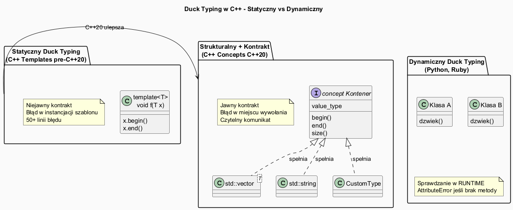

# Duck Typing w C++



## Slajd 1: Czym jest Duck Typing?

> *„Jeśli chodzi jak kaczka i kwacze jak kaczka, to jest kaczką."*
> — James Whitcomb Riley (inspiracja; termin spopularyzowany w Pythonie)

**Duck typing** to forma **typowania strukturalnego**: obiekt jest akceptowany,
jeżeli posiada wymagane operacje — niezależnie od formalnej hierarchii dziedziczenia.

```python
# Python – duck typing dynamiczny
def posortuj(kolekcja):
    return sorted(kolekcja)  # akceptuje list, tuple, set, generator...
# Nie sprawdza TYPU – sprawdza, czy obiekt ma __iter__ i __lt__
```

| Styl | Kiedy sprawdzane | Przykład |
|------|-----------------|---------|
| Statyczny (nominatywny) | Czas kompilacji, po nazwie | Java `implements Sortable` |
| Dynamiczny (duck typing) | Czas wykonania | Python, Ruby |
| Strukturalny statyczny | Czas kompilacji, po API | **C++ templates** |
| Strukturalny z kontraktem | Czas kompilacji + dokumentacja | **C++ concepts** |

---

## Slajd 2: C++ templates jako niejawny duck typing

Szablony C++ od początku (C++98) są **strukturalnym typowaniem statycznym**:

```cpp
// Nie ma interfejsu „ma size()" – ale szablon zadziała dla każdego T
// które MA metodę size():
template<typename T>
std::size_t rozmiar(const T& x) {
    return x.size();  // T musi mieć size() – niejawny kontrakt
}

rozmiar(std::vector<int>{1,2,3});  // OK – vector ma size()
rozmiar(std::string{"hello"});     // OK – string ma size()
rozmiar(std::map<int,int>{});      // OK – map ma size()
// rozmiar(42);                    // BŁĄD – int nie ma size() – ale PÓŹNO

// Kaczka: kompilator sprawdza w miejscu UŻYCIA, nie DEFINICJI
// → wszystkie błędy "duck typing violation" są w instancjacji szablonu
```

**Analogia z kaczką:**
- Pytamy się: `T` czy kwacze (ma `operator<`)? 
- Nie pytamy: `T` dziedziczy po `Sortable`?
- Jeśli nie kwacze → błąd kompilacji (z trudnym komunikatem w pre-C++20)

---

## Slajd 3: SFINAE jako jawny duck typing pre-C++20

```cpp
// SFINAE – czy T "kwacze" (ma begin/end)?
template<typename T, typename = void>
struct MaBeginEnd : std::false_type {};

template<typename T>
struct MaBeginEnd<T,
    std::void_t<decltype(std::declval<T>().begin()),
                decltype(std::declval<T>().end())>>
    : std::true_type {};

// Użycie – warunkowe przeciążenie (duck typing z selekcją)
template<typename T>
std::enable_if_t<MaBeginEnd<T>::value>
iteruj(const T& kol) {
    for (const auto& x : kol) std::cout << x << " ";
    std::cout << "\n";
}

template<typename T>
std::enable_if_t<!MaBeginEnd<T>::value>
iteruj(const T& x) {
    std::cout << "(nie-kontener) " << x << "\n";
}

// Akceptuje COKOLWIEK co ma begin/end – bez dziedziczenia:
iteruj(std::vector<int>{1,2,3});  // "kaczka kontenerowa"
iteruj(std::string{"abc"});        // też "kaczka kontenerowa"
iteruj(42);                        // "nie-kaczka"
```

---

## Slajd 4: Concepts jako jawny, czytelny duck typing

```cpp
// C++20: concept JASNO opisuje, co T musi „umieć"
template<typename T>
concept Kaczkowy_Kontener = requires(T c) {
    c.begin();
    c.end();
    { c.size() } -> std::convertible_to<std::size_t>;
    typename T::value_type;
};

// Prosta, czytelna funkcja z concept:
template<Kaczkowy_Kontener T>
void drukuj(const T& kol) {
    for (const auto& x : kol) std::cout << x << " ";
    std::cout << "\n";
}

// "Kaczka" – akceptowane:
drukuj(std::vector<int>{1,2,3});      // OK
drukuj(std::array<double,3>{});       // OK
drukuj(std::string{"hello"});         // OK (ma begin/end/size/value_type)

// "Nie-kaczka" – odrzucone z JASNYM komunikatem:
// drukuj(42);
// Błąd: "int does not satisfy Kaczkowy_Kontener"
//   (wymagane: begin(), end(), size(), value_type)
```

---

## Slajd 5: Porównanie – Python vs C++ duck typing

```python
# Python – duck typing dynamiczny
class Kot:
    def dzwiek(self): return "Miau"

class Pies:
    def dzwiek(self): return "Hau"

class Traktor:
    def dzwiek(self): return "Brum"

def glosno(zwierze):
    print(zwierze.dzwiek())   # sprawdzane W CZASIE DZIAŁANIA

glosno(Kot())     # OK
glosno(Pies())    # OK
glosno(Traktor()) # OK – traktor "kaczkuje" tak samo
glosno(42)        # AttributeError dopiero w RUNTIME
```

```cpp
// C++ – duck typing statyczny przez concept
template<typename T>
concept MaDzwiek = requires(T x) {
    { x.dzwiek() } -> std::convertible_to<std::string>;
};

template<MaDzwiek T>
void glosno(T x) { std::cout << x.dzwiek() << "\n"; }

// Żadnego dziedziczenia! Tylko „kwakanie" przez API:
struct Kot   { std::string dzwiek() { return "Miau"; } };
struct Pies  { std::string dzwiek() { return "Hau";  } };
struct Traktor { std::string dzwiek() { return "Brum"; } };

glosno(Kot{});     // OK
glosno(Pies{});    // OK
glosno(Traktor{}); // OK
// glosno(42);     // BŁĄD KOMPILACJI (nie w runtime!)
```

---

## Slajd 6: Duck typing a dziedziczenie – trade-offs

**Dziedziczenie (nominatywne):**
```cpp
struct IZwierze {
    virtual std::string dzwiek() const = 0;
    virtual ~IZwierze() = default;
};
struct Kot : IZwierze { std::string dzwiek() const override { return "Miau"; } };
```

**Duck typing przez concepts:**
```cpp
template<typename T>
concept Zwierze = requires(T x) {
    { x.dzwiek() } -> std::convertible_to<std::string>;
};
struct Kot { std::string dzwiek() const { return "Miau"; } };
```

| Aspekt | Dziedziczenie | Duck Typing (concepts) |
|--------|--------------|----------------------|
| Powiązanie klas | Jawne (`IZwierze`) | Brak (strukturalne) |
| Rozszerzalność | Trzeba zmieniać klasę | Nowe klasy bez modyfikacji |
| Polimorfizm | Runtime | Compile-time |
| Narzut wydajnościowy | vtable, pointer | Zero (inlining) |
| Łatwość testowania | Wymaga mock'ów | Dowolna struktura |
| Czytelność błędów | Dobra | Dobra (z concepts) |

---

## Slajd 7: Praktyczne zastosowanie – Open/Closed Principle

Duck typing przez concepts realizuje **Open/Closed Principle**:
klasy otwarte na rozszerzenie, zamknięte na modyfikację:

```cpp
// Concept "Kształt" – kontrakt bez dziedziczenia
template<typename T>
concept Ksztalt = requires(T k) {
    { k.pole()   } -> std::floating_point;
    { k.obwod()  } -> std::floating_point;
};

// Istniejące klasy (bez modyfikacji):
struct Kolo  {
    double r;
    double pole()  const { return 3.14159 * r * r; }
    double obwod() const { return 2 * 3.14159 * r; }
};

struct Prostokat {
    double a, b;
    double pole()  const { return a * b; }
    double obwod() const { return 2 * (a + b); }
};

// Nowa klasa od zewnętrznej biblioteki (bez dziedziczenia!):
struct ZewnetrznaFigura {  // ktoś inny napisał tę klasę
    double pole()  const { return 100.0; }
    double obwod() const { return 40.0; }
    // Nie dziedziczy po niczym – ale "kwacze" jak Ksztalt!
};

template<Ksztalt K>
double calkowite_pole(const std::vector<K>& ksztalty) {
    double suma = 0;
    for (const auto& k : ksztalty) suma += k.pole();
    return suma;
}
```
