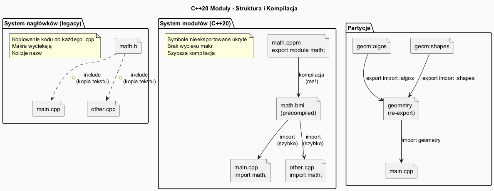

# Moduły C++20



## Slajd 1: Problemy z `#include`

Przez 50 lat C++ korzystał z systemu nagłówków odziedziczonego z C. Niesie to ze sobą poważne problemy:

```cpp
// Plik: main.cpp
#include <iostream>
#include <vector>
#include <algorithm>
#include "MojaKlasa.h"
// ↑ Preprocesor KOPIUJE zawartość każdego pliku.
// <iostream> to ~10 000 linii kodu wklejanych dosłownie do każdego .cpp!

// Problem 1: POWOLNA KOMPILACJA
// Każda jednostka translacji kompiluje te same nagłówki od nowa.
// W dużych projektach: 80-90% czasu kompilacji to nagłówki!

// Problem 2: WYCIEKI MAKR
#define MAX 100   // w MojaKlasa.h
// MAX zanieczyszcza globalną przestrzeń nazw!

// Problem 3: KOLEJNOŚĆ INCLUDOWANIA
// Błędy trudne do znalezienia, gdy nagłówki są w złej kolejności

// Problem 4: BRAK ENKAPSULACJI
// Wszystkie symbole z nagłówka są widoczne wszędzie
// Nie można "ukryć" implementacji bez pliku .cpp

// Problem 5: include guards / #pragma once – konieczne obejście
#ifndef MOJA_KLASA_H
#define MOJA_KLASA_H
// ... treść nagłówka
#endif
```

**Mechanizm `#include` — tekstowe wklejanie.** Preprocesor C/C++ działa na poziomie
**tekstu** przed kompilacją — `#include <iostream>` dosłownie wkleja tysiące linii kodu
do każdego pliku `.cpp`. W projekcie z 100 plikami `.cpp` każdy z `#include <vector>`
zmusza kompilator do przetworzenia `<vector>` od nowa — 100 razy, każdorazowo budując
AST i sprawdzając typy. Precompiled Headers (PCH) to obejście, nie rozwiązanie — jedno
z kompilacji nagłówków jest zachowane i reużywane, ale tylko dla ustalonego zestawu
nagłówków. Makra „wyciekają" ponieważ preprocesor jest globalny — `#define MAX 100`
w dowolnym dołączonym pliku zmienia znaczenie symbolu `MAX` wszędzie od tego momentu.
Moduły rozwiązują oba problemy: kompilują się **raz** do formatu binarnego (BMI)
i makra nie przekraczają granic modułu.

---

## Slajd 2: Moduły – nowy model kompilacji (C++20)

```cpp
// Plik: math.cppm  (lub .ixx – zależy od kompilatora)
export module math;   // deklaracja jednostki modułu

import <iostream>;    // import zależności modułu

// Eksportowane symbole – widoczne dla importera
export double kwadrat(double x) { return x * x; }
export double szescian(double x) { return x * x * x; }

// NIEEKSPORTOWANE – wewnętrzna implementacja, niewidoczna z zewnątrz!
double pomocnicza_impl(double x) { return x * 2; }   // prywatne

// Eksport klasy:
export class Kalkulator {
public:
    double dodaj(double a, double b) { return a + b; }
    double odejmij(double a, double b) { return a - b; }
};

// ─────────────────────────────────────────────
// Plik: main.cpp
import math;           // zamiast #include "math.h"
import <iostream>;     // moduł biblioteki standardowej

int main() {
    std::cout << kwadrat(5.0) << "\n";      // 25
    std::cout << szescian(3.0) << "\n";     // 27

    Kalkulator k;
    std::cout << k.dodaj(3, 4) << "\n";     // 7
    // pomocnicza_impl(5);  // BŁĄD – nie jest eksportowana
}
```

**Jak działa BMI (Binary Module Interface).** Gdy kompilator przetwarza plik `.cppm`,
tworzy **BMI** — plik binarny zawierający przetworzone, zserializowane informacje o
wyeksportowanym interfejsie modułu (typy, sygnatury funkcji, szablony). Gdy inny plik
importuje moduł, kompilator odczytuje BMI **zamiast** parsować tekst nagłówka od nowa.
BMI jest kompilatorospecyficzny (GCC tworzy `.gcm`, MSVC `.ifc`) i musi być skompilowany
przed każdym importerem — stąd wymóg znania topologii zależności przez system budowania.
Kluczowa różnica od PCH: BMI jest modułem o zdefiniowanym interfejsie publicznym —
symbole nieeksportowane są **naprawdę ukryte**, a nie tylko schowane w przestrzeni nazw.

---

## Slajd 3: Partycje modułu

Duże moduły można podzielić na **partycje**:

```cpp
// Plik: geometry-shapes.cppm  (partycja "shapes" modułu "geometry")
export module geometry:shapes;

export struct Kolo  { double r; };
export struct Prostokat { double a, b; };

// ─────────────────────────────────────────────
// Plik: geometry-algorithms.cppm  (partycja "algorithms")
export module geometry:algorithms;
import :shapes;   // import innej partycji – tylko wewnątrz modułu!

export double pole(const Kolo& k)      { return 3.14 * k.r * k.r; }
export double pole(const Prostokat& p) { return p.a * p.b; }

// ─────────────────────────────────────────────
// Plik: geometry.cppm  (główna jednostka – re-eksportuje partycje)
export module geometry;
export import :shapes;        // re-eksport partycji
export import :algorithms;    // re-eksport partycji

// ─────────────────────────────────────────────
// Plik: main.cpp
import geometry;   // jeden import daje dostęp do wszystkiego

int main() {
    Kolo k{5.0};
    std::cout << pole(k) << "\n";   // z partycji algorithms
}
```

**Partycje — wewnętrzna organizacja modułu.** Partycje modułu (`geometry:shapes`) są
**wewnętrzne** — importujący kod widzi tylko `geometry`, nie może importować `geometry:shapes`
bezpośrednio. To prawdziwa enkapsulacja: wewnętrzny podział implementacji jest ukryty
przed użytkownikami biblioteki. W systemie nagłówkowym każdy header był dostępny globalnie;
tu szczegóły organizacji modułu są prywatne. Partycje umożliwiają też podział pracy
w zespołach: różni programiści pracują na różnych partycjach bez wycieków implementacji.
Jednostka główna (`geometry.cppm`) re-eksportuje tylko to, co ma być publiczne —
wewnętrzne partycje pomocnicze mogą pozostać niewidoczne.

---

## Slajd 4: `module :private` – podział interfejsu i implementacji

```cpp
// Plik: mylib.cppm
export module mylib;

// ---- Interfejs publiczny (przed module :private) ----
export class Baza {
public:
    void metoda();                // deklaracja
    virtual ~Baza() = default;
};

export void funkcja_pub();        // deklaracja

// ---- Implementacja prywatna (po module :private) ----
// Uwaga: wymaga wsparcia kompilatora (GCC 14+, Clang 17+)
module :private;

void Baza::metoda() {
    // implementacja – niewidoczna dla importerów
    std::cout << "Baza::metoda()\n";
}

void funkcja_pub() {
    std::cout << "funkcja_pub()\n";
}

// Korzyść: zmiana implementacji nie wymaga rekompilacji importerów!
// (To jest niemożliwe z nagłówkami)
```

**ABI stability przez `module :private`.** W klasycznym systemie nagłówkowym każda
zmiana w pliku `.h` (nawet komentarza lub prywatnego pola klasy) powoduje recompile
wszystkich `.cpp` z `#include`. Z `module :private` wszystko po tej dyrektywie jest
częścią jednostki implementacji — zmiana implementacji metody **nie zmienia** BMI.
Importerzy nie muszą być rekompilowani, bo ich widok modułu (BMI) pozostał identyczny.
To zbliża C++ do modelu typowego dla skompilowanych bibliotek `.dll`/`.so`, ale na
poziomie kodu źródłowego. W praktyce to dramatyczne przyspieszenie iteracji: programiści
modyfikujący implementację nie „dotykają" API i nie wywołują lawinowej rekompilacji.

---

## Slajd 5: Porównanie – nagłówki vs moduły

| Aspekt | Nagłówki (`#include`) | Moduły (`import`) |
|--------|----------------------|-------------------|
| Szybkość kompilacji | Wolna (każdy .cpp) | **Szybka** (raz skompilowany) |
| Enkapsulacja | Brak | **Pełna** (nieeks. symbole ukryte) |
| Makra | Wyciekają | **Nie wyciekają** |
| Kolejność include | Ważna | Nie ma znaczenia |
| Narzędzia legacy | Wszechobecne | Tylko C++20+ |
| Wsparcie kompilatorów | Wszędzie | GCC 11+, Clang 16+, MSVC 2019+ |
| include guards | Konieczne | Zbędne |
| Typowe rozszerzenie | `.h`, `.hpp` | `.cppm`, `.ixx` |

**Wyniki benchmarków (Mozilla Firefox, LLVM):**
- Czas kompilacji z modułami: **40-70% krótszy** niż z nagłówkami wstępnie kompilowanymi (PCH)
- Czas przyrostowej kompilacji: **jeszcze lepszy** (zmiana implementacji ≠ recompile importerów)

**Dlaczego moduły są szybsze — kompilacja raz, reużycie wiele razy.** System nagłówkowy
wymaga przetworzenia każdego nagłówka w każdej jednostce translacji — kompilator parsuje
tekst, buduje AST, sprawdza typy, a następnie wyrzuca wynik (pcja PCH ratuje cześć pracy).
Z modułami: jeden plik `.cppm` kompiluje się raz do BMI. Każdy import tego modułu odczytuje
gotowy BMI — kompilator dostaje przetworzone, gotowe do użycia informacje bez parsowania
tekstu. Przyspieszenie jest tym większe, im więcej plików importuje ten sam moduł.
Strategia migracji dla istniejących projektów: zacznij od stworzenia modułu wrappera
wokół istniejących nagłówków (`#include "legacy.h"` wewnątrz modułu, export interfejsu)
— pozwala na stopniowe przejście bez refaktoryzacji całej bazy kodu naraz.

---

## Slajd 6: Importowanie biblioteki standardowej

```cpp
// C++23: globalne import modułów biblioteki standardowej
import std;           // CAŁY standard w jednym imporcie (C++23)

// C++20: importowanie poszczególnych nagłówków jako moduły
import <iostream>;    // odpowiednik #include <iostream>
import <vector>;
import <algorithm>;

// Mieszanie (tymczasowe – dla kodu legacy):
#include <cstdio>     // stare nagłówki C nadal działają
import <iostream>;    // nowe moduły C++

// ─────────────────────────────────────────────
// Wzorzec: moduł biblioteki z header-compat
export module mojlib;

// Zewnętrzna zależność przez #include (gdy nie ma modułu)
#include "zewnetrzna_biblioteka.h"  // OK wewnątrz modułu

export void moja_funkcja();   // interfejs modułu
```

**Strategia migracji kodu legacy.** Kopiowanie całej bazy kodu do `.cppm` na raz nie
jest realistyczne. Zalecane podejście stopniowe: (1) nowe moduły używają `import std`
lub `import <nagłówek>`; (2) istniejące biblioteki owijamy w moduł-wrapper: wewnątrz
modułu `#include "stara_biblioteka.h"`, export wybranych symboli; (3) pliki `.cpp` mogą
nadal używać `#include` — moduły i nagłówki koegzystują w jednym projekcie. Makra
i `using namespace` z nagłówków wewnątrz modułu nie przeciekają do importerów —
to kluczowa gwarancja. `import std` (C++23) jest szczególnie wartościowy: cała biblioteka
standardowa jako jeden spójny moduł, kompilowany raz.

---

## Slajd 7: Build system i kompilacja modułów

Moduły wymagają zmiany w procesie budowania:

```bash
# GCC 14+ (eksperymentalnie):
g++ -std=c++20 -fmodules-ts -c math.cppm -o math.gcm  # precompile moduł
g++ -std=c++20 -fmodules-ts main.cpp math.gcm -o prog  # kompiluj main

# MSVC 2019+:
cl /std:c++20 /experimental:module /c math.ixx          # precompile
cl /std:c++20 /experimental:module main.cpp math.ifc    # link

# CMake 3.28+ (oficjalne wsparcie modułów):
add_library(math)
target_sources(math
  PUBLIC
    FILE_SET CXX_MODULES FILES math.cppm
)
target_compile_features(math PUBLIC cxx_std_20)
```

**Uwaga:** Ze względu na różnice wsparcia kompilatorów, kod w `src/` używa
symulacji modułów przez namespace i klasy – by działał na GCC 11+.
Komentarze pokazują, jak wyglądałby kod z pełnymi modułami.

**Wyzwanie dependency scanning.** Tradycyjny system budowania (make, CMake pre-3.28)
zakładał, że zależności między plikami `.cpp` są z góry znane i można je obliczać
niezależnie. Moduły wymuszają **skanowanie zależności** przed kompilacją: `math.cppm`
musi być skompilowany przed `main.cpp`, który go importuje. System budowania musi
zrozumieć kolejność: `import math` → skompiluj `math.cppm` najpierw. CMake 3.28 dodał
oficjalne wsparcie przez `FILE_SET CXX_MODULES` — skanuje pliki źródłowe w poszukiwaniu
deklaracji `export module` i `import`, buduje graf zależności i kompiluje w poprawnej
kolejności. Ninja (zalecany backend) doskonale wspiera ten model budowania przyrostowego.
Dla projektów multiplatformowych MSVC jest najdojrzalszą implementacją modułów; GCC i
Clang nadrabiają zaległości w kolejnych wydaniach.
